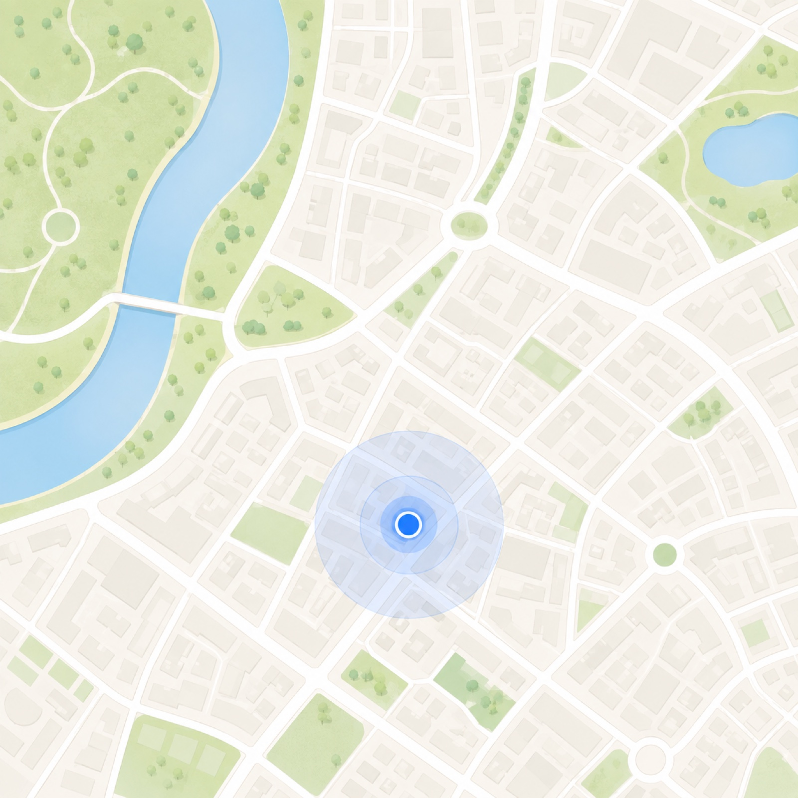

# 이미지 에셋 카탈로그

앱에서 쓰는 모든 이미지의 **미리보기 · 의미 · 사용처** 목록.
파일명만으로 어떤 이미지인지 알기 어렵다는 지적(2026-08-11)에 따라 만들었다.
**이미지를 추가/삭제/개명하면 이 문서도 함께 고칠 것** — 어긋난 카탈로그는
없느니만 못하다. 파일 존재 여부는 `test/asset_files_test.dart`가 검증한다.

## 구조 규칙

- 위치: `assets/images/{도메인}/{기능명}.{svg|png|jpg}`
- 도메인 = 화면 단위 (코드의 `features/{도메인}/` 구조와 같은 원리)
- 파일명 = 12자 이내 기능명, snake_case
- SVG는 24×24 격자·선 1.25px, 기본색 `currentColor` + 강조색 브랜드 블루(#2563EB) 고정
  — 코드에서는 `AppIcon(AppIconId.xxx)`로만 사용 (`lib/core/icons/app_icons.dart`)

## brand/ — 브랜드 (로고·앱아이콘·스플래시)

| 미리보기 | 파일 | 의미 | 사용처 |
|---|---|---|---|
|  | `ci.png` | 회사 CI 로고 | 로그인 화면 상단 |
|  | `splash.png` | 스플래시 마크 (위치핀+인물+명함) | 앱 시작 스플래시, 주변 화면 로딩 |
|  | `icon.png` | 앱 런처 아이콘 원본 | flutter_launcher_icons 생성 소스 |
|  | `mark.svg` | 앱 아이콘 마크(라인) | 앱 내 브랜드 표시 |

## common/ — 공통 (어느 화면에나 나올 수 있는 것)

| 미리보기 | 파일 | 의미 | 사용처 (AppIconId) |
|---|---|---|---|
|  | `back.svg` | 뒤로 가기 | `back` |
|  | `share.svg` | 공유 | `share` |
|  | `save.svg` | 저장/다운로드 | `saveDownload` |
|  | `sync.svg` | 동기화 | `sync` |
|  | `notify.svg` | 알림(종) | `notification` |
|  | `connect.svg` | 연결 중 상태 | `connecting` |
|  | `more.svg` | 더보기(⋯) | `more` |

## nearby/ — 주변 인맥 (레이더 화면)

| 미리보기 | 파일 | 의미 | 사용처 (AppIconId) |
|---|---|---|---|
|  | `people.svg` | 주변 인맥 (탭바 아이콘) | `nearbyPeople` |
|  | `radar.svg` | 레이더 감지 | `radarDetect` |
|  | `radius.svg` | 감지 반경 설정 | `detectRadius` |
|  | `pin_on.svg` | 위치 사용 중 핀 | `pinActive` |
|  | `pin_off.svg` | 위치 꺼짐 핀 | `pinInactive` |
|  | `map.jpg` | "지금 가까운 사람" 카드의 지도 배경 | radar_view.dart |

## wallet/ — 명함 지갑

| 미리보기 | 파일 | 의미 | 사용처 (AppIconId) |
|---|---|---|---|
|  | `wallet.svg` | 명함 지갑 (탭바 아이콘) | `cardWallet` |
|  | `add.svg` | 명함 추가 | `addCard` |
|  | `edit.svg` | 명함 수정 | `editCard` |
|  | `fav.svg` | 즐겨찾기(별) | `favorite` |

## scan/ — 명함 스캔·등록

| 미리보기 | 파일 | 의미 | 사용처 (AppIconId) |
|---|---|---|---|
|  | `scan.svg` | 명함 카메라 스캔 | `scanCard` |
|  | `gallery.svg` | 갤러리에서 이미지 업로드 | `galleryUpload` |

## comm/ — 소통 기록 (통화·문자·이메일·카카오톡)

| 미리보기 | 파일 | 의미 | 사용처 (AppIconId) |
|---|---|---|---|
|  | `call.svg` | 전화 걸기 | `call` |
|  | `callchk.svg` | 통화 완료 확인 | `callCheck` |
|  | `msg.svg` | 문자 메시지 | `message` |
|  | `mailsend.svg` | 이메일 보내기 | `mailSend` |
|  | `maillink.svg` | 이메일 연결 | `emailLink` |
|  | `chatsend.svg` | 채팅(카카오톡) 보내기 | `chatSend` |
|  | `memo.svg` | 메모 남기기 | `memo` |
|  | `recent.svg` | 최근 소통 이력 | `recentContact` |

## ai/ — AI 대화 가이드

| 미리보기 | 파일 | 의미 | 사용처 (AppIconId) |
|---|---|---|---|
|  | `brief.svg` | AI 브리핑 | `aiBriefing` |
|  | `talkpts.svg` | 대화 포인트 | `talkPoints` |
|  | `chip.svg` | AI 잔여 횟수 칩 | `aiChip` |
|  | `datainfo.svg` | AI 전송 데이터 안내 | `aiDataInfo` |
|  | `proc.svg` | AI 생성 중(처리 중) | `aiProcessing` |

## settings/ — 설정

| 미리보기 | 파일 | 의미 | 사용처 (AppIconId) |
|---|---|---|---|
|  | `gear.svg` | 설정 (탭바 아이콘) | `settings` |
|  | `logout.svg` | 로그아웃 | `logout` |
|  | `acctdel.svg` | 계정 삭제(회원 탈퇴) | `accountDelete` |
|  | `cancel.svg` | 서비스 해지 | `cancelService` |
|  | `locinfo.svg` | 위치정보 이용 안내 | `locationInfo` |
|  | `revoke.svg` | 동의 철회 | `consentRevoke` |
|  | `carddata.svg` | 명함 데이터 보관 안내 | `cardData` |

## profile/ — 내 프로필

| 미리보기 | 파일 | 의미 | 사용처 (AppIconId) |
|---|---|---|---|
|  | `qr.svg` | QR 명함 교환 | `qrScan` |

## 번들에서 제외된 레거시 (참고)

`assets/icons3d/`에 남아 있는 파일(radar.png, 라벤더 시절 이미지 등)과
`assets/icon/`은 **앱에서 쓰지 않아 번들에서 제외**했다. 도구 스크립트
(`tool/generate_app_icon*.dart`)가 참조하므로 파일은 보존한다.
