# 관리자 매뉴얼 — 서버/AI 연동 설정

운영자가 직접 콘솔에서 진행해야 하는 절차만 모아둔 문서. 코드 작업은
다루지 않는다(코드 변경은 `backlog.md`/커밋 이력 참고). 절차를 실제로
진행한 순서 그대로 기록했다.

---

## 1. AI 서버(Gemini) 연동 설정

**목적**: 앱의 AI 대화 브리핑 기능(`generateBriefing`)을 실제로 동작시키기
위한 서버 측 설정. 이 절차가 끝나야 앱에서 AI 기능이 "준비 중" 대신 실제로
작동한다.

**관리 계정**: creamhouseapp@gmail.com (Firebase/Google Cloud/Google AI
Studio 전부 이 계정으로 로그인)

### 1-1. Firebase Blaze(종량제) 요금제 전환

Cloud Functions는 무료(Spark) 요금제에서 실행되지 않는다 — Blaze로
전환해야 서버 코드(AI 프록시 등)를 배포할 수 있다.

1. [Firebase 콘솔](https://console.firebase.google.com) 접속 (creamhouseapp@gmail.com)
2. **connection-sense** 프로젝트 선택
3. 왼쪽 하단 "Spark 요금제" 뱃지 클릭 → **⚙️ 설정 → 사용량 및 결제 → 세부정보 및 설정**으로도 진입 가능
4. "**Blaze - 종량제**" 선택 → "플랜 선택"
5. Cloud Billing 계정이 없으면 "**Cloud Billing 계정 만들기**" → 국가(대한민국) → 계정 유형(개인/사업자) → 카드 정보 입력 → 약관 동의
6. 결제 계정 선택 후 "**Blaze로 업그레이드**"

전환 시 **Google Cloud 무료 체험판 크레딧($300 상당, 원화 환산 약
₩430,000대)**이 자동 적용되는 경우가 있다(2026-08-07 확인, 유효기간
90일) — 이 크레딧이 소진되기 전까지는 추가 비용이 거의 발생하지 않는다.

### 1-2. 예산 알림 확인/설정 (안전장치)

Blaze로 전환하면 Firebase가 프로젝트 기준 기본 예산(₩5,000/월, 알림
50%/90%/100%)을 자동으로 만들어 두는 경우가 있다 — 아래에서 이미 있는지
먼저 확인하고, 없으면 새로 만든다.

1. [Google Cloud 콘솔 → 결제 → 예산 및 알림](https://console.cloud.google.com/billing/budgets) 접속
2. 목록에 "Firebase Project connection-sense" 같은 예산이 이미 있으면 그대로 사용
3. 없으면 "예산 만들기" → 이름 지정 → 프로젝트를 connection-sense로 한정 → 금액 ₩5,000~10,000 정도로 설정 → 기본 알림 임계값(50/90/100%)으로 저장

> 상단에 "cost data delays" 관련 경고 배너가 뜰 수 있는데, 구글 쪽 시스템
> 이슈(비용 집계 지연)로 조치할 것 없음.

### 1-3. Gemini API 키 발급

1. [Google AI Studio → API 키](https://aistudio.google.com/api-keys) 접속 (creamhouseapp@gmail.com)
2. "**API 키 만들기**" 클릭
3. "가져온 프로젝트 선택" 드롭다운에서 **connection-sense**가 안 보이면 → "**프로젝트 가져오기**" 클릭 → connection-sense 선택
4. connection-sense가 선택된 상태로 "만들기"
5. 생성된 키의 "프로젝트" 칸이 **connection-sense**로, "결제 등급"이 무료 등급이 아닌 것으로 표시되는지 확인

> ⚠️ **"Default Gemini Project"로 만들어진 키를 쓰면 안 된다** — 무료
> 등급으로 잡혀서 Blaze 크레딧과 무관하게 동작하고 한도도 낮다. 반드시
> connection-sense 프로젝트로 만든 키를 써야 한다.

> ⚠️ **발급된 키 값은 어디에도(채팅, 캡처, 커밋) 남기지 않는다.** 키가
> 한 번이라도 외부에 노출되면 즉시 삭제하고 새로 발급받는다.

### 1-4. 키를 Firebase Secret Manager에 등록

터미널에서 프로젝트 루트로 이동한 뒤 실행한다.

```bash
cd /Volumes/X31/Claude/connection-trace-ai-v2-flutter
```

인터랙티브 프롬프트(`firebase functions:secrets:set GEMINI_API_KEY`만
실행 후 값 입력)는 값이 빈 채로 등록되는 오류(`Secret Payload cannot be
empty`)가 반복 발생했다 — **파이프 방식을 쓴다:**

```bash
echo -n "실제_API_키_값" | firebase functions:secrets:set GEMINI_API_KEY
```

> ⚠️ **`GEMINI_API_KEY`는 고정된 이름(리터럴 문자열)이다.** 서버 코드
> (`functions/src/index.ts`의 `defineSecret("GEMINI_API_KEY")`)가 이
> 이름을 그대로 찾기 때문에, 절대 이 자리에 실제 키 값을 넣으면 안 된다.
> 큰따옴표 안(`echo -n "..."`)에만 실제 키 값이 들어간다.

성공하면 `+ Created a new secret version for GEMINI_API_KEY` 같은
메시지가 뜬다. 실행 후 `history -c`로 터미널 기록을 지우는 것을 권장.

### 1-5. Cloud Functions 배포

```bash
firebase deploy --only functions
```

`generateBriefing(asia-northeast3)` 관련 성공 메시지가 뜨면 완료.

### 1-6. 앱 코드 반영 (개발자 작업, 참고용)

배포가 끝나면 `lib/core/services/ai_briefing_service.dart`의
`kAiServiceDeployed`를 `false → true`로 바꾸고 앱을 재빌드해야
클라이언트에서 실제로 AI 기능이 켜진다 — 이건 코드 변경이라 이 문서가
아니라 개발 담당(에이전트/개발자)이 처리.

---

## 2. App Check — AI 호출을 우리 앱만 할 수 있게 막기

**목적**: `generateBriefing`은 로그인 여부(`request.auth`)만 확인한다. 즉
Google 로그인만 통과하면 **우리 앱이 아닌 스크립트도 호출할 수 있고**, 그
호출은 회사 명의 유료 Gemini 키로 나가 그대로 요금이 된다. uid당 하루 10회
한도가 있지만 계정을 여러 개 만들면 우회된다. App Check는 "이 호출이 진짜
우리 앱, 진짜 기기에서 왔는가"를 증명하는 토큰을 붙여 이 구멍을 막는다.

**⚠️ 강제(`enforceAppCheck: true`)를 켠 뒤로는 토큰을 못 만드는 빌드에서
AI 브리핑이 막힌다.** 그리고 **정식 무결성 검증기는 스토어 배포를 전제로
한다** — 2026-08-08 실기기에서 확인한 사실이다.

| 검증기 | 언제 통과하나 | 지금 |
|---|---|---|
| Play Integrity (Android) | Google Play가 아는 앱(내부 테스트 트랙 포함) | ❌ Play 미배포 + debug 키 서명(P1-19) |
| App Attest (iOS) | TestFlight / App Store 빌드 | ❌ 개발 서명 빌드는 Firebase가 `403 App attestation failed`로 거부 |

그래서 **스토어를 거치지 않는 빌드는 debug 제공자 + 기기별 디버그 토큰**으로
쓴다. 빌드할 때 세 번째 인자를 붙이면 된다.

```bash
tool/build_app.sh ios release appcheck-debug   # devicectl로 직접 설치할 때
tool/build_app.sh apk release appcheck-debug   # 테스터 배포용 APK
```

⚠️ **스토어에 올리는 빌드에는 이 인자를 붙이지 말 것.** 붙이면 디버그 토큰만
있으면 누구나 우리 앱인 척할 수 있어 App Check가 무의미해진다.

| 단계 | 누가 | 상태(2026-08-08) |
|---|---|---|
| 앱에 App Check 붙이기(코드) | 개발 | ✅ 완료 |
| 인스턴스 상한 명시(코드) | 개발 | ✅ 배포 완료(`maxInstances=3` 확인) |
| App Check API 활성화(2-0) | 개발 | ✅ 완료 |
| iOS 앱에 Apple 팀 ID 등록 | 개발 | ✅ 완료(`77L7BH2M2W`) |
| 갤럭시 디버그 토큰 등록 + 서버 도달 확인 | 개발 | ✅ `app: VALID` 확인 |
| 아이폰 디버그 토큰 등록 + 서버 도달 확인 | 개발 | ⬜ |
| `enforceAppCheck: true`로 전환·재배포 | 개발 | ⬜ |
| 스토어 배포 후 정식 검증기로 재확인 | 개발 | ⬜ P0-1 / P1-19 이후 |

### 2-0. Firebase App Check API 켜기 (가장 먼저)

**2026-08-08 확인: 이 프로젝트는 App Check API가 꺼져 있었다**(`state:
DISABLED`). 이 상태에서는 콘솔에 앱과 디버그 토큰을 아무리 정확히 등록해도
기기에서 토큰 교환이 403으로 실패한다. 그런데 앱 로그에는 "등록 안 했으면
콘솔에서 등록하라"는 **엉뚱한 안내**만 떠서, 원인을 등록 실수로 오해하기 쉽다.

- 확인·활성화: https://console.cloud.google.com/apis/api/firebaseappcheck.googleapis.com/overview?project=connection-sense
- 2026-08-08에 이미 켰으므로 지금은 추가 조치 없음. 위 증상이 재발하면 여기부터 볼 것.

### 2-1. Firebase 콘솔에 앱 등록

1. [Firebase 콘솔 → App Check](https://console.firebase.google.com/project/connection-sense/appcheck) 접속
2. "앱" 탭에 Android/iOS 앱이 목록에 보인다. 각각 클릭해서 인증 제공자를 등록한다.
   - **Android** → **Play Integrity** 선택 후 저장
   - **iOS** → **App Attest** 선택 후 저장 (팀 ID를 물으면 `77L7BH2M2W`)
3. 각 앱 행의 "⋮ → 디버그 토큰 관리"에서 개발용 토큰을 등록한다(아래 2-2).

> ⚠️ **iOS 앱이 목록에 두 개 보인다.** 반드시 번들 ID가
> `com.creamhouse.connectionsense`인 쪽(appId `…ios:534c871d9bfd7d78182254`)을
> 고를 것. 다른 하나(`com.connectiontrace.…`, appId `…ios:711add…`)는
> 2026-08-04에 버린 옛 앱이다. 앱 ID를 헷갈리면 등록은 성공한 것처럼 보이는데
> 기기에서는 계속 실패한다 — 2026-08-08에 실제로 이 함정을 밟았다.
>
> 또 하나: App Check REST API는 **등록 여부와 무관하게 기본 config를
> 돌려준다.** 조회 결과가 그럴듯하다고 "등록돼 있다"고 판단하면 안 된다.

### 2-2. 디버그 토큰 등록 (개발·테스트 기기용)

debug 빌드로 앱을 실행하면 로그에 아래 같은 줄이 한 번 찍힌다.

```
Enter this debug secret into the allow list in the Firebase Console for your project:
xxxxxxxx-xxxx-xxxx-xxxx-xxxxxxxxxxxx
```

- Android: `adb logcat | grep -i "debug secret"`
- iOS: Xcode 콘솔 출력에서 검색

이 값을 위 2-1의 "디버그 토큰 관리"에 등록하면 그 기기만 통과한다.

> ⚠️ **디버그 토큰은 사실상 우회 열쇠다.** 유출되면 누구나 우리 앱인 척할 수
> 있으니 채팅·캡처·커밋에 남기지 말고, 안 쓰는 토큰은 콘솔에서 지운다.

### 2-3. 비용 한도 — 예산 알림은 차단 장치가 아니다

1-2의 예산(₩5,000/월)은 **알림만** 보낸다. 한도에 닿아도 자동으로 멈추지
않으므로, 실제로 요금을 막는 건 아래 세 가지다.

| 장치 | 어디 | 지금 값 |
|---|---|---|
| App Check 강제 | 코드 `enforceAppCheck` | ✅ 켜짐(2026-08-08) |
| 동시 인스턴스 상한 | 코드 `functions/src/index.ts`의 `maxInstances` | 3 |
| 사용자별 호출 한도 | 코드 `DAILY_LIMIT`/`MONTHLY_LIMIT` | **20/일, 100/월**(실측 2026-08-18). ⛔ **제도 폐지** — 충전형 확정으로 회차 한도는 없어지고 **잔액이 상한**이 된다. 상수 제거는 지갑 전환(P1-5)과 **같은 배포**로 나간다 |
| Gemini 월 지출 한도 | [AI Studio — spend cap](https://aistudio.google.com/spend) | **확인 필요** |

> `maxInstances`가 3인 이유: 값을 지정하지 않았는데도 이미 3이 잡혀 있었다.
> 어디서 온 건지 모르는 기본값에 기대면 다음 배포에서 조용히 바뀌어도 아무도
> 모르므로, 그 값을 그대로 코드에 못 박았다. 인스턴스당 동시 요청이 80이라
> 3개면 최대 240건을 동시에 처리한다.

Gemini 월 지출 한도가 마지막 방어선이다. 위 두 가지를 다 뚫어도 이 한도를
넘으면 Google이 호출을 거절한다 — **감당 가능한 금액으로 잡혀 있는지
확인해 둘 것.**

---

## 3. 출시 준비 — Apple / Google Play 콘솔 작업

앱을 스토어에 올리기까지 **운영자가 콘솔에서 직접 해야 하는 일**만 순서대로
정리했다. 각 항목이 어느 주소인지 붙여 뒀으므로 이 문서 하나만 열어두고
진행하면 된다.

> ⚠️ **Apple 주소의 하위 경로는 로그인 없이 검증할 수 없다.** Apple은 없는
> 경로도 로그인 페이지로 넘겨버려서(302) 404로 구분이 안 된다. 아래 최상위
> 주소는 확인했고 하위 경로는 Apple 표준 구조 기준이다 — 링크가 엉뚱한 데로
> 가면 최상위에서 메뉴를 따라 들어갈 것.

### 3-0. 순서를 이렇게 잡는 이유

**① Apple 권한 문제(P-1)를 가장 먼저 던져둔다.** 계정 이메일 왕복에 시간이
걸릴 수 있고, 이게 안 풀리면 iOS는 TestFlight도 App Attest 검증도 전부 막힌다.
답을 기다리는 동안 나머지를 진행하면 된다.

**② 테스터를 늘리려면 Play 내부 테스트(A-3)를 먼저 한다.** 지금처럼 APK를
직접 전달하면 **기기마다 App Check 디버그 토큰을 등록해야 AI 브리핑이
동작한다**(2절 참고). 사람이 늘수록 관리가 안 되고, 디버그 토큰은 사실상
우회 열쇠라 유출 위험도 함께 커진다. Play 내부 테스트 트랙에 올리면 Play
Integrity가 정상 동작해 **토큰 등록이 아예 필요 없어진다.**

### 3-1. 🍎 Apple

| # | 할 일 | 주소 | 비고 |
|---|---|---|---|
| **P-1** | **빌드 업로드 403 해결** — `apps@creamhouse.net`의 역할 확인, 목록에 없으면 신규 초대 | [App Store Connect → 사용자 및 접근](https://appstoreconnect.apple.com/access/users) | **최대 병목.** Developer Portal 권한과 App Store Connect 권한은 **별개 시스템**이라, 포털에서 Admin이어도 여기 목록에 없으면 업로드가 막힌다 |
| P-2 | Sign in with Apple 키(.p8) 발급 | [Developer → Keys](https://developer.apple.com/account/resources/authkeys/list) | **.p8 파일은 발급 시 한 번만 내려받을 수 있다.** 잃어버리면 재발급뿐 |
| P-2b | App ID에 Sign in with Apple 활성화 + Services ID 생성 | [Developer → Identifiers](https://developer.apple.com/account/resources/identifiers/list) | App ID는 `com.creamhouse.connectionsense` |
| P-3 | Firebase에 Apple 제공사 등록 | [Firebase → Authentication → 로그인 방법](https://console.firebase.google.com/project/connection-sense/authentication/providers) | Services ID · Team ID(`77L7BH2M2W`) · Key ID · .p8 키 |
| P-4 | 앱 레코드 생성 + TestFlight 테스터 등록 | [App Store Connect → 앱](https://appstoreconnect.apple.com/apps) | P-1 해결 후에만 가능 |
| P-5 | **App Privacy 양식** 작성 | 위 앱 레코드 → 앱 개인정보 보호 | 개인정보처리방침과 **불일치하면 즉시 반려**. 방침 URL은 3-3 참고 |
| P-6 | 인증서·프로비저닝 만료 확인 | [Developer → Certificates](https://developer.apple.com/account/resources/certificates/list) | 만료일 정책은 [여기](https://developer.apple.com/support/expiration/) |

### 3-2. 🤖 Google Play

| # | 할 일 | 주소 | 비고 |
|---|---|---|---|
| A-1 | 개발자 계정 등록(**$25 1회**) | [Play Console 가입](https://play.google.com/console/signup) | 개인/사업자 선택 주의 — 사업자로 하면 사업자등록증 확인이 필요하다 |
| **A-2** | **업로드 키스토어 생성** | 로컬 작업 | `.gitignore` 안전망은 2026-08-08에 넣어 뒀다(루트 `.gitignore`, 12개 위치 검증 완료). 다만 **키는 저장소 밖(예: `~/keys/`)에 두는 것이 원칙**이다 — `.gitignore`는 실수 방지용이지 보관 위치가 아니다. ⚠️ **키를 잃으면 앱 업데이트를 영원히 못 올린다** — 반드시 별도 백업 |
| A-3 | 앱 등록 + **내부 테스트 트랙** 생성, 테스터 이메일 등록 | [Play Console](https://play.google.com/console) | 이걸 해야 App Check 디버그 토큰에서 벗어난다(3-0 참고) |
| A-4 | **앱 콘텐츠** — 개인정보처리방침 URL, **계정 삭제 URL** 입력 | Play Console → 앱 → 정책 → 앱 콘텐츠 | URL은 3-3에 준비돼 있다. 계정 삭제 URL이 없으면 **제출 자체가 진행되지 않는다** |
| A-5 | **데이터 보안(Data safety) 양식** | 같은 "앱 콘텐츠" 화면 | 방침과 불일치하면 즉시 반려 |
| A-6 | App Check에서 Play Integrity 동작 확인 | [Firebase → App Check](https://console.firebase.google.com/project/connection-sense/appcheck) | A-3 후 자동 동작 |

### 3-3. 스토어 양식에 넣을 URL (이미 게시돼 있음)

Firebase Hosting에 배포돼 서비스 중이다(2026-08-08 확인).

| 용도 | URL |
|---|---|
| 개인정보처리방침 | https://connection-sense.web.app/privacy-policy |
| 이용약관 | https://connection-sense.web.app/terms-of-service |
| 접근권한 안내 | https://connection-sense.web.app/app-permissions |
| **계정 삭제 안내** | https://connection-sense.web.app/account-deletion |

> ⚠️ 이 공개 페이지(`docs/legal/*.html`)와 앱 안에서 보이는 문서
> (`legalDocs` Firestore)는 **서로 동기화되지 않는다.** 관리자 콘솔에서만
> 고치면 여기 URL은 옛 문안 그대로 남는다 — 스토어에 등록한 문서는 특히
> 양쪽을 함께 고칠 것(`docs/admin/README.md` 참고).

### 3-4. 💰 스토어 수수료 15% 만들기 — 유료 상품 출시 전 신청 2건

인앱결제(AI 횟수 충전 등 디지털 상품)는 스토어 결제가 의무이고, 수수료는
기본 30%지만 **둘 다 연 매출 100만 달러 이하 구간은 15%로 낮출 수 있다.**
애플은 **신청해야** 적용되고, 구글도 등급 등록 절차가 있다. 배경 계산은
backlog 추가 151 참고 (1,000원 판매 → 부가세·수수료 제하고 약 773원 정산).

**🍎 Apple — App Store Small Business Program (반드시 신청)**

| 단계 | 내용 |
|---|---|
| 1 | https://developer.apple.com/kr/app-store/small-business-program/ 접속 |
| 2 | **계정 소유자**(Account Holder) Apple ID로 로그인해야 신청 가능 — 이 프로젝트는 `apps@creamhouse.net` |
| 3 | 유료 응용 프로그램 계약(Paid Apps Agreement)이 활성 상태여야 함 — 2026-08-08 확인 시 이미 활성 |
| 4 | 연결된 개발자 계정이 더 있으면 모두 신고(합산 매출로 자격 판정) |
| 5 | 신청 후 승인되면 15% 적용. **적용 시점이 신청·승인 월 기준으로 정해지므로 유료 상품을 파는 첫 달 전에 미리 신청할 것** |

- 자격: 직전 연도 정산 수익(proceeds) 100만 달러 이하 — 신규 개발사는 해당.
- 연 매출이 100만 달러를 넘기면 그 시점부터 30%로 전환되고 프로그램에서 나가게 된다.

**🤖 Google Play — 15% 서비스 수수료 등급 (등록 확인)**

| 단계 | 내용 |
|---|---|
| 1 | [Play Console](https://play.google.com/console) → 설정 → **서비스 수수료** (또는 "수수료 등급") 메뉴 확인 |
| 2 | 연 수익 100만 달러까지 15%가 적용되는 등급에 **계정 그룹 정보를 제출/동의**해야 하는 절차가 있음 (관련 개발자 계정이 있으면 함께 신고) |
| 3 | 등록 상태가 "적용 중"인지 확인 — 미등록 상태면 첫 달러부터 30%가 나간다 |

- ⚠️ 메뉴 이름·위치는 콘솔 개편으로 바뀔 수 있다. "서비스 수수료"로 콘솔 내 검색하면 나온다.

**공통 참고**

- 한국은 제3자 결제(외부 PG)도 법적으로 허용되지만 그 경우에도 스토어에 26% + PG 수수료 2~3%가 들어 **15% 인앱결제보다 손해**다. 쓰지 말 것.
- 부가세 10%는 스토어가 소비자가에서 대신 걷어 납부한다. 정산액 감각: **판매가의 약 77%** (15% 구간 기준).

---

## 3-5. 🌐 도메인과 메일 — 2026-09-01에 한 것 전부

> **왜 이 절이 있나**: 여기 적힌 것은 **코드가 아니라 콘솔·DNS 조작**이라
> 저장소에 흔적이 남지 않는다. 이 문서가 유일한 기록이다. 도메인 갱신
> (2027-09-01), 담당자 교체, 값이 깨졌을 때 **여기부터 본다.**

### 3-5-0. 먼저 — 화면이 **셋**이고 서로 다르다

가장 자주 헷갈리는 지점이다. **어느 도메인을 만지느냐에 따라 가는 곳이 다르다.**

| 도메인 | DNS 관리 | 무엇에 쓰나 |
|---|---|---|
| `connectionsense.co.kr` 외 4개 | **닷네임코리아** (dotname.co.kr) | 홈페이지 · 인증 메일 발신 |
| `creamhouse.net` | **DNSEver** (dnsever.com) | 회사 메일(Google Workspace) |
| — | **Firebase 콘솔** | 위 값을 요구하고 확인하는 쪽 |

⚠️ **네임서버가 가리키는 곳에서 DNS를 만진다.** 도메인을 산 곳이 아니다.
`connectionsense.co.kr`은 닷네임코리아에서 사고 **NS도 그쪽(Cloudflare 위임)**이라
닷네임코리아 화면에서 만진다.

### 3-5-1. 등록한 도메인 다섯 (닷네임코리아, 2026-09-01 등록 / 2027-09-01 만료)

| 도메인 | 퓨니코드 | 역할 |
|---|---|---|
| `connectionsense.co.kr` | — | **대표.** 홈페이지가 여기 뜬다 |
| `connectsense.co.kr` | — | 대표로 리디렉션 |
| `salesense.co.kr` | — | 대표로 리디렉션 |
| `영업센스.kr` | `xn--zj4buzv2e3g.kr` | 대표로 리디렉션 |
| `커넥션센스.kr` | `xn--b60b481anc16d556a.kr` | 대표로 리디렉션 |

⚠️ **한글 도메인은 Firebase 콘솔에서 한글로는 안 받는다.** 퓨니코드로 넣어야 한다.
등록업체 화면에서는 한글로 보인다.

⚠️ **`salesense`는 `s`가 하나다**(`salessense` 아님). 틀리기 쉽다.

### 3-5-2. 웹 — 홈페이지를 대표 도메인에 붙이기

**Firebase Hosting에는 사이트가 셋 있다.** 붙일 곳을 잘못 고르면 엉뚱한 게 열린다.

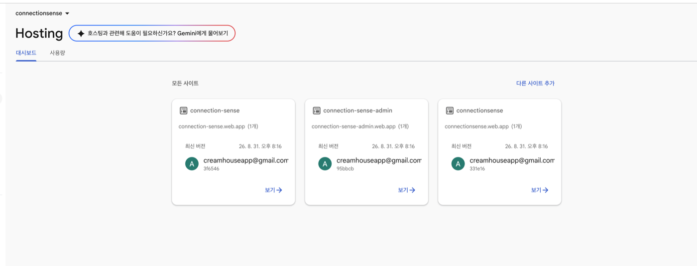

| 사이트 | 내용 | 소스 |
|---|---|---|
| `connection-sense` | 법적 고지(방침·약관) | `docs/legal` |
| `connection-sense-admin` | 관리자 콘솔 | `docs/admin` |
| **`connectionsense`** | **홍보 페이지** ← 대표 도메인은 여기 | `docs/site` |

📌 **법적 고지 주소는 `connection-sense.web.app` 그대로 두는 것이 맞다.**
앱·플레이콘솔·카카오·네이버에 이미 박혀 있어, 바꾸면 그 전부를 고쳐야 하고
하나라도 빠지면 **방침을 볼 수 없는 상태**가 된다(보호법 §30② 「지속적 게재」).

**절차**

1. Hosting → `connectionsense` 사이트 → 「커스텀 도메인 추가」

   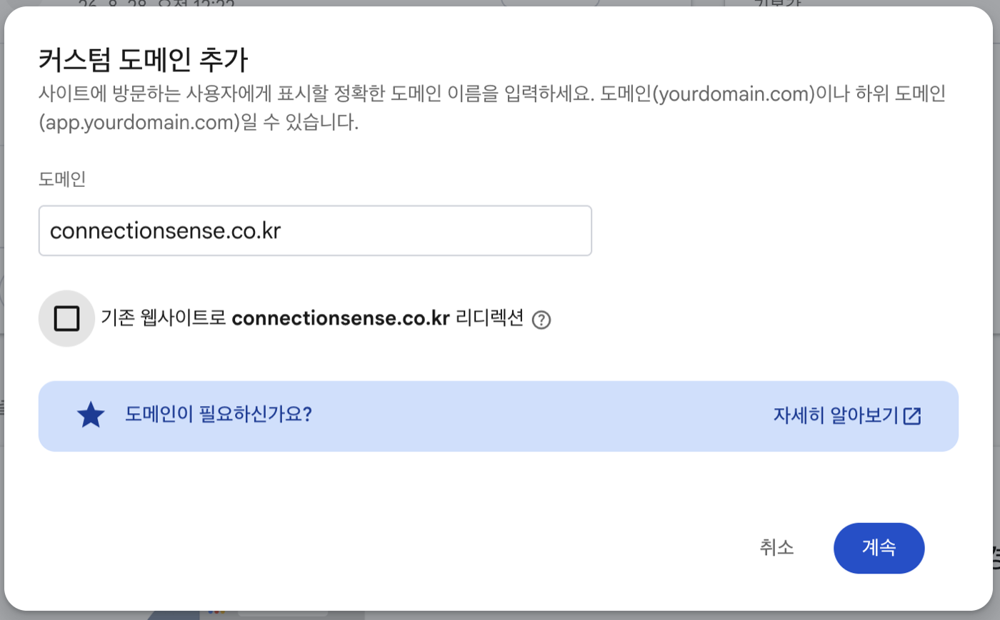

   🚨 **대표 도메인은 체크하지 않는다.** 「기존 웹사이트로 리디렉션」을 켜면
   대표가 다른 데로 튕겨 나간다. **나머지 넷에만 켠다.**

2. Firebase가 값 둘을 준다 — **다섯 도메인 모두 같은 값**이다(TXT는 사이트를
   가리키는 값이라 도메인마다 다르지 않다).

   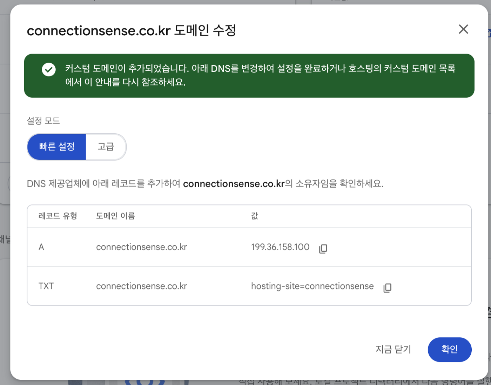

3. 닷네임코리아 → **DNS 관리 → DNS 레코드 설정**

   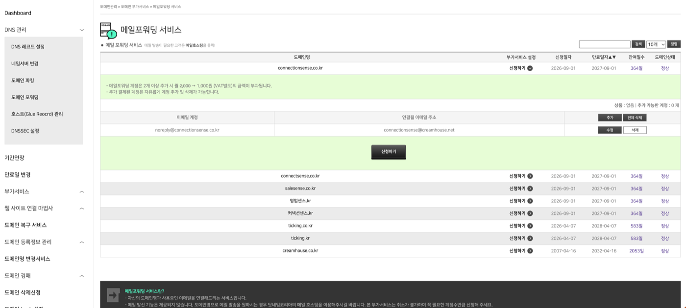

   ⚠️ 「도메인 포워딩」이 아니다. 그건 주소를 튕겨보내는 것이라 Firebase 연결에 못 쓴다.

   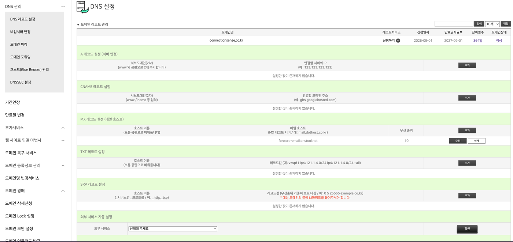

   | 넣을 곳 | 서브도메인 | 값 |
   |---|---|---|
   | A 레코드 | (비움) | `199.36.158.100` |
   | TXT 레코드 | (비움) | `hosting-site=connectionsense` |

4. 🚨 **`www`는 A가 아니라 CNAME이다.**

   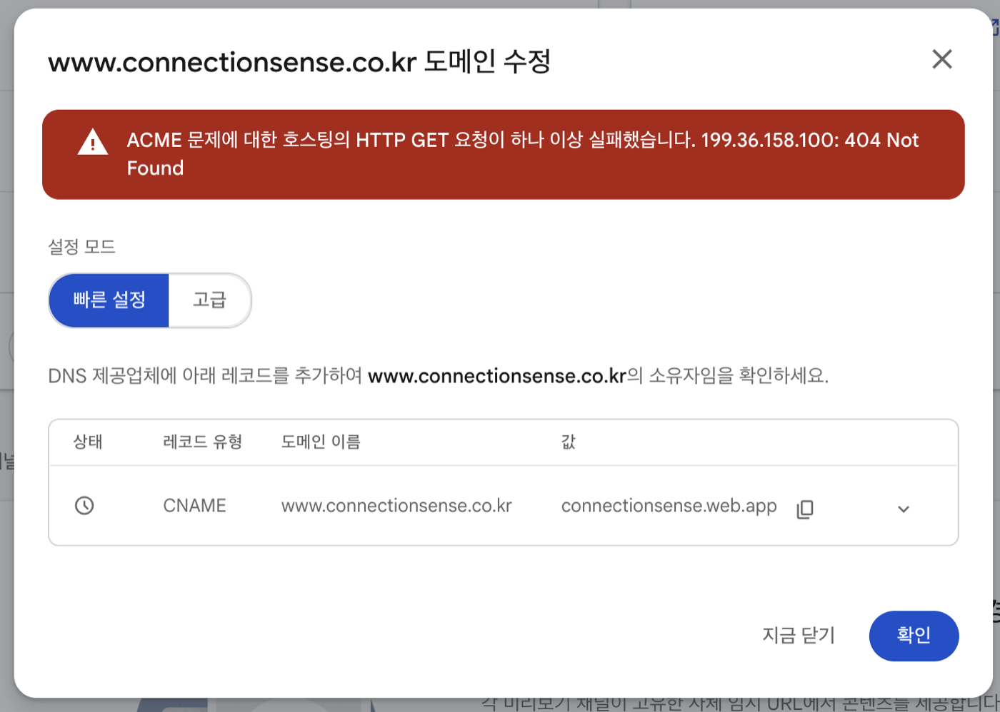

   닷네임코리아 화면의 *"www 와 공란으로 2개 추가합니다"*는 **일반 안내**이고,
   Firebase는 `www`를 CNAME으로 받는다. A로 넣으면 위처럼 **ACME 404**로 실패한다.
   **등록업체의 안내와 Firebase의 요구는 다르다.**

   | 넣을 곳 | 서브도메인 | 값 |
   |---|---|---|
   | CNAME | `www` | `connectionsense.web.app` (끝 점 없이) |

   그리고 Firebase에도 `www.connectionsense.co.kr`을 **리디렉션 체크를 켜고** 추가한다.

5. SSL 인증서 발급을 기다린다 — **실측 30분**(Firebase 안내는 최대 24시간).

   ⚠️ **기다리는 동안 DNS를 건드리면 처음부터 다시 시작된다.**

   ⚠️ **콘솔 표시가 실물보다 늦다.** 「인증서 발급 중」이라고 떠 있는데
   `https`가 이미 200을 주는 일이 있었다. **재는 쪽을 믿는다.**

   ```
   curl -s -o /dev/null -w "%{http_code}" https://connectionsense.co.kr/
   ```

6. 완료 화면

   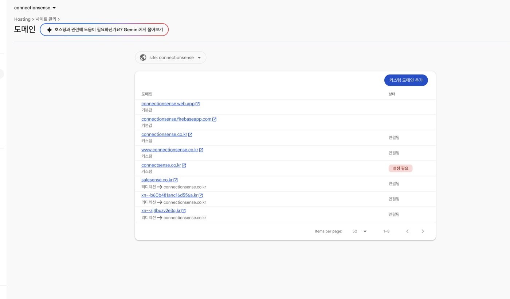

   🚨 **리디렉션 대상 오타를 반드시 확인한다.** 실제로 `connectionse<b>e</b>nse.co.kr`로
   오타가 들어가 존재하지 않는 주소로 보내고 있었다. **눈으로는 안 보인다** — 재야 한다.

   ```
   curl -s -o /dev/null -w "%{redirect_url}\n" https://connectsense.co.kr/
   ```

### 3-5-3. 메일 — 인증 메일이 스팸함으로 가던 문제

**증상**: 가입 인증·비밀번호 재설정 메일이 **스팸함으로 갔다**(추가 639).

**원인**: 발신이 `noreply@connection-sense.firebaseapp.com`이라 **우리 도메인과
무관한 곳에서 온 메일**로 보였다.

📌 **방향을 갈라서 이해해야 한다** — 이걸 혼동하면 "설정했는데 왜 그대로냐"가 된다.

```
받는 쪽(inbound)   포워딩 · MX      → 누가 우리에게 보낸 메일
보내는 쪽(outbound) SPF · DKIM      → 우리가 남에게 보내는 메일  ← 스팸함은 여기
```

#### (가) 회사 도메인 `creamhouse.net` 정리 — 커넥션센스와 무관하게 해야 했던 것

🚨 **SPF가 세 줄이었다.** SPF는 도메인에 **하나여야** 하고, 둘 이상이면 받는
서버가 **검사를 통째로 건너뛴다.** 즉 회사에서 나가던 **모든 메일이 이미
불리한 상태**였다.

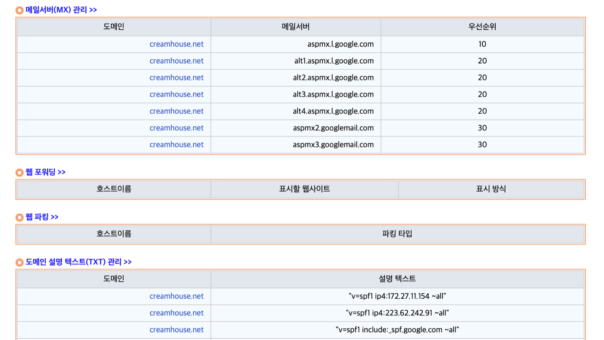

| 줄 | 판정 |
|---|---|
| `ip4:172.27.11.154` | 🚨 **사설 IP** — 인터넷에서 그 주소로 도착하는 메일은 **원리상 없다.** 아무 일도 안 하던 줄 |
| `ip4:223.62.242.91` | SK텔레콤 대역 · 메일 포트 전부 닫힘. 안 쓰는 듯하나 확실치 않아 **품어서** 합쳤다 |
| `include:_spf.google.com` | ✅ 실제로 쓰는 것(MX가 전부 구글) |

**최종형 (DNSEver → 도메인 설명 텍스트(TXT) 관리)**

```
v=spf1 ip4:223.62.242.91 include:_spf.google.com include:_spf.firebasemail.com ~all
```

⚠️ **SPF는 조회 10회를 넘어도 무효가 된다.** 2026-09-01 실측 **5회**로 여유 있다.
`include:`를 더할 때는 다시 재 볼 것.

**DKIM (Google Workspace)** — 회사 메일에 서명을 붙인다.

관리 콘솔 → 앱 → Google Workspace → Gmail → **이메일 인증**

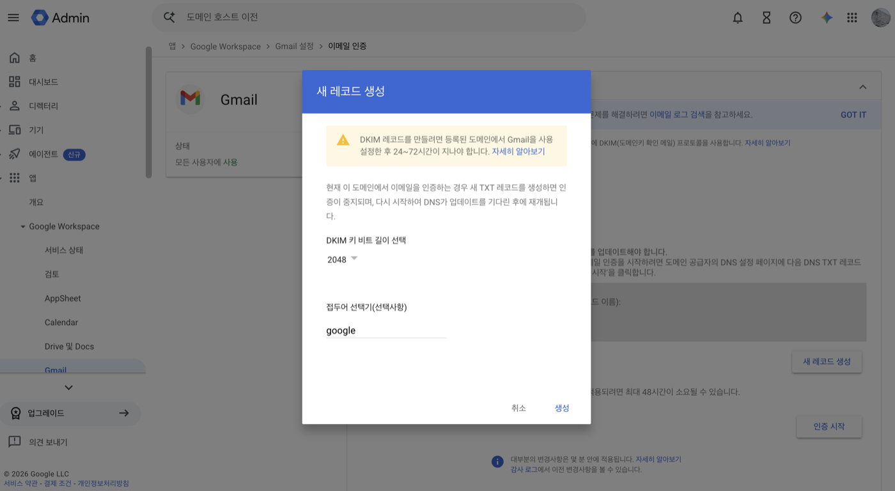

- 비트 길이 **2048**, 접두어 `google` 그대로.
- ⚠️ **「새 레코드 생성」을 누를 때마다 열쇠가 새로 만들어진다.** 값을 DNS에 넣기
  전에 다시 누르면 **DNS 값이 그 즉시 낡는다.** 2026-09-01에 세 번 겪었다.

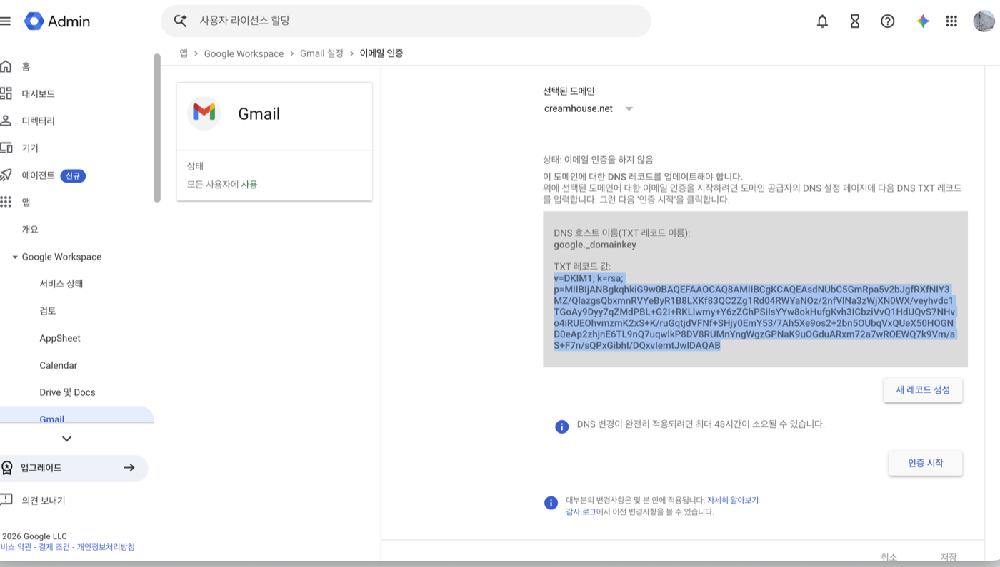

- 값이 **408자**로 길다. DNSEver는 **255자 넘는 값을 알아서 나눠 내보낸다**
  (실측 확인 — 1024로 낮출 필요 없다).
- DNSEver에 `google._domainkey`로 넣고 **「변경」을 눌러야 저장된다.**
  목록에 보이는 것만으로는 안 나간다.

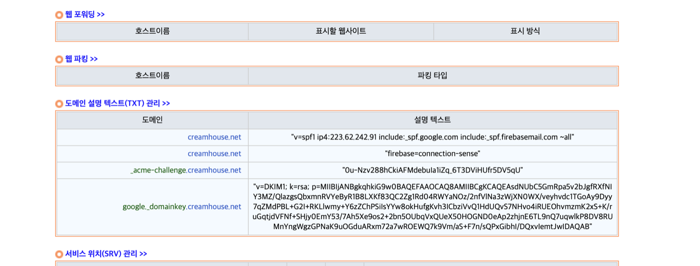

- DNS가 퍼진 뒤 콘솔에서 **「인증 시작」**.

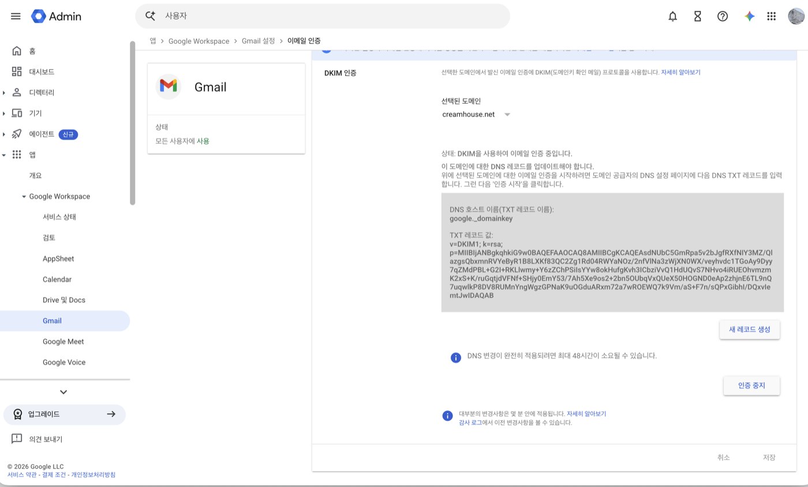

⚠️ **DNSEver는 네임서버 다섯(ns43·75·84·231·259)에 순차 전파된다.**
`ns43`·`ns231`이 **한 시간 넘게** 늦은 적이 있다. **한 서버만 보고 판정하지 말 것.**

```
for ns in ns43 ns75 ns84 ns231 ns259; do dig +short TXT google._domainkey.creamhouse.net @$ns.dnsever.com; done
```

#### (나) 발신 도메인 — **회사 것이 아니라 앱 것으로**

⭐ 처음에는 `creamhouse.net`으로 잡았다가 **`connectionsense.co.kr`로 옮겼다.**

| | `creamhouse.net` | **`connectionsense.co.kr`** |
|---|---|---|
| 브랜드 | 회사 도메인 · 앱 이름과 무관 | ✅ 앱 이름 그대로 |
| 회사 메일 | SPF를 계속 건드려야 함 | ✅ 건드릴 일 없음 |
| 답장 경로 | — | ✅ 포워딩이 이미 걸려 있음 |

**절차** — Firebase 콘솔 → **Authentication** → 템플릿 → 「이메일 주소 인증」 연필
→ 발신 주소 옆 **「도메인 직접 입력」**

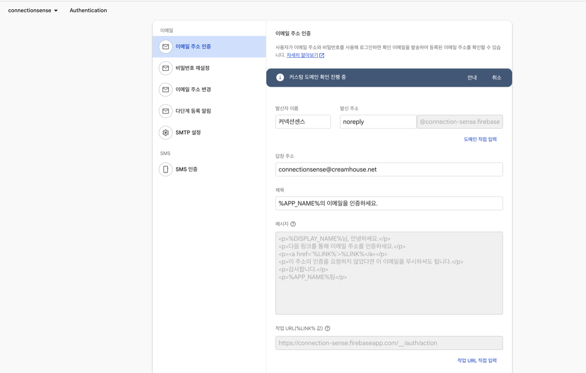

⚠️ **호스팅이 아니라 Authentication이다.** 화면이 비슷해 헷갈린다.

파란 띠의 **「안내」**를 누르면 값 넷이 나온다.

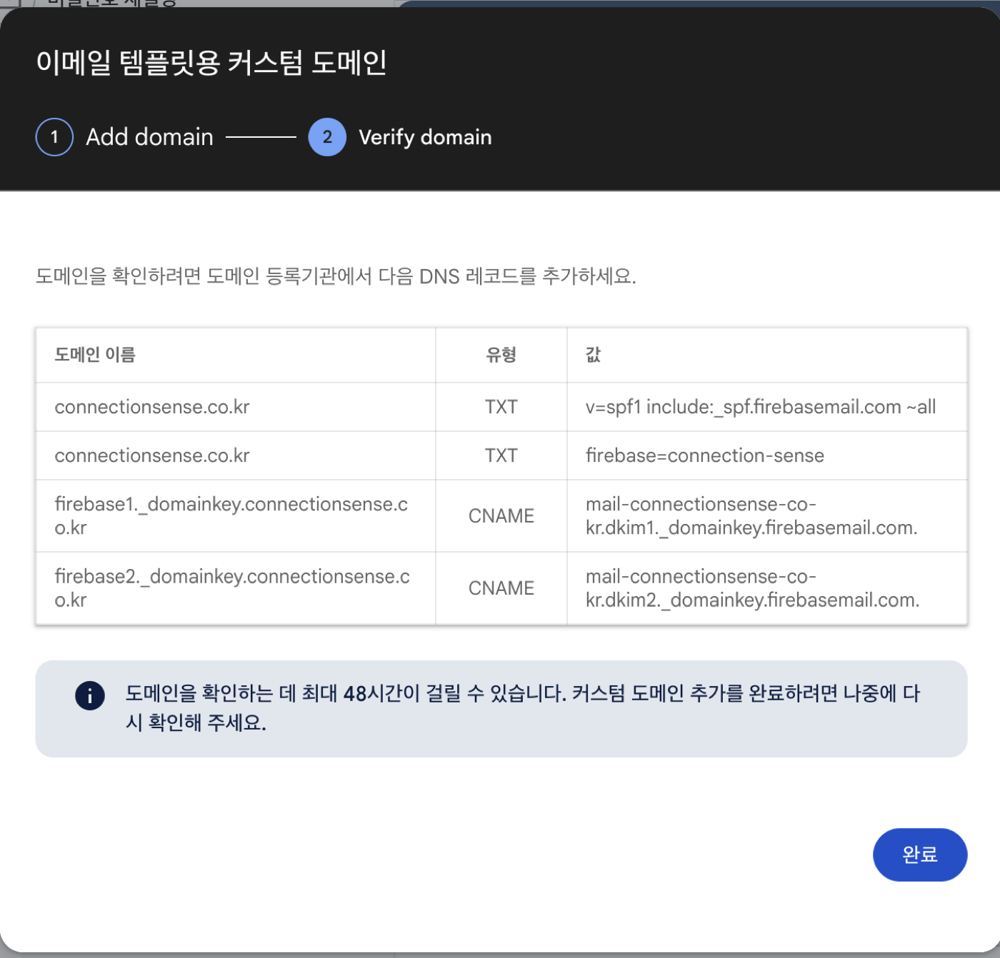

| 유형 | 이름 | 값 |
|---|---|---|
| TXT | (비움) | `v=spf1 include:_spf.firebasemail.com ~all` |
| TXT | (비움) | `firebase=connection-sense` |
| CNAME | `firebase1._domainkey` | `mail-connectionsense-co-kr.dkim1._domainkey.firebasemail.com` |
| CNAME | `firebase2._domainkey` | `mail-connectionsense-co-kr.dkim2._domainkey.firebasemail.com` |

🚨 **Firebase는 SPF를 「추가」하라고 안내하지만, 이미 SPF가 있으면 「수정」해서
한 줄에 합쳐야 한다.** 그대로 추가하면 두 줄이 되어 **SPF가 통째로 무효**가 된다.
`connectionsense.co.kr`에는 SPF가 없었으므로 그냥 넣었다.

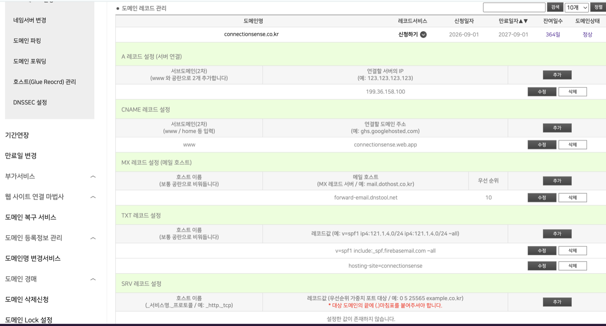

- ⚠️ CNAME 값 끝의 점(`.`)은 **빼고** 넣는다.
- ⚠️ 서브도메인 칸에 `.connectionsense.co.kr`을 붙이지 않는다 — 자동으로 붙는다.
- ⚠️ `dkim1`↔`firebase1`, `dkim2`↔`firebase2` 숫자를 맞춘다.

**확인은 실측 55분** 걸렸다(콘솔 안내는 최대 48시간).

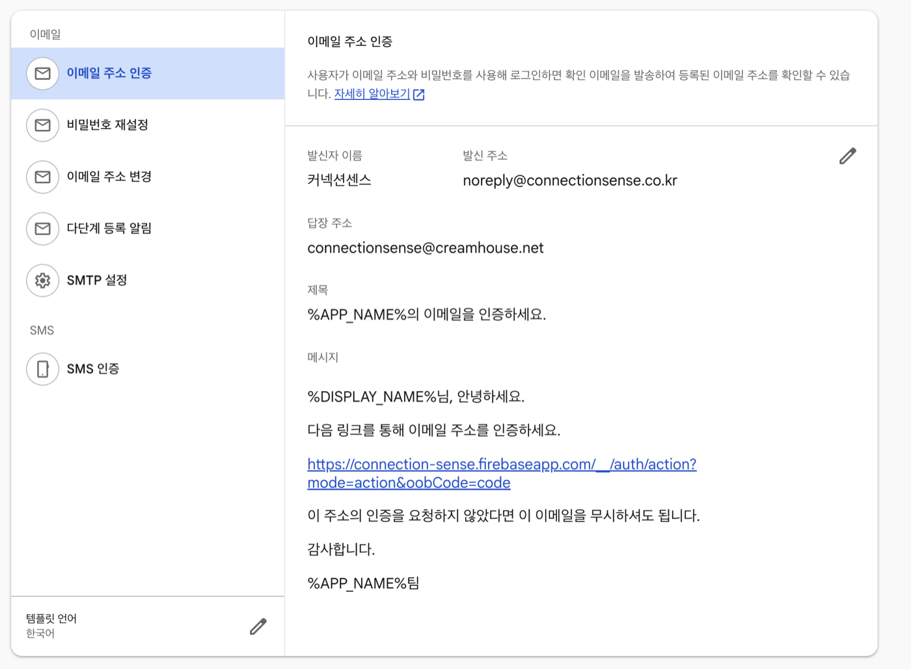

#### (다) 결과 — 받은편지함으로 온다

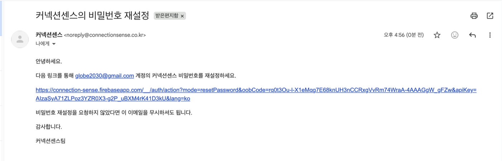

```
발신자 이름   커넥션센스
발신 주소     noreply@connectionsense.co.kr
답장 주소     connectionsense@creamhouse.net
제목·본문     %APP_NAME% → 「커넥션센스」로 자동 치환
```

📌 **`%APP_NAME%`은 프로젝트 「공개용 이름」을 쓴다**(프로젝트 이름이 아니다).
설정 → 일반 → 공개 설정 → 공개용 이름 = **커넥션센스**. 그래서 **제목도 본문도
손댈 필요가 없었다.**

⚠️ **「이메일 주소 인증」과 「이메일 주소 변경」 템플릿의 본문은 수정할 수 없다**
(구글이 스팸·피싱 악용을 막으려고 잠가 뒀다). **비밀번호 재설정만 수정 가능.**
공개용 이름을 바꾸는 것이 본문까지 바꾸는 유일한 방법이다.

⚠️ **템플릿 저장에는 횟수 제한이 있다.** 연달아 여러 개를 고치면
*"현재 이 프로젝트에서는 이메일 템플릿 업데이트를 사용할 수 없습니다"*가 뜬다.
시간이 지나면 풀린다.

⚠️ **커스텀 도메인이 「확인 진행 중」인 동안에는 템플릿 저장이 막힌다.**
화면은 저장된 것처럼 보이지만 서버에는 안 들어간다. **파란 띠의 「취소」를 눌러
잠금을 풀고 저장한 뒤 다시 신청**하면 된다(DNS는 그대로 두면 재신청이 빠르다).

#### (라) DMARC — SPF·DKIM 다음 단계

**둘 다 있어도 DMARC가 없으면 절반만 한 것이다.** 받는 쪽에 *"검사가 실패하면
어떻게 하라"*를 알려 주고, **사칭 시도를 보고서로 받는다.**

**두 도메인 모두에 넣었다.**

| 도메인 | 화면 | 호스트 이름 |
|---|---|---|
| `creamhouse.net` | DNSEver → TXT 관리 | `_dmarc` |
| `connectionsense.co.kr` | 닷네임코리아 → TXT 레코드 | `_dmarc` |

```
v=DMARC1; p=none; rua=mailto:connectionsense@creamhouse.net
```

⚠️ **`p=none`은 아무것도 막지 않는다** — 보고만 받는 설정이라 메일이 차단될
위험이 없다. 몇 주 지켜보고 문제가 없으면 그때 `p=quarantine` → `p=reject`로
단계를 올린다. **처음부터 강하게 걸면 정상 메일이 막힌다.**

⚠️ **호스트 이름에 `_dmarc`를 반드시 넣는다.** 비워 두면 루트 TXT에 들어가
SPF 옆에 엉뚱한 줄이 생긴다.

### 3-5-4. 값이 깨졌는지 한 번에 재는 법

```bash
D=connectionsense.co.kr    # 또는 creamhouse.net
dig +short TXT $D | grep spf          # SPF — 반드시 한 줄
dig +short TXT _dmarc.$D              # DMARC
dig +short CNAME firebase1._domainkey.$D
dig +short CNAME firebase2._domainkey.$D
curl -s -o /dev/null -w "%{http_code}\n" https://$D/
```

⚠️ **공개 DNS(8.8.8.8)와 권한 네임서버가 다를 수 있다.** 확인이 안 되면
권한 서버에 직접 물어본다.

```bash
for ns in $(dig +short NS $D); do dig +short TXT $D @$ns; done
```

### 3-5-5. ⬜ 아직 안 한 것

| 항목 | 왜 | 언제 |
|---|---|---|
| 법적 고지를 대표 도메인으로 | 지금 `connection-sense.web.app` — 옮기면 앱·스토어·소셜 콘솔의 URL을 **전부** 고쳐야 한다 | 신중히, 한 번에 |
| 비밀번호 재설정 화면 자체 제작 | Firebase 기본 화면이 새 비밀번호를 **한 번만** 받는다(추가 641·649) | 도메인이 섰으니 착수 가능 |
| 작업 URL(`%LINK%`) 교체 | 지금 `connection-sense.firebaseapp.com/__/auth/action` | 위 화면을 만들 때 함께 |
| `creamhouse.net`의 Firebase DKIM 제거 | 발신을 옮겨서 안 쓰인다. **다만 무해하고 SPF 조회도 여유 있어 급하지 않다** | 정리할 때 |

---

## 4. 참고 — 이 프로젝트에서 쓰는 주소 전부

**주의**: Firebase Blaze 결제, Google Cloud 결제, Google AI Studio(Gemini)
결제는 **서로 다른 시스템**이다(2026-08-07 확인 — backlog 추가 96 참고).
카드를 한 번 등록했다고 셋 다 자동으로 연결되는 게 아니라서, 문제가 생기면
아래 표에서 "정확히 어느 콘솔"인지 구분해서 확인해야 한다. 같은 이유로
**Apple Developer Portal 권한과 App Store Connect 권한도 별개 시스템**이다
(3-1의 P-1 참고).

| 용도 | 주소 | 비고 |
|---|---|---|
| Firebase 콘솔(프로젝트 개요) | https://console.firebase.google.com/project/connection-sense/overview | |
| Firestore 데이터 직접 조회/수정 | https://console.firebase.google.com/project/connection-sense/firestore/data | 사용량 카운터(`users/{uid}.aiUsage`) 등을 관리자 권한으로 직접 볼 때. **운영 데이터라 신중히.** |
| Google Cloud 콘솔 — 결제 예산 및 알림 | https://console.cloud.google.com/billing/budgets | Firebase Blaze 전체 사용량 예산. **알림만 보내고 자동 차단은 안 한다**(2-3 참고). **Gemini API 자체 결제는 여기 안 잡힘**(아래 항목 참고). |
| Firebase 콘솔 — App Check | https://console.firebase.google.com/project/connection-sense/appcheck | 앱별 인증 제공자(Play Integrity/App Attest) 등록, 디버그 토큰 관리, 토큰 도착 현황 확인. 위 2절 참고. |
| Google Cloud 콘솔 — API 라이브러리(Gmail API) | https://console.cloud.google.com/apis/library/gmail.googleapis.com?project=connection-sense | 앱의 Gmail 가져오기 기능이 403으로 실패하면 여기서 "사용 설정"이 꺼져 있는지 가장 먼저 확인(2026-08-07 실제로 이게 원인이었음 — 추가 98). |
| Google AI Studio — API 키 발급 | https://aistudio.google.com/api-keys | 반드시 "connection-sense" 프로젝트로 만든 키를 쓸 것(위 1-3 참고). |
| Google AI Studio — 프로젝트/선불 크레딧 | https://aistudio.google.com/projects | Gemini API는 Firebase Blaze와 별개로 **자체 선불 크레딧**을 쓴다. "prepayment credits are depleted" 에러가 나면 여기서 충전(최소 단위 16,000원 확인됨, 2026-08-07). |
| Google AI Studio — 월 지출 한도(spend cap) | https://aistudio.google.com/spend | 크레딧을 충전해도 이 한도가 낮게 잡혀 있으면 또 429로 막힌다 — "project has exceeded its monthly spending cap" 에러가 나면 여기서 상향(2026-08-07 실제로 겪음 — 추가 96). |
| GitHub 저장소 | https://github.com/globe2030-git/connection-trace-ai-v2-flutter | |
| **App Store Connect** | https://appstoreconnect.apple.com | 빌드 업로드·앱 레코드·TestFlight·App Privacy. ⚠️ `appstoreconnect.com`이 아니라 **`.apple.com`**이다 |
| App Store Connect — 사용자 및 접근 | https://appstoreconnect.apple.com/access/users | 업로드 403(P-1)이 나면 **여기부터** 볼 것 |
| Apple Developer — 계정 | https://developer.apple.com/account | 팀 ID `77L7BH2M2W` |
| Apple Developer — Keys(.p8) | https://developer.apple.com/account/resources/authkeys/list | Sign in with Apple 키. **발급 시 한 번만 내려받을 수 있다** |
| Apple Developer — Identifiers | https://developer.apple.com/account/resources/identifiers/list | App ID `com.creamhouse.connectionsense`, Services ID |
| Apple Developer — Certificates | https://developer.apple.com/account/resources/certificates/list | 만료 정책: https://developer.apple.com/support/expiration/ |
| **Google Play Console** | https://play.google.com/console | 앱 등록·내부 테스트·앱 콘텐츠·데이터 보안 |
| Play Console — 개발자 계정 가입 | https://play.google.com/console/signup | $25 1회 |
| Firebase — Authentication(로그인 방법) | https://console.firebase.google.com/project/connection-sense/authentication/providers | Apple 제공사 등록(P-3) |
| Firebase — Authentication(사용자) | https://console.firebase.google.com/project/connection-sense/authentication/users | 계정 정리·인증 상태 확인 |
| Firebase — App Distribution | https://console.firebase.google.com/project/connection-sense/appdistribution | Play 트랙 쓰기 전 임시 테스터 배포 |
| Firebase — Hosting | https://console.firebase.google.com/project/connection-sense/hosting/sites | **`legal`·`admin`·`site` 세 사이트**(2026-09-01 정정 — `site`가 홍보 페이지). 3-5-2 참고 |
| **관리자 콘솔(운영)** | https://connection-sense-admin.web.app | 공지·1:1문의·법적문서 편집. `connectionsense@creamhouse.net`으로 **Google 계정 로그인** |
| **홈페이지(공개)** | https://connectionsense.co.kr | 홍보 페이지. Firebase Hosting `site` 타겟(`docs/site`). 3-5-2 참고 |
| 도메인 등록·DNS — 닷네임코리아 | https://www.dotname.co.kr | `connectionsense.co.kr` 외 4개. **웹·인증메일 DNS는 여기** |
| 도메인 DNS — DNSEver | https://kr.dnsever.com | `creamhouse.net`(회사 메일). **위와 다른 곳이다** |
| Google Workspace 관리 콘솔 | https://admin.google.com | 회사 메일 DKIM. 앱 → Google Workspace → Gmail → 이메일 인증 |
| 법적 고지(공개) | https://connection-sense.web.app | 스토어 양식에 넣는 URL — 3-3 참고 |
| 관리자 웹 콘솔(공지/문의/법적문서/경영리포트) | Firebase Hosting `admin` 타겟으로 배포 (`firebase deploy --only hosting:admin`) | |

### 2026-08-07에 실제로 겪은 문제 → 어느 콘솔에서 풀었는지

AI 브리핑을 처음 실기기로 써보면서 겪은 순서 그대로. 다음에 비슷한 에러가
나면 이 표에서 증상으로 먼저 찾아볼 것.

| 에러 메시지(요지) | 원인 | 어디서 해결 |
|---|---|---|
| "Your prepayment credits are depleted" | Gemini API 자체 선불 크레딧이 0원 | AI Studio — 프로젝트/선불 크레딧 페이지에서 충전 |
| "Your project has exceeded its monthly spending cap" | 위 크레딧을 채워도 월 지출 한도 자체가 낮게 걸려 있음 | AI Studio — 월 지출 한도 페이지에서 상향 |
| "AI 브리핑 서비스 준비 중이에요" (반복) | 서버(`generateBriefing`)의 사용자별 하루 호출 한도(10회)를 오늘 테스트로 다 씀 | Firestore 데이터 직접 조회/수정 페이지에서 `users/{uid}.aiUsage.dailyCount`를 0으로 |
| Gmail 가져오기 "Bad state: Gmail 조회에 실패했습니다 (403)" | connection-sense 프로젝트에서 Gmail API 자체가 비활성화 상태 | Google Cloud 콘솔 — API 라이브러리(Gmail API) 페이지에서 "사용 설정" |

---

## 5. 앱 업데이트 안내(버전 게이트) 운영 가이드

관리자 콘솔 **"앱 업데이트" 탭**에서 "지금 스토어에 올라간 앱보다 낡은
빌드를 쓰는 사람"에게 업데이트를 안내하는 기능. **코드 배포 없이, 여기서
값만 바꾸면 앱을 다시 켤 때 즉시 반영**된다(config/appUpdate, P1-45).

이 기능은 **읽을 줄 알아야 하는 두 가지 숫자**로 동작한다.

- **빌드 번호**: 스토어에 올라간 앱 버전이 아니라, `pubspec.yaml`의
  `1.0.0+7` 같은 표기에서 **`+` 뒤의 정수**다. 화면에 보이는 "1.0.0"이
  아니라 "7" 쪽. 앱은 자기 빌드 번호와 여기 설정한 숫자를 비교한다.
- **최소 지원 빌드 / 최신 빌드**: "최소"보다 낮으면 **강제**(닫을 수 없고
  스토어로만 이동), "최신"보다 낮으면 **권장**("나중에" 허용). 두 값 다
  0이면 아무 안내도 하지 않는다.

**iOS/Android는 따로 설정한다**(2026-08-12, PR #117). 두 스토어의 심사
통과 시점이 서로 다르기 때문 — 예를 들어 iOS 빌드 7이 먼저 심사를
통과했는데 Android는 아직 6이면, "최신 빌드"를 하나로만 두면 아직 스토어에
없는 Android 7을 있다고 잘못 안내하게 된다. 그래서 iOS/Android 칸이
각각 따로 있다 — **자기 플랫폼 칸만 채우면 된다.**

### 5-1. 언제 값을 바꾸나 (평소 운영 순서)

1. 새 빌드를 스토어(App Store/Play)에 올리고 **심사를 통과**시킨다.
2. 그 플랫폼의 **"최신 빌드 번호"** 칸에 새 빌드 번호를 넣고 저장 →
   구버전 사용자에게 "업데이트 있어요"(권장, 닫아도 됨) 안내가 뜨기
   시작한다.
3. 그 빌드가 **문제없이 며칠 안정적으로 돌아간다고 확인되면**, 그때
   "최소 지원 빌드 번호"를 그 아래 어떤 빌드까지 봐줄지로 올려 강제
   전환한다. **새 빌드를 올리자마자 바로 최소값을 올리지 말 것** — 아직
   검증 안 된 빌드로 전원을 강제 이동시키는 셈이라 위험하다.
4. 두 플랫폼 다 갱신했으면 저장 한 번, 앱은 별도 배포 없이 다음 실행부터
   바로 반영한다.

### 5-2. 스토어 URL 채우는 법 (쉽게)

"iOS 스토어 URL" / "Android 스토어 URL" 칸은 안내 화면의 "스토어로 이동"
버튼이 여는 주소다. 형식만 맞추면 되고, 매번 똑같은 규칙이라 한 번 채워
두면 다시 바꿀 일이 거의 없다.

**🍎 iOS — `https://apps.apple.com/app/id` 뒤에 숫자만 붙이면 된다.**

```
https://apps.apple.com/app/id6501234567
```

- 뒤에 붙는 숫자는 **Apple ID**(앱마다 하나씩 자동으로 부여되는 고유
  번호, 개발자 본인 Apple 계정 ID와는 다른 것).
- 찾는 곳: **App Store Connect → 해당 앱 선택 → "앱 정보"(App
  Information) → "Apple ID"** 항목에 적힌 숫자를 그대로 복사해 위 URL
  뒤에 붙인다.

**🤖 Android — `https://play.google.com/store/apps/details?id=` 뒤에
패키지명을 붙이면 된다.**

```
https://play.google.com/store/apps/details?id=com.connectiontrace.connection_trace_ai_flutter
```

- 패키지명은 이미 정해져 있고 앞으로도 안 바뀐다 —
  **`com.connectiontrace.connection_trace_ai_flutter`**를 그대로 복사해
  붙이면 끝(`android/app/build.gradle.kts`의 `applicationId`와 동일).

**⚠️ 베타 심사 중 주의 — 두 URL 모두 스토어에 정식 공개(또는 공개
트랙)되기 전에는 링크를 눌러도 빈 페이지거나 "찾을 수 없음"이 뜬다.**
지금은 **URL만 미리 채워 두고, "최소 지원 빌드" 칸은 반드시 0(강제
없음)**으로 둘 것. 최소값을 0보다 높게 걸어 두면, 아직 스토어에 앱이
없는 상태에서 강제 업데이트를 발동시켜 **사용자를 갈 곳 없는 빈
스토어 페이지로 보내고 앱만 막는 사고**가 난다(soft-brick). 정식
공개가 확정된 뒤에 최소값을 올릴 것.

### 5-3. 구버전 앱과의 호환 (알아만 둘 것)

플랫폼별 칸(iOS/Android)과 별도로, 화면에는 안 보이는 **레거시 값**이
저장 시 자동으로 함께 채워진다(두 플랫폼 값 중 더 낮은 쪽). 아주 옛날
버전 앱(플랫폼 구분을 모르는 빌드)을 위한 안전장치라, 관리자가 따로
신경 쓸 부분은 없다 — 그냥 iOS/Android 칸만 정확히 채우면 나머지는
자동으로 처리된다.
