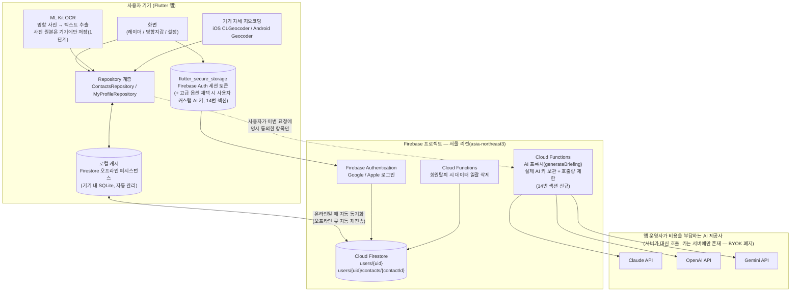

# 명함/인맥 데이터 서버 저장 — 구축 계획서 (Firebase 기반)

작성일: 2026-08-04 (최초 작성)
최종 개정일: 2026-08-04 — 사용자가 전제 두 가지를 변경(① AI 연동을
BYOK에서 앱 제공업체 서버 프록시 방식으로 전환하며 이번 범위에 포함,
② 사진 서버 저장을 "언젠가의 후보"에서 "확정된 2단계 계획"으로 승격).
무엇이 왜 바뀌었는지는 맨 아래 **"16. 문서 갱신 이력"** 참고.
작성자: 서비스 기획/PM (flutter-planner)
상태: **문서만 작성 완료, 코드 구현은 아직 시작 안 함**

> 이 문서는 코드를 한 줄도 바꾸지 않고 "무엇을, 왜, 어떤 순서로" 만들지만
> 정리한 설계 문서다. 실제 구현은 이 문서를 승인한 뒤 `flutter-developer`
> 에이전트에게 섹션 단위로 위임한다. 문서 안에서 확정하지 못하고 남겨둔
> 부분은 전부 **"확인 필요"** 라고 표시해 뒀다 — 실제 코드를 작성하는
> 시점에 다시 검토해야 한다.

## 사용자가 이미 확정한 전제

1. 백엔드는 **Firebase**(Firebase Auth + Cloud Firestore + Cloud Storage), 리전은 **서울(asia-northeast3)**.
2. **명함 사진 원본은 1단계에서는 서버에 올리지 않는다.** OCR로 뽑아낸 텍스트 필드만 Firestore에 저장하고, 원본 이미지는 기기에만 둔다. **2026-08-04 갱신**: "사진도 서버에 올리자"는 요청이 실제로 들어와, Cloud Storage 업로드를 막연한 후보가 아니라 **확정된 2단계 계획**으로 승격해 **15번 섹션**에 별도로 정리했다 — 단 1단계(이 문서의 1~13번 섹션)가 다루는 범위 자체는 바뀌지 않았고, 2단계는 1단계 출시 이후 별도로 착수한다.
3. **기존 로컬 데이터는 앱 업데이트 후 첫 로그인 시 자동으로 서버에 올라간다.** 단, 한 기기를 여러 계정이 써왔을 위험을 막을 확인 절차가 필요하다.
4. **오프라인 우선(오프라인에서도 조회·신규 등록이 되고, 온라인이 되면 자동 동기화).**
5. **2026-08-04 신규 확정**: AI 브리핑(Claude/OpenAI/Gemini) 연동을 **BYOK(사용자가 직접 API 키 발급)에서 앱 제공업체(운영사)가 서버에서 대신 제공하는 방식으로 전환한다.** 예전 계획서는 "AI는 BYOK 유지, 이번 범위 밖"으로 명시했으나, 이제 **이번 Firebase 서버 구축 작업 범위 안**에 포함된다 — 자세한 설계는 **14번 섹션**.

---

## 목차

1. [개요 / 왜 서버가 필요한가](#1-개요--왜-서버가-필요한가)
2. [아키텍처](#2-아키텍처)
3. [데이터 모델 / Firestore 스키마](#3-데이터-모델--firestore-스키마)
4. [보안 규칙(Security Rules)](#4-보안-규칙security-rules)
5. [인증 연동](#5-인증-연동)
6. [앱 코드 변경 범위](#6-앱-코드-변경-범위)
7. [마이그레이션 절차](#7-마이그레이션-절차-기존-로컬-데이터--서버)
8. [회원탈퇴 및 데이터 삭제 흐름](#8-회원탈퇴-및-데이터-삭제-흐름)
9. [개인정보 처리 관점](#9-개인정보-처리-관점)
10. [단계별 구축 절차](#10-단계별-구축-절차)
11. [비용 추정](#11-비용-추정)
12. [리스크 및 대응](#12-리스크-및-대응)
13. [체크리스트](#13-체크리스트-구축-완료-판단-기준)
14. [AI 연동 — BYOK에서 서버 프록시 방식으로 전환](#14-ai-연동--byok에서-서버-프록시-방식으로-전환)
15. [사진(명함원본·아바타·프로필) 서버 저장 — 2단계 계획](#15-사진명함원본아바타프로필-서버-저장--2단계-계획)
16. [문서 갱신 이력](#16-문서-갱신-이력)

---

## 1. 개요 / 왜 서버가 필요한가

지금까지 이 앱은 의도적으로 "서버 없음" 구조였다 — 명함·프로필·소통기록이
전부 사용자 기기(`shared_preferences`)에만 저장된다. 이 구조의 한계:

- **기기 분실/초기화 시 데이터가 전부 사라진다.** 명함 지갑에 수백 장이
  쌓여도 백업이 없다.
- **기기를 바꾸면(안드로이드→아이폰 포함) 처음부터 다시 등록해야 한다.**
- **로그인은 있지만 "회원"이 아니다.** 지금 SNS 로그인(`AuthRepository`)은
  기기에 세션만 암호화 저장하는 방식이라, 서버 쪽에 실제 계정 레코드가
  없다. 같은 계정으로 다른 기기에 로그인해도 데이터가 이어지지 않는다.
- **계정 전환 시 데이터가 섞인다(P0 버그, 2번 섹션에서 자세히 다룸).**
  `signOut()`이 로그인 세션만 지우고 명함/프로필은 기기에 전역으로 남아
  있어서, 같은 기기를 다른 계정이 쓰면 이전 사람 명함이 새 계정에도 보인다.

Firebase 기반 서버를 두면 이 네 가지가 모두 해결되고, 향후 "관리 콘솔
통계"(`docs/planning/design/admin_console_mockup.html`) 같은 후속
작업의 공통 기반도 마련된다.

**2026-08-04 범위 변경**: 원래 "AI 키를 서버가 대신 보유하는 방식"(구
HANDOFF 해야 할 일 2-b)은 이번 문서의 범위 밖으로 분류돼 있었으나,
사용자가 "AI 연동을 사용자가 직접 하는 게 불편하다"고 판단해 **이번
Firebase 서버 구축 작업에 포함시키기로 확정했다.** 명함/프로필 데이터
저장(1~13번 섹션)과 AI 프록시 전환(14번 섹션)을 같은 Firebase 프로젝트,
같은 구현 단계에서 함께 진행한다. 관리 콘솔 통계 착수만 여전히 이 문서의
범위 밖이다.

---

## 2. 아키텍처



**핵심 설계 포인트**

- **명함 사진 원본, 위치 좌표(위도/경도)는 이 다이어그램의 어느 화살표에도
  Firebase 방향으로 나가지 않는다(1단계 기준, 2단계는 15번 섹션).** 사진은
  OCR에만 쓰이고 기기에 남고, 좌표는 3번 섹션 하단의 "좌표(geo) 필드는 왜
  서버에 안 올리는가"를 볼 것.
- Firestore 오프라인 퍼시스턴스는 `cloud_firestore` SDK가 기본 제공하는
  기능으로, **직접 로컬 DB를 새로 만들 필요가 없다** — SDK가 기기 안에
  자체 캐시(SQLite 기반)를 두고, 화면은 그 캐시를 구독(`snapshots()`)해서
  그린다. 인터넷이 끊겨도 캐시에서 즉시 읽고 쓸 수 있고, 쓰기는 로컬 큐에
  쌓였다가 온라인이 되면 자동으로 서버에 반영된다. 지금 있는
  `shared_preferences` JSON 블롭 방식을 Firestore SDK의 캐시가 사실상
  대체하는 셈이다(6번 섹션에서 자세히).
- **AI 브리핑(Claude/OpenAI/Gemini) 연동은 2026-08-04부터 이번 작업 범위
  안에 포함된다.** 사용자가 직접 발급한 키(BYOK) 대신, 운영사가 보유한
  키를 Cloud Functions AI 프록시가 대신 호출하는 구조로 바뀐다 — 자세한
  설계는 14번 섹션. **API 키는 앱 바이너리 어디에도 들어가지 않는다**
  (앱을 디컴파일해도 키가 나오지 않도록, Cloud Functions 환경변수/Secret
  Manager에만 보관한다 — 클라이언트에 공용 키를 넣으면 리버스 엔지니어링
  으로 추출돼 무단 사용·과금 피해로 이어지기 때문).

---

## 3. 데이터 모델 / Firestore 스키마

기존 클라이언트 모델(`lib/data/models/contact_model.dart`,
`lib/data/models/my_profile_model.dart`)을 그대로 매핑한다 — 필드를
새로 짓지 않고 실제 코드에 있는 필드명을 기준으로 스키마를 설계했다.

### 컬렉션 구조

```
users (collection)
  └─ {uid} (document)                     ← Firebase Auth uid, 계정당 문서 1개
       ├─ profile: { ... }                ← MyProfileModel 매핑 (내 프로필)
       ├─ account: { ... }                ← 로그인/가입 메타데이터
       ├─ migration: { ... }              ← 7번 섹션의 마이그레이션 상태
       ├─ aiUsage: { ... }                ← AI 프록시 호출량 카운터(14번 섹션 신규)
       └─ contacts (subcollection)
            └─ {contactId} (document)     ← ContactModel 매핑 (등록한 명함 1건)
```

`{contactId}`는 지금 클라이언트가 이미 쓰고 있는
`ContactModel.id`(`DateTime.now().millisecondsSinceEpoch.toString()`)를
그대로 Firestore 문서 ID로 재사용한다. **다만 구현 시 Firestore가
자체 제공하는 `collection.doc().id`(20자 무작위 문자열, 오프라인 상태에서도
로컬에서 즉시 생성 가능)로 바꾸는 걸 권장** — 밀리초 타임스탬프 방식은
여러 기기에서 동시에 쓸 때 충돌 가능성이 이론상 있다(개인용 앱이라
실제로는 위험이 낮음. **확인 필요** — flutter-developer 구현 시 최종 판단).

### `users/{uid}` 문서

| 필드 | 타입 | 매핑 출처 | 비고 |
|---|---|---|---|
| `profile.name` | string | `MyProfileModel.name` | |
| `profile.title` | string | `MyProfileModel.title` | |
| `profile.company` | string | `MyProfileModel.company` | |
| `profile.phone` | string | `MyProfileModel.phone` | |
| `profile.email` | string | `MyProfileModel.email` | |
| `profile.address` | string | `MyProfileModel.address` | |
| `profile.addressDetail` | string \| null | `MyProfileModel.addressDetail` | |
| `profile.avatarPath` | **저장 안 함(1단계)** | `MyProfileModel.avatarPath` | 아래 "avatarPath/avatarUrl 처리" 참고. 2단계에서 `profile.avatarStoragePath`로 부활(15번 섹션) |
| `account.authProvider` | string | Firebase Auth `providerId` | `google.com` / `apple.com` |
| `account.email` | string | Firebase Auth `user.email` | 로그인 계정 이메일(SNS 제공) |
| `account.displayName` | string | Firebase Auth `user.displayName` | |
| `account.photoUrl` | string \| null | Firebase Auth `user.photoURL` | SNS가 호스팅하는 원격 URL이라 그대로 저장 가능(기기 로컬 파일이 아님) |
| `account.createdAt` | timestamp | 서버 생성 시각(`FieldValue.serverTimestamp()`) | 최초 가입일 |
| `account.updatedAt` | timestamp | 서버 시각 | 마지막 프로필 저장 시각 |
| `migration.legacyDataClaimed` | boolean | 앱이 기록 | 7번 섹션 |
| `migration.migratedAt` | timestamp \| null | 앱이 기록 | |
| `migration.contactCountAtMigration` | number \| null | 앱이 기록 | 이관 당시 명함 수(사후 검증용) |
| `aiUsage.dailyCount` / `aiUsage.dailyResetAt` | number / timestamp | Cloud Functions AI 프록시가 기록 | 14번 섹션 호출량 제한용, 대화 내용 자체는 저장하지 않음(권장안) |
| `aiUsage.monthlyCount` / `aiUsage.monthlyResetAt` | number / timestamp | Cloud Functions AI 프록시가 기록 | 상동 |

### `users/{uid}/contacts/{contactId}` 문서

| 필드 | 타입 | 매핑 출처(`ContactModel`) | Firestore 저장 여부 |
|---|---|---|---|
| `name` | string | `name` | O |
| `company` | string | `company` | O |
| `title` | string | `title` | O |
| `phone` | string | `phone` | O |
| `officePhone` | string \| null | `officePhone` | O |
| `email` | string | `email` | O |
| `address` | string \| null | `address` | O |
| `addressDetail` | string \| null | `addressDetail` | O |
| `postalCode` | string \| null | `postalCode` | O |
| `tags` | array\<string\> | `tags` | O |
| `talkingPoints` | array\<string\> | `talkingPoints` | O |
| `memo` | string \| null | `memo` | O |
| `isPriority` | boolean | `isPriority` | O |
| `commLogs` | array\<map\> | `commLogs`(`CommunicationLogModel`) | O (아래 표) |
| `avatarUrl` | **저장 안 함(1단계 기본값)** | `avatarUrl` | X — 아래 설명. 2단계에서 `avatarStoragePath`로 부활(15번 섹션) |
| `geo.lat` / `geo.lng` | **저장 보류(기본값 X)** | `geo`(`GeoPosition`) | X — 아래 설명, 법적 재검토 필요 |
| `createdAt` | timestamp | 서버 생성 시각 | O(신규) |
| `updatedAt` | timestamp | 서버 시각 | O(신규) |

`commLogs` 배열 원소(embedded map, `CommunicationLogModel` 매핑):

| 필드 | 타입 | 매핑 출처 |
|---|---|---|
| `id` | string | `CommunicationLogModel.id` |
| `type` | string | `type` (`call`/`sms`/`email`/`kakao`) |
| `summary` | string | `summary` |
| `timestamp` | timestamp | `timestamp` — 로컬 JSON은 ISO 문자열이지만 Firestore는 네이티브 `Timestamp` 타입으로 저장(정렬/쿼리에 유리) |
| `isAutoSynced` | boolean | `isAutoSynced`(항상 `false`, 출시 빌드는 수동 입력만) |
| `source` | string | `source`(`manual`/`gmail`) |

`commLogs`는 지금처럼 문서 안에 배열로 내장(embed)한다. 인맥 1명당
소통기록이 수백 건 이상 쌓이는 극단적 케이스에서만 Firestore 문서 크기
제한(1문서 최대 1MiB)에 걸릴 수 있는데, 텍스트 요약 위주라 현실적으로
거의 발생하지 않는다. 나중에 실제로 문제가 되면 `commLogs`를 별도
서브컬렉션(`users/{uid}/contacts/{contactId}/commLogs/{logId}`)으로
쪼개면 된다(지금은 과설계라 배열 방식 유지 권장).

### avatarPath / avatarUrl 처리 — 왜 서버에 안 올리는가

코드를 확인해 보니 `ContactModel.avatarUrl`과 `MyProfileModel.avatarPath`는
이름과 달리 **원격 URL이 아니라 기기 로컬 파일 경로**다(갤러리에서 고른
사진을 앱 문서 폴더에 복사해 둔 경로, `image_picker` 기반). 즉 "명함 원본
사진은 서버에 안 올린다"는 원칙과 같은 성격의 개인 사진 데이터다.

이번 1단계에서는 이 필드들을 **Firestore에 아예 저장하지 않는다**
(기기 로컬 전용 유지, 기기 교체 시 사진만 유실 — 텍스트 정보는 보존됨).
사람 얼굴이 담긴 사진이라 원본 명함 사진과 동일한 민감도로 취급하는 게
안전하다는 판단. **2026-08-04 갱신**: "사진도 서버에 올리자"는 요구가
실제로 들어와, Cloud Storage 업로드를 막연한 후보가 아니라 **확정된
2단계 계획**으로 승격했다(15번 섹션). 단 1단계(이 섹션 기준)는 여전히
사진을 올리지 않는 것으로 유지 — 2단계는 1단계 출시 이후 별도 착수한다.

### geo(좌표) 필드는 왜 서버에 안 올리는가 — 반드시 확인 필요

`backlog.md`(추가 40)에 이미 다음과 같은 판단이 기록돼 있다:

> 위치기반서비스 신고 판단: 현재 좌표는 사용자 단말에서만 일시 이용하고
> 사업자 서버로 전송하지 않으므로 위치정보지원센터 안내상 현재 구조는
> 신고 제외로 판단. **향후 좌표를 서버로 전송하거나 서버가 가공/추천하는
> 순간 재검토 필수.**

이번에 사용자가 확정한 범위는 "OCR 텍스트 필드(이름·회사·직함·전화·
이메일·주소·상세주소 등)"까지이고 좌표(`lat`/`lng`)는 명시적으로 포함되어
있지 않다. 주소 "텍스트"를 서버에 저장하는 것과, 그 주소를 지오코딩해서
나온 "좌표"를 서버에 저장하는 것은 한국 위치정보법(위치정보의 보호 및
이용 등에 관한 법률) 관점에서 성격이 다를 수 있다 — 좌표가 서버로
넘어가는 순간 "위치정보사업자 신고" 대상 여부를 다시 판단해야 한다는
경고가 이미 backlog에 남아 있다.

**이번 설계에서는 안전하게 좌표를 Firestore에 저장하지 않는 쪽으로
설계했다.** 대신:
- 명함의 주소(`address`, `addressDetail`, `postalCode`) 텍스트는 그대로
  Firestore에 동기화한다.
- 근접 감지(레이더)에 쓰는 좌표는 지금처럼 **기기에서 그때그때
  지오코딩해서 메모리에만 들고 있는 방식을 유지**한다(주소 텍스트가
  Firestore에서 내려오면, 그 주소를 기기 자체 지오코딩 API로 다시 변환).
  오프라인 상태에서는 지오코딩 자체가 안 될 수 있어(네트워크 필요) 좌표
  계산이 지연될 수 있지만, 이미 계산해 캐시해 둔 좌표는 로컬에 남아 있어
  큰 지장은 없다.

이 판단은 **법적 재검토가 필요한 영역**이라 "확인 필요"로 남겨둔다.
좌표를 서버에 저장하는 쪽으로 바꾸고 싶다면, 실제 구현 전에 위치정보
관련 법률 검토(필요 시 위치정보지원센터 문의)를 먼저 거칠 것을 권장한다.

### 인덱스

MVP 단계에서는 **별도 복합 인덱스(composite index)를 미리 만들 필요가
없다.** `users/{uid}/contacts` 서브컬렉션에서 단순히 "이 계정의 명함
전체를 최신순으로" 가져오는 정도의 쿼리(`orderBy('updatedAt', descending:
true)`)는 Firestore가 자동으로 인덱싱한다. 나중에 "우선순위이면서
최신순" 같은 다중 조건 쿼리(`where('isPriority', ...).orderBy(...)`)를
추가하면 Firestore 콘솔/로그에 "이 인덱스를 만들어라"는 안내와 함께
클릭 한 번으로 만들 수 있는 링크가 뜬다 — 그때 만들면 된다.

---

## 4. 보안 규칙(Security Rules)

Firestore 보안 규칙은 서버 코드 없이도 "누가 무엇을 읽고 쓸 수 있는지"를
강제하는 선언적 규칙이다. 아래 내용을 Firebase 콘솔의
Firestore Database → 규칙 탭에 그대로 붙여넣거나,
`firestore.rules` 파일로 관리하고 `firebase deploy --only firestore:rules`로
배포한다.

```
rules_version = '2';

service cloud.firestore {
  match /databases/{database}/documents {

    // users/{uid} 문서 — 본인만 읽고 쓸 수 있다.
    match /users/{userId} {
      allow read, write: if isOwner(userId);

      // users/{uid}/contacts/{contactId} — 본인 명함만 본인이 읽고 쓸 수 있다.
      match /contacts/{contactId} {
        allow read, delete: if isOwner(userId);
        allow create, update: if isOwner(userId) && isValidContact();
      }
    }

    function isOwner(userId) {
      return request.auth != null && request.auth.uid == userId;
    }

    // 최소한의 데이터 무결성 검사 — 필수 필드 존재, 과도하게 큰 문자열 방지.
    function isValidContact() {
      let data = request.resource.data;
      return data.name is string && data.name.size() < 200
        && data.company is string && data.company.size() < 200
        && data.phone is string && data.phone.size() < 50
        && (!('memo' in data) || data.memo == null || (data.memo is string && data.memo.size() < 5000));
    }

    // 위 경로 외 문서는 기본적으로 전부 거부(명시적 허용이 없으면 차단됨 —
    // Firestore 규칙은 화이트리스트 방식이라 별도 마지막 줄이 필요 없음).
  }
}
```

이 규칙의 핵심: **자기 자신의 `uid` 아래 문서만 읽고 쓸 수 있다.** 다른
사용자가 본인 계정으로 로그인한 뒤 API를 조작해서 남의 `users/{다른uid}`
문서를 읽으려고 시도해도 서버(Firestore)가 거부한다 — 클라이언트 코드의
실수와 무관하게 서버가 마지막 방어선 역할을 한다.

**배포 전 필수 확인**: Firebase 콘솔의 "규칙 놀이터(Rules Playground)"
에서 "로그인 안 한 상태로 읽기 시도", "다른 uid로 읽기 시도" 두 시나리오가
모두 거부되는지 시뮬레이션하고 배포할 것 — 13번 체크리스트에도 포함.

> 위 규칙은 Firestore(문서형 DB)용이다. Cloud Storage(사진 파일)용
> 보안 규칙은 문법이 다르고, 2단계(15번 섹션)에서 별도로 정리했다 —
> 1단계에는 사진을 올리지 않으므로 지금은 필요 없다.

---

## 5. 인증 연동

### 지금 구조 (`lib/data/repositories/auth_repository.dart`)

- `GoogleSignIn.instance.authenticate()`로 구글 계정 인증 → 계정 정보
  (`displayName`/`email`/`photoUrl`)를 직접 뽑아서 `flutter_secure_storage`에
  JSON으로 암호화 저장. **서버 쪽 회원 레코드는 없음.**
- Apple은 `signInWithApple()`이 항상 `AuthException`을 던지는 스텁 상태
  (`SnsAuthProvider.apple.isAvailable == false`).
- `signOut()`은 세션(`_sessionKey = 'auth_session_v1'`)만
  `flutter_secure_storage`에서 지운다. **다른 리포지토리(명함/프로필/AI
  키)는 전혀 건드리지 않는다 — 이게 P0 계정 격리 버그의 원인.**

### 바뀌는 부분

1. **`GoogleSignIn`으로 얻은 인증 정보를 그대로 Firebase Auth에 다시
   전달**한다. 즉 사용자 입장에서는 "Google로 로그인" 버튼을 누르는
   흐름이 똑같지만, 내부적으로 한 단계가 추가된다:
   `GoogleSignIn 인증 성공` → `GoogleAuthProvider.credential(...)` 생성
   → `FirebaseAuth.instance.signInWithCredential(credential)` 호출 →
   Firebase가 이 사람에게 고유한 `uid`를 발급(최초 1회) 또는 기존 `uid`를
   반환(재로그인 시 동일 `uid`가 항상 나옴 — 이게 "회원" 개념의 핵심).
   `google_sign_in: ^7.2.0`은 최신 v7 API(`GoogleSignIn.instance`
   싱글턴, `authorizationClient`로 액세스 토큰 획득)를 쓰고 있어서, 정확한
   idToken/accessToken 추출 방식은 **FlutterFire 공식 가이드로 구현 시점에
   재확인 필요**(문서 작성 시점에 v7 API 변경 이력이 있어 예제 코드가
   버전마다 다를 수 있음 — 확인 필요).
2. **`GoogleAuthGateway`(구글 로그인 1회 초기화 가드)는 그대로 유지**한다.
   Firebase Auth 추가와 무관하게 `GoogleSignIn.instance.initialize()`를
   앱 전체에서 한 번만 부르는 제약은 동일하게 지켜야 한다
   (`EmailSyncService`의 Gmail 가져오기도 같은 가드를 공유하므로).
3. **Apple 로그인**: `sign_in_with_apple` 패키지(HANDOFF 해야 할 일 3번에서
   이미 예정돼 있던 작업) + `OAuthProvider('apple.com').credential(...)` →
   동일하게 `signInWithCredential`. Apple Developer Program 가입이 선행
   조건인 것은 기존과 동일.
4. **세션 저장 방식이 바뀐다.** 지금처럼 수동으로 `flutter_secure_storage`에
   JSON을 쓰는 대신, `FirebaseAuth.instance.authStateChanges()` 스트림을
   구독해서 로그인 상태를 판단한다 — Firebase Auth SDK가 세션 토큰 저장·
   자동 갱신을 알아서 처리한다(내부적으로 기기 보안 저장소를 쓰므로
   보안 수준은 동일하거나 더 낫다).
5. **`signOut()`이 반드시 해야 할 일이 늘어난다** — 이번 서버 도입으로
   P0 버그를 실제로 고치는 지점이다:
   - `FirebaseAuth.instance.signOut()` 호출(세션 종료)
   - **로그아웃하는 `uid`로 네임스페이스된 로컬 캐시를 전부 정리**(6번
     섹션에서 "계정별 로컬 캐시 격리" 참고) — Firestore 오프라인 캐시는
     계정이 바뀌어도 자동으로 안 지워지므로 명시적으로 처리해야 한다.
   - `signInAsGuest()` 디버그 우회 메서드는 Firestore 연동 시점에 반드시
     제거하거나(HANDOFF 해야 할 일 7번에 이미 "OAuth 설정 끝나면 지울
     것"으로 예정돼 있음), `uid`가 없는 상태로 명함 화면에 진입하는 경로
     자체를 차단해야 한다 — `uid` 없이는 Firestore 규칙이 모든 읽기/쓰기를
     거부하므로 QA 우회 버튼이 그대로 있으면 크래시하거나 빈 화면만 보임.
6. **AI API 키(`ai_credentials_repository.dart`)는 더 이상 이번 변경과
   무관하지 않다.** 2026-08-04 결정으로 AI 연동이 BYOK에서 서버 프록시
   방식으로 바뀌면서, 이 리포지토리의 역할이 "사용자가 직접 발급한 키
   저장"에서 "고급 사용자용 선택적 커스텀 키 저장"(채택 여부 확인 필요)
   으로 축소되거나 완전히 제거될 수 있다 — 자세한 내용은 **14번 섹션
   "기존 BYOK UI 처리 방침"** 참고. 다만 Firebase Auth 세션 저장 방식이
   바뀌는 것(위 1~5항)은 이 항목과 무관하게 그대로 적용된다.

---

## 6. 앱 코드 변경 범위

### 새로 추가되는 의존성 (`pubspec.yaml`)

| 패키지 | 용도 |
|---|---|
| `firebase_core` | Firebase 초기화 |
| `firebase_auth` | Google/Apple 로그인을 Firebase 계정으로 연결 |
| `cloud_firestore` | 명함/프로필 데이터 저장 + 오프라인 캐시 |
| `cloud_functions` | 회원탈퇴 시 서버 쪽 일괄 삭제 함수 + **AI 프록시 콜러블 함수 호출(14번 섹션, 신규)** |
| (dev) `flutterfire_cli` | `flutterfire configure`로 플랫폼별 설정 파일 자동 생성 |

### 새로 생기는 파일

| 경로 | 역할 |
|---|---|
| `lib/firebase_options.dart` | `flutterfire configure`가 자동 생성(플랫폼별 Firebase 프로젝트 설정값) |
| `android/app/google-services.json` | Android Firebase 설정(자동 생성) |
| `ios/Runner/GoogleService-Info.plist` | iOS Firebase 설정(자동 생성) |
| `lib/data/repositories/migration_service.dart` (가칭) | 7번 섹션의 "레거시 로컬 데이터 확인·이관" 로직 |
| `lib/data/services/account_scoped_cache.dart` (가칭) | 계정(`uid`)별로 네임스페이스된 로컬 키 관리 유틸(P0 격리 버그 수정의 핵심) |
| `firestore.rules` | 4번 섹션 보안 규칙(레포 루트 또는 `firebase/` 디렉터리) |
| `functions/` (Node.js 또는 Python 프로젝트) | `deleteAccountData` Cloud Function(8번 섹션) |
| `functions/src/generateBriefing.*` | **신규(14번 섹션)** — AI 프록시 콜러블 함수. 실제 Claude/OpenAI/Gemini API 키를 서버 환경변수/Secret Manager에서 읽어 호출하고, 사용자별 호출량 제한을 적용한다. |
| `firebase.json`, `.firebaserc` | Firebase CLI 프로젝트 연결 설정 |

### 바뀌는 기존 파일

| 경로 | 변경 내용 |
|---|---|
| `lib/main.dart` | `runApp()` 전에 `Firebase.initializeApp(options: DefaultFirebaseOptions.currentPlatform)` 추가. `ContactsRepository`/`MyProfileRepository`가 Firestore 기반으로 바뀌면서 생성자 시그니처가 바뀔 수 있음(Firestore 인스턴스 + 현재 `uid` 주입 필요). |
| `lib/data/repositories/auth_repository.dart` | 5번 섹션 전체 재작성. `FirebaseAuth` 래퍼로 축소되고, `signOut()`이 계정별 로컬 캐시 정리를 함께 수행. |
| `lib/data/repositories/contacts_repository.dart` | `shared_preferences` 직접 읽고 쓰던 로직을 Firestore 서브컬렉션 구독(`snapshots()`)으로 교체. 오프라인 캐시는 Firestore SDK가 대신 관리하므로 수동 JSON 직렬화 코드(`_loadFromDisk`/`_saveToDisk`)는 제거됨. `addContact`/`updateContact`/`deleteContact`는 로컬 상태를 직접 바꾸는 대신 Firestore에 쓰기만 하면 SDK가 알아서 로컬 캐시와 화면을 갱신(`snapshots()` 리스너). |
| `lib/data/repositories/my_profile_repository.dart` | 위와 동일한 패턴으로 `users/{uid}` 문서의 `profile` 필드를 구독/갱신하는 방식으로 교체. |
| `lib/data/repositories/ai_credentials_repository.dart` | **변경됨(2026-08-04)** — 14번 섹션 참고. 기본 흐름에서는 더 이상 쓰이지 않는다(권장안: 완전 제거). "고급 사용자용 본인 키 사용" 옵션으로 남기면 축소된 형태로 유지(채택 여부 확인 필요, 14번 섹션에서 두 안 제시). |
| `lib/core/services/ai_briefing_service.dart` | **재작성(14번 섹션)** — Claude/OpenAI/Gemini REST API를 기기에서 직접 호출하던 로직을 제거하고, `FirebaseFunctions.instance.httpsCallable('generateBriefing')` 콜러블 함수 호출로 교체. |
| `lib/presentation/features/briefing/views/ai_data_review_sheet.dart` | **동의 흐름 자체는 유지(우회 금지, 사용자가 이미 확정한 전제)**, 동의 문구만 개정. "AI 제공사에 직접 전송"에서 "커넥션센스 서버를 거쳐 AI 제공사에 전달"로 바뀐 사실을 반영해야 함 — 문구 초안은 14번 섹션. |
| `lib/presentation/features/settings/views/ai_connection_modal_view.dart` | **화면 목적이 바뀔 가능성 높음** — "API 키 입력" 화면에서 "AI 연동 상태 안내"(기본 제공 중, 별도 키 입력 불필요, 남은 호출 횟수 표시 등) 화면으로. 고급 옵션 채택 여부에 따라 최종 형태 결정(14번 섹션). |
| `lib/presentation/common/auth_gate.dart` | 로그인 상태 판정 기준이 `AuthRepository.isSignedIn`(로컬 세션 유무)에서 `FirebaseAuth` 상태 + "마이그레이션 완료 여부"로 확장됨. 로그인 직후 마이그레이션이 끝날 때까지 짧은 로딩/확인 화면이 추가로 필요(7번 섹션). |
| `lib/presentation/features/settings/*` | "회원 탈퇴" 메뉴 신규 추가(8번 섹션) — 지금은 로그아웃만 있고 탈퇴 UI 자체가 없음. |
| `android/app/build.gradle.kts`, `ios/Podfile` | `flutterfire configure` 및 Firebase iOS SDK 설치 과정에서 자동/반자동으로 일부 변경(Google Services 플러그인 적용 등) — 기존에 있는 `camera_android_camerax` 우회 코드, ML Kit 한국어 pod 추가 부분과 충돌하지 않는지 빌드 시 확인 필요. |

### 오프라인 우선 구현 방법 (Firestore 오프라인 퍼시스턴스)

- 모바일에서는 `cloud_firestore`의 오프라인 퍼시스턴스가 **기본 활성화**돼
  있다. 명시적으로 캐시 크기를 지정해 의도를 코드에 남기는 걸 권장:
  ```dart
  FirebaseFirestore.instance.settings = const Settings(
    persistenceEnabled: true,
    cacheSizeBytes: Settings.CACHE_SIZE_UNLIMITED,
  );
  ```
- 화면은 `collection.snapshots()`(실시간 리스너)를 구독한다. 오프라인
  상태에서도 이 리스너는 로컬 캐시에서 즉시 데이터를 준다 — "인터넷이
  없으면 로딩만 계속 돈다" 같은 문제가 없다.
- **신규 명함 등록도 오프라인에서 그대로 된다**: Firestore 문서 ID는
  서버 응답을 기다리지 않고 클라이언트에서 즉시 생성할 수 있고
  (`collection.doc()`), `set()`/`update()` 호출은 로컬 큐에 먼저
  반영되고 화면에도 즉시 반영된다. 온라인이 되면 SDK가 큐에 쌓인 쓰기를
  자동으로 서버에 재전송한다 — **개발자가 별도 재시도 로직을 만들 필요가
  없다.**
- 동기화 대기 상태를 사용자에게 보여주고 싶다면
  `snapshots(includeMetadataChanges: true)`로 구독해서
  `snapshot.metadata.hasPendingWrites`가 `true`인 동안 "저장 대기 중"
  배지를 표시할 수 있다(선택 사항, MVP 필수는 아님).
- **주의**: 이 앱은 사용자 1인이 여러 기기를 "동시에" 오프라인으로 쓰는
  경우가 흔치 않을 것으로 가정한다. 두 기기가 동시에 오프라인 상태로
  같은 명함을 다르게 수정한 뒤 각각 온라인이 되는 극단적 충돌 상황은
  Firestore 기본 동작(나중에 쓴 값이 이긴다, last-write-wins)을 그대로
  받아들인다 — 정교한 충돌 병합은 이번 범위에서 설계하지 않는다.

---

## 7. 마이그레이션 절차 (기존 로컬 데이터 → 서버)

### 왜 단순 자동 업로드로는 안 되는가

`lib/data/repositories/contacts_repository.dart:7`,
`my_profile_repository.dart:7`을 보면 저장 키(`saved_contacts_v2`,
`my_profile_v1`)가 **계정과 무관한 전역 키**다. 즉 지금 기기에 있는
로컬 데이터가 "지금 로그인된 사람의 것"이라는 보장이 전혀 없다 — 이
기기를 이전에 다른 계정으로 써본 적이 있다면, 그 사람의 명함이 남아있는
상태에서 새 계정으로 로그인하는 순간 무조건 업로드해버리면 **엉뚱한
계정에 남의 명함이 귀속되는 사고**가 난다. 이건 이번 마이그레이션
설계에서 반드시 막아야 하는 시나리오다.

### 설계

**1단계 — 로컬 캐시를 계정별로 격리(선행 작업, 서버 유무와 무관하게 필요)**

- 지금의 전역 키를 계정 무관 상태에서 계정별 키로 바꾸는 것 자체는
  Firebase 도입과 별개로도 필요한 수정이다(HANDOFF에 이미 P0로 지적됨).
- 새 키 형식 예: `saved_contacts_v2::<uid>`, `my_profile_v1::<uid>`.
  로그인 전(=`uid` 없음)에는 이 리포지토리들에 접근 자체가 불가능해야
  한다(현재는 `AuthGate`가 로그인 전 화면 진입을 막고 있어 구조적으로는
  이미 가능 — 리포지토리 초기화 시점을 로그인 완료 이후로 늦추는 것으로
  구현).

**2단계 — "레거시(계정 미지정) 로컬 데이터" 발견 시 소유권 확인**

앱 업데이트로 이 문서의 기능이 처음 배포되는 시점, 즉 **1단계가 적용되기
직전까지 저장돼 있던 옛 전역 키 데이터**가 있는지 앱이 가장 먼저 검사한다.

1. 사용자가 로그인(Google/Apple)에 성공해 `uid`를 얻는다.
2. 이 기기에 옛 전역 키(`saved_contacts_v2`, `my_profile_v1`, 계정
   구분 없음)가 남아 있고, **아직 어떤 계정에도 귀속 처리되지 않은
   상태**(별도 플래그 `legacy_local_data_resolved`가 기기에 없음)라면,
   업로드 전에 반드시 아래와 같은 확인 화면을 보여준다:

   > **"이 기기에 저장된 명함 정보가 있어요"**
   > 이 기기에 [N]장의 명함과 프로필 정보([프로필 이름])가 저장돼
   > 있습니다.
   > 지금 로그인한 계정([로그인 이메일])의 정보가 맞나요?
   > 다른 사람이 이 기기를 사용했었다면 "아니요"를 선택해 주세요 —
   > 선택해도 정보가 삭제되지는 않고, 안전하게 보관만 됩니다.
   >
   > [예, 제 정보가 맞습니다] [아니요, 제 것이 아닙니다]

   - `프로필 이름`은 `MyProfileModel.name`(설정돼 있다면)을 보여줘서
     본인 확인을 돕는다. 로그인 이메일과 프로필에 기록된 이메일이
     다르면 추가 경고 문구("프로필에 저장된 연락처와 로그인 계정이
     다릅니다")를 덧붙인다.
3. **"예"를 선택하면**: 옛 전역 데이터를 이번에 로그인한 `uid`로
   귀속시켜 Firestore에 업로드하고, 로컬 키도 `::<uid>` 형식으로
   이전(rename)한다. `legacy_local_data_resolved = true` 플래그를
   기기에 남긴다(다음부터 이 확인 화면이 다시 뜨지 않도록).
4. **"아니요"를 선택하면**: 업로드하지 않는다. 대신 옛 데이터를
   삭제하지 말고 `legacy_unclaimed_backup_<timestamp>` 같은 별도 키로
   이름을 바꿔 보관한다(진짜 주인이 나중에 로그인할 가능성에 대비 —
   다만 이 백업은 자동으로 다시 노출되지 않고, 필요 시 고객 문의로만
   복구 지원). 이번에 로그인한 계정은 빈 상태(명함 0장)로 시작한다.
   `legacy_local_data_resolved = true` 플래그는 이 경우에도 남긴다.
5. 이후 로그인/로그아웃을 반복해도 이 확인 화면은 **기기 최초 1회만**
   뜬다(플래그 기준) — 이후로는 항상 1단계에서 만든 계정별 키만 쓰므로
   애초에 "주인 불명 데이터"가 다시 생기지 않는다.

**3단계 — 정상 업로드(신규 가입 또는 "예" 선택 이후)**

- 로컬 명함 목록을 순회하며 Firestore 배치 쓰기(`WriteBatch`, 최대
  500건씩)로 `users/{uid}/contacts/{contactId}`에 저장한다.
- 프로필은 `users/{uid}` 문서의 `profile` 필드에 1회 저장(merge:
  true — `account`/`migration` 필드를 덮어쓰지 않도록).
- `migration.migratedAt`, `migration.contactCountAtMigration`을 함께
  기록해 나중에 "이관 당시 몇 건이었는지" 검증할 수 있게 한다.

### 실패/중복 처리

- **업로드 도중 네트워크가 끊기면**: Firestore 오프라인 큐가 자동으로
  재전송을 처리하므로(6번 섹션), 배치 쓰기를 그대로 로컬 큐에 맡기고
  "동기화 대기 중" 상태로 UI를 보여주면 된다 — 사용자가 직접 재시도
  버튼을 누를 필요는 없다. 다만 `legacy_local_data_resolved` 플래그는
  **업로드 큐에 넣는 시점이 아니라, 실제로 서버 반영이 확인된 뒤**
  세우는 게 안전하다(중간에 앱이 강제 종료되면 다음 실행 시 이어서
  큐 상태를 확인하고 마저 처리).
- **같은 명함이 이미 서버에 있는 경우(예: 마이그레이션 재시도)**: 문서 ID
  기준으로 `set(merge: true)`를 쓰면 같은 ID는 덮어쓰기만 되고
  중복 문서가 생기지 않는다.
- **롤백**: 마이그레이션은 Firestore에 데이터를 "추가"만 하고 로컬
  원본을 즉시 지우지 않는다(로컬 키는 이전만 하지 삭제하지 않음) — 만약
  서버 업로드 결과가 잘못됐다고 판단되면, 로컬에 남아있는 계정별 백업
  키에서 다시 복원할 수 있다. 로컬 원본은 최소 1회 정상 동기화가
  확인된 이후 일정 기간(예: 30일) 뒤에만 정리하는 것을 권장(**확인
  필요** — 정확한 보관 기간은 실제 QA 결과를 보고 정하는 게 안전).

> **사진의 마이그레이션 정책은 이 절차와 다르다.** 텍스트 데이터는 위처럼
> 로그인 즉시 자동 이관하지만, 2단계(15번 섹션)에서 다루는 사진은
> 자동으로 밀어 올리지 않고 사용자가 명시적으로 켜는 옵트인 방식을
> 제안한다 — 자세한 내용과 이유는 15번 섹션 "기존 사용자 사진 소급
> 업로드 여부".

---

## 8. 회원탈퇴 및 데이터 삭제 흐름

지금은 로그아웃 기능만 있고 "회원 탈퇴"(계정 자체와 서버에 쌓인 데이터를
완전히 삭제하는 기능)가 없다. 서버에 실제 개인정보가 쌓이는 이상 이
기능은 필수다(개인정보보호법상 이용자가 삭제를 요구할 수 있어야 함).

### 왜 클라이언트에서 직접 재귀 삭제하면 안 되는가

Firestore는 상위 문서를 지워도 하위 서브컬렉션(`contacts`)이 자동으로
같이 지워지지 않는다. 클라이언트가 직접 `contacts` 안의 문서를 전부
순회하며 지우게 할 수도 있지만, 명함이 수백 건이면 배터리/네트워크
소모가 크고, 중간에 앱이 꺼지면 일부만 지워진 상태로 남는다. **Cloud
Functions(서버에서 실행되는 코드)로 한 번에 처리하는 게 안전하고
표준적인 방법이다.**

### 흐름

1. 설정 화면에 **"회원 탈퇴"** 메뉴 신규 추가(현재 없음). 누르면 아래
   내용을 명확히 경고하는 확인 다이얼로그를 띄운다:
   - 등록된 명함 [N]장, 프로필 정보가 모두 영구 삭제되며 복구할 수 없다.
   - AI 연동에 직접 등록한 커스텀 키가 있다면(고급 옵션 채택 시, 14번
     섹션) 기기 로컬 보관분도 함께 삭제된다. AI 호출량 카운터
     (Firestore에 보관, 14번 섹션)도 계정 삭제 시 함께 삭제된다.
   - "탈퇴" 버튼은 실수 방지를 위해 한 번 더 확인(예: 문구 입력 또는
     2단계 확인)받는 걸 권장.
2. 사용자가 최종 확인하면, 앱이 **Cloud Functions의 콜러블 함수
   `deleteAccountData`**를 호출한다(`cloud_functions` 패키지,
   `FirebaseFunctions.instance.httpsCallable('deleteAccountData').call()`).
3. 서버 쪽 `deleteAccountData` 함수(Admin SDK 사용, 보안 규칙의 영향을
   받지 않음)가 하는 일:
   - `users/{uid}/contacts` 서브컬렉션 전체를 배치 단위로 재귀 삭제.
   - `users/{uid}` 문서 자체를 삭제.
   - `Firebase Auth`에서 해당 `uid` 계정을 삭제
     (`admin.auth().deleteUser(uid)`).
   - (2단계 도입 후에는) Cloud Storage의 `users/{uid}/` 경로 전체도
     함께 삭제 — 15번 섹션 참고.
4. 함수 성공 응답을 받으면 클라이언트는:
   - 계정별로 네임스페이스된 로컬 캐시(`::<uid>` 키들)와 Firestore 오프라인
     캐시를 정리.
   - AI 연동에 직접 등록한 커스텀 키 등 기기 로컬 저장소
     (`flutter_secure_storage`)도 함께 삭제(이 계정 전용으로 쓴 것이었다면).
   - 로그인 화면으로 이동, "탈퇴가 완료됐습니다" 안내.
5. **재인증(reauthentication) 처리**: Firebase Auth는 보안상 "최근에
   로그인하지 않은 상태에서 계정 삭제"를 거부할 수 있다. 탈퇴 버튼을
   누른 시점에 세션이 오래됐다면 Google/Apple 재로그인을 한 번 더
   요구하는 흐름이 필요할 수 있음(**확인 필요** — 실제 SDK 동작은
   구현 시점에 재확인).

### 삭제 시점 정책 (즉시 삭제 vs 유예 기간)

두 가지 선택지가 있다:

- **(A) 즉시 영구 삭제** — 탈퇴 확인 즉시 위 흐름을 실행해 서버 데이터를
  완전히 지운다. 개인정보보호법상 "지체 없이 삭제"를 가장 깔끔하게
  충족하고, 구현도 단순하다. **권장안.**
- **(B) 유예 기간(예: 30일) 후 삭제** — 탈퇴 요청 시 `deletedAt` 타임스탬프만
  기록하고 계정을 비활성화한 뒤, Cloud Scheduler로 30일 뒤 실제 삭제를
  수행. "실수로 탈퇴를 눌렀을 때 복구" UX를 지원할 수 있지만, 그 기간
  동안 개인정보가 서버에 남아있다는 점을 개인정보처리방침에 명시해야
  하고 구현도 더 복잡하다.

이번 문서는 **(A) 즉시 삭제**를 기본 설계로 제안한다(법적으로 더
안전하고 단순). (B)로 바꾸고 싶다면 UX상 이점과 법적 부담을 사용자가
직접 저울질해서 결정할 사안 — **⚠️ 필요 시 사용자 확인 권장**(단, 이번
1차 구현을 막을 정도는 아니므로 (A)로 우선 진행하고 필요하면 나중에
전환 가능).

---

## 9. 개인정보 처리 관점

서버 저장이 추가되면서 지금 없는 "종합 개인정보처리방침"에 반드시
포함돼야 할 항목을 정리한다. **아래는 문서 초안을 위한 항목 정리이며,
실제 게시 전 법률 검토를 권장한다(특히 국외이전 부분은 확인 필요).**

### 수집하는 개인정보 항목

| 구분 | 항목 | 수집 경로 |
|---|---|---|
| 로그인 계정 정보 | 이메일, 표시 이름, 프로필 사진 URL, 로그인 제공사(Google/Apple), 고유 식별자(uid) | Firebase Authentication (SNS 로그인) |
| 내 프로필(명함) | 이름, 직함, 회사, 전화번호, 이메일, 주소, 상세주소 | 사용자 직접 입력 또는 본인 명함 OCR 스캔 |
| 등록한 인맥(명함) | 이름, 회사, 직함, 휴대전화, 사무실전화, 이메일, 주소, 상세주소, 우편번호, 메모, 태그, 대화 포인트, 소통기록 요약 | 사용자가 명함을 스캔(OCR)하거나 직접 입력 |
| AI 브리핑 호출 로그(2026-08-04 신규) | 요청 시각, 호출 횟수(대화 내용 자체는 서버에 영구 저장하지 않는 것을 권장안으로 제안 — 14번 섹션) | Cloud Functions AI 프록시가 호출량 제한을 위해 기록 |
| **수집하지 않는 항목(1단계 기준)** | 명함 사진 원본, 사용자·인맥의 위치 좌표(위도/경도), 인맥/프로필 사진 원본 파일 | 전부 기기에만 보관, 서버 전송 안 함. **2단계(15번 섹션)에서 사진은 수집 항목으로 이동 예정** |

### 보관 위치·기간

- **Cloud Firestore**: 서울 리전(asia-northeast3) — **국내 저장**.
  회원 탈퇴 또는 계정 삭제 시 즉시(권장안 A 기준) 삭제.
- **Firebase Authentication**: **확인 필요 — 국외 저장 가능성.**
  Firestore와 달리 Firebase Authentication은 리전을 서울로 고정할 수
  없는 서비스로 알려져 있다(2026-08 기준 조사). 즉 로그인 계정 정보
  (이메일, 고유 식별자, 인증 토큰)는 Google의 글로벌 인프라(한국 외
  지역 포함 가능)에서 처리될 수 있다. 개인정보처리방침에 **국외이전
  고지**가 필요할 가능성이 있으므로, 게시 전 법무 검토를 권장한다.
- **기기 로컬**: 명함 사진 원본(1단계), 인맥/프로필 사진(1단계), AI
  API 키(고급 옵션 채택 시에만 기기 로컬), 좌표 캐시 — 서버로 전송되지
  않고 기기에만 보관, 앱 삭제 시 함께 삭제.

### 파기

- 회원 탈퇴 시: 8번 섹션의 흐름대로 Firestore 문서 전체 및 Firebase
  Auth 계정을 삭제.
- 개별 명함/소통기록 삭제 시: 해당 문서/배열 원소만 즉시 삭제(이미
  클라이언트에 구현돼 있는 개별 삭제 기능이 Firestore 쓰기로 바뀌는
  것뿐, 사용자 경험은 동일).

### 제3자 제공 / 위탁 (AI API 전송) — 2026-08-04 갱신, 구조가 근본적으로 바뀜

**바뀐 점**: 예전에는 사용자가 자기 키로 AI 제공사에 직접 요청을 보내는
구조라, 법적으로 "이용자 본인이 스스로 제3자에게 정보를 전달"하는
모양에 가까웠다. **서버 프록시로 바뀌면서, 이제 커넥션센스 운영사가
사용자의 정보를 AI 제공사에 위탁 처리하는 모양이 된다** — 즉 운영사가
개인정보 처리 흐름의 당사자로 새로 들어온다. 개인정보처리방침에
"AI 제공사(Anthropic/OpenAI/Google 등)"를 **개인정보 처리위탁 항목
(수탁자)**으로 명시해야 하고, 위탁 업무 내용(AI 대화 포인트 생성)과
위탁 데이터 항목(선택된 명함 정보·소통기록 요약)을 구체적으로 적어야
한다(개인정보보호법 제26조 관련, **확인 필요** — 정확한 고지 문구는
법률 검토 권장).

- `ai_data_review_sheet.dart`의 "요청마다 실제 전송 항목을 보여주고
  명시 동의를 받는" 흐름은 **그대로 유지**한다(사용자가 이미 확정한
  전제, 우회 금지). 다만 "누구에게 전달되는지"가 바뀌므로 동의 문구는
  개정이 필요하다 — 문구 초안은 14번 섹션.
- Firestore에 저장된 명함 데이터 자체는 여전히 AI 제공사에 자동으로
  전달되지 않는다 — 사용자가 그때그때 선택한 항목만, Cloud Functions
  AI 프록시를 거쳐 나간다(직접 "기기→AI 제공사"가 아니라 "기기→Cloud
  Functions→AI 제공사"로 경로가 한 단계 늘어남).
- Cloud Functions AI 프록시는 호출량 제한을 위해 "이 uid가 오늘/이번
  달 몇 번 호출했는지" 카운터를 Firestore에 남긴다(14번 섹션) — 위
  표의 "AI 브리핑 호출 로그" 항목이 이것이다.
- Firebase(Google)는 인프라 제공자로서 이 서비스 운영에 필요한 범위
  안에서 데이터를 처리한다 — 개인정보처리방침에 "Google Firebase"를
  위탁 처리자(또는 국외 인프라 제공자)로 명시할 필요가 있다.

### 국외이전 여부 요약

| 데이터 | 저장 위치 | 국외이전 해당 여부 |
|---|---|---|
| 명함/프로필 텍스트 데이터 (Firestore) | 서울(asia-northeast3) | 아니오 |
| 로그인 계정 정보 (Firebase Auth) | **확인 필요**(글로벌 인프라, 국내 고정 불가로 알려짐) | **가능성 있음 — 법무 검토 필요** |
| AI 브리핑 전송 데이터 | 커넥션센스 서버(Cloud Functions, 서울)를 경유해 운영사가 계약한 AI 제공사(Anthropic/OpenAI/Google, 대부분 해외 서버)로 최종 전달 | 예 — **경유지는 국내(서울)로 바뀌었지만 최종 처리는 여전히 해외 AI 제공사에서 이뤄짐**(2026-08-04 갱신, BYOK에서 위탁 처리 구조로 성격이 바뀌었으므로 고지 문구도 함께 갱신 필요) |

---

## 10. 단계별 구축 절차

**[사용자]** 표시는 Firebase 콘솔 등에서 사람이 직접 클릭해야 하는 작업,
**[개발자]** 표시는 코드/CLI로 하는 작업이다.

### 준비 단계

1. **[사용자]** Google 계정으로 https://console.firebase.google.com 접속.
2. **[사용자]** "프로젝트 추가" 클릭 → 프로젝트 이름 입력(예:
   `connection-sense`) → Google Analytics 연결 여부 선택(선택 사항,
   나중에 HANDOFF "6. 화면별 통계 지표"를 SaaS로 우선 수집하고 싶다면
   연결 추천) → 프로젝트 생성.
3. **[사용자]** 요금제를 **Blaze(종량제)**로 전환: 콘솔 좌측 하단
   "업그레이드" → 결제 수단(카드) 등록. **이유**: 8번 섹션의 회원탈퇴용
   Cloud Functions과 14번 섹션의 AI 프록시 Cloud Function은 Spark(무료)
   요금제에서 아예 쓸 수 없다(사용량이 0에 가까워도 요금제 자체를
   Blaze로 바꿔야 함 — 무료 한도는 Blaze에서도 그대로 적용되니 실제
   청구액은 사용량에 따름).

### Firestore / Authentication 설정

4. **[사용자]** 콘솔 좌측 메뉴 "빌드 → Firestore Database" → "데이터베이스
   만들기" → **리전은 반드시 `asia-northeast3 (Seoul)` 선택**(생성 후
   리전 변경 불가이니 신중히 확인) → "프로덕션 모드"로 시작(보안 규칙은
   4번 섹션 내용을 이후 개발자가 붙여넣음).
5. **[사용자]** "빌드 → Authentication" → "시작하기" → Sign-in method 탭에서
   **Google** 활성화(프로젝트 지원 이메일 지정) → 저장.
   Apple은 유료 Apple Developer Program 가입 후 Services ID/Key를
   등록해야 활성화되므로, 이 부분은 HANDOFF 해야 할 일 8번(Apple
   Developer Program 가입)이 끝난 뒤 진행.

### 앱-Firebase 연결

6. **[개발자]** `dart pub global activate flutterfire_cli` 설치 후
   `flutterfire configure --project=<위에서 만든 프로젝트 ID>` 실행 →
   Android/iOS 플랫폼 선택 → `google-services.json`,
   `GoogleService-Info.plist`, `lib/firebase_options.dart` 자동 생성.
   - Android 패키지명은 이미 `com.connectiontrace.connection_trace_ai_flutter`
     로 고정돼 있으니 그대로 매칭.
   - iOS 번들 ID는 이미 `com.connectiontrace.connectionTraceAiFlutter`로
     고정돼 있으니 그대로 매칭.
7. **[사용자 또는 개발자]** Google 로그인이 Android에서 동작하려면
   서명 인증서의 SHA-1/SHA-256 지문을 Firebase 콘솔(프로젝트 설정 →
   내 앱 → SHA 인증서 지문 추가)에 등록해야 한다. 개발자가
   `keytool`로 디버그/릴리즈 키스토어에서 값을 뽑아 콘솔에 입력하는
   방식이 일반적 — 릴리즈 서명 키는 회사(사용자) 소유이므로 이 값을
   개발자와 공유하거나, 사용자가 직접 콘솔에 입력.
8. **[개발자]** `pubspec.yaml`에 `firebase_core`/`firebase_auth`/
   `cloud_firestore`/`cloud_functions` 추가 → `flutter pub get`.
9. **[개발자]** `lib/main.dart`에 `Firebase.initializeApp()` 추가,
   오프라인 퍼시스턴스 설정(6번 섹션 코드).

### 코드 구현

10. **[개발자]** `AuthRepository`를 Firebase Auth 기반으로 재작성(5번
    섹션).
11. **[개발자]** `ContactsRepository`/`MyProfileRepository`를 Firestore
    기반으로 재작성 + 계정별 로컬 캐시 격리(6·7번 섹션의 P0 수정).
12. **[개발자]** 마이그레이션 서비스 구현(7번 섹션 전체 로직).
13. **[개발자]** `firestore.rules` 작성 → `firebase login` →
    `firebase init firestore`(콘솔에서 만든 프로젝트와 연결) →
    `firebase deploy --only firestore:rules`. 배포 전 Rules Playground로
    "타 계정 읽기 차단" 시뮬레이션 필수.
14. **[개발자]** `firebase init functions`(Node.js 또는 Python 중 택 1,
    **확인 필요** — 팀 선호나 기존 스킬에 따라 결정) → `deleteAccountData`
    콜러블 함수 작성(8번 섹션 로직) → `firebase deploy --only functions`.
15. **[개발자]** 설정 화면에 "회원 탈퇴" UI 신규 구현, `AuthGate`에
    마이그레이션 대기 상태 반영.

**AI 프록시 관련 절차는 14번 섹션에 별도로 정리했다** — 위 10~15번 코드
구현 단계와 같은 시점에 병행 구현을 권장한다(같은 Firebase 프로젝트,
같은 `functions/` 디렉터리, 같은 배포 파이프라인을 재사용하므로 따로
떼어 나중에 하면 오히려 번거롭다).

### 검증 및 공개

16. **[사용자+개발자]** 실기기 QA — 13번 체크리스트 항목을 전부 실행.
    특히 "다중 계정 전환 시 데이터 격리", "오프라인 등록 후 온라인
    동기화", **"AI 프록시 호출 한도 초과 시나리오"**는 반드시 실기기에서
    재현 확인.
17. **[사용자]** 개인정보처리방침을 9번 섹션 내용을 반영해 갱신·게시
    (법률 검토 권장 — 특히 Firebase Authentication 국외이전 여부와,
    AI 제공사 위탁 처리 고지).
18. **[사용자]** 앱스토어(Google Play Data Safety / App Store Privacy
    Nutrition Label)의 개인정보 수집 항목을 "서버 저장함"으로 갱신 —
    지금은 "서버 없음" 전제로 작성돼 있었을 가능성이 높으므로 반드시 재검토.

---

## 11. 비용 추정

Firebase 공식 가격 정책(2026-08 기준 조사) 기준:

| 항목 | 무료 한도(Spark, Blaze 공통) | 초과 시 단가(Blaze) |
|---|---|---|
| Firestore 읽기 | 하루 50,000회 | 100,000회당 $0.06 |
| Firestore 쓰기 | 하루 20,000회 | 100,000회당 $0.18 |
| Firestore 삭제 | 하루 20,000회 | 100,000회당 $0.02 |
| Firestore 저장 용량 | 1GiB | 초과분 GiB당 요금(**정확한 단가는 콘솔에서 확인 필요**) |
| Firebase Authentication (Google/Apple 등 소셜 로그인) | 월간 활성 사용자(MAU) 50,000명까지 무료 | 50,000명 초과분부터 MAU당 $0.0055 |
| Cloud Functions | 월 200만 회 호출까지 무료(Blaze 요금제에서만 사용 가능, 무료 한도는 Blaze에서도 적용) | 초과분 100만 회당 $0.40 + 컴퓨팅 시간(GB-초) 별도 과금 |

### 사용자 규모별 추정 (텍스트 데이터만 저장하므로 용량 자체는 매우 작음 — 명함 1건당 1KB 미만)

| 사용자 수 | 예상 월 비용(Firestore/Auth/Functions 인프라만) | 근거 |
|---|---|---|
| ~100명 | **$0(무료 한도 내)** | 로그인·명함 등록·조회를 다 합쳐도 하루 읽기/쓰기가 무료 한도(하루 5만/2만)에 크게 못 미침 |
| ~1,000명 | **$0 ~ 소액**(사용 패턴에 따라 무료 한도 근접 가능) | 활동적인 사용자가 많으면 읽기 쿼터에 근접할 수 있음 — 콘솔 사용량 그래프로 모니터링 권장 |
| ~10,000명 | **월 $10~30 수준으로 추정**(러프 추정치, 실사용 패턴에 따라 변동) | 예: 하루 30만 회 읽기 초과분(약 25만) → $0.15/일, 쓰기 5만 회 초과분(약 3만) → $0.054/일 → 월 6~7달러 수준 + 여유분 감안 |

**주의**: 위 표는 "명함 텍스트 데이터 위주" 인프라(Firestore/Auth/
Functions 호출 자체)만의 러프 추정치다. **AI 프록시 실제 호출 비용은
별도로 아래 추가 표에서 다룬다.** Cloud Storage(사진)는 이번 1단계
비용 추정에는 포함하지 않았다 — **2단계 계획과 비용 추정은 15번
섹션에 별도로 정리했다**(2026-08-04 확정, 저장 용량 + 다운로드
트래픽 비용이 새로 추가됨). 정확한 최신 단가와 저장 용량 단가는
배포 직전에 https://firebase.google.com/pricing 에서 재확인할 것 —
확인 필요.

### AI 프록시 비용 추정 (2026-08-04 신규 — 14번 섹션 설계 반영)

이번 결정으로 AI 호출 비용을 **운영사가 전액 부담**하게 된다. Firebase
인프라 비용과 별도로 예산을 잡아야 한다. 상세 가정과 계산은 14번 섹션에
있고, 여기서는 사용자 규모별 요약만 제시한다.

**전제**: 서버가 Gemini 3.6 Flash 유료 등급 하나만 제공한다고 가정(14번
섹션 권장안 — 실제로 몇 개 제공사를 서버가 부담할지는 **⚠️ 사용자
확인 필요**, 3사를 모두 제공하면 비용이 이보다 커질 수 있음). 호출 1회당
비용은 입력·출력 토큰 추정치 기준 약 **$0.005**(14번 섹션 계산 근거).

| 사용자 수 | 평균 사용(월 15회/인 가정) 시 예상 비용 | 전원이 상한(월 100회)까지 채웠을 때(최악의 경우) |
|---|---|---|
| ~100명 | 약 $7.5/월 | 약 $50/월 |
| ~1,000명 | 약 $75/월 | 약 $500/월 |
| ~10,000명 | 약 $750/월 | 약 $5,000/월 |

**"최악의 경우" 열이 왜 중요한가**: 호출량 제한(14번 섹션)이 없으면
악의적이거나 버그가 있는 클라이언트가 무제한으로 호출해 이 표의 오른쪽
열보다도 훨씬 큰 비용이 발생할 수 있다. 반드시 14번 섹션의 상한 설계와
Firebase 예산 알림을 함께 적용할 것.

### 비용 관리 권장 사항

- Google Cloud 콘솔에서 **예산 알림(Budget Alert)**을 설정해 월 사용액이
  일정 금액(예: $20, AI 프록시 도입 이후에는 실제 예상 규모에 맞춰 상향
  조정)을 넘으면 이메일로 통보받도록 한다.
- Firebase App Check(정식 앱 빌드에서만 API 호출을 허용하는 부가 기능)
  도입을 고려하면, 리버스 엔지니어링된 앱이나 자동화 스크립트로 인한
  비정상 트래픽/비용 폭주를 막을 수 있다(일반 Cloud Functions에는
  선택 사항이지만, **AI 프록시 함수만큼은 App Check를 강하게 권장**한다
  — 14번 섹션, 실제 돈이 나가는 엔드포인트이기 때문).

---

## 12. 리스크 및 대응

| 리스크 | 심각도 | 대응 |
|---|---|---|
| 계정 간 데이터 오염(P0, 다른 계정 명함이 보임) | 높음 | 6·7번 섹션의 "계정별 로컬 캐시 격리" + "레거시 데이터 소유권 확인 다이얼로그"로 원천 차단. QA 체크리스트에 다중 계정 전환 시나리오 필수 포함. |
| 보안 규칙 설정 실수로 남의 데이터가 노출됨 | 높음 | 4번 섹션 규칙을 그대로 사용, 배포 전 Rules Playground 시뮬레이션 필수. 정기적으로(예: 분기 1회) 규칙 재검토. |
| **무료 등급 AI 키로 명함 데이터를 보내 모델 학습에 활용될 위험(2026-08-04 신규)** | **높음** | Google AI Studio 무료 등급은 입력을 사람이 검수·모델 개선에 활용하는 정책이 확인됨(14번 섹션 근거). **반드시 유료 등급(결제 연결)으로만 서버 키를 발급**할 것 — 13번 체크리스트에 검증 항목 추가. |
| **서버가 AI 키를 보유해 어뷰징·무제한 과금 유발(2026-08-04 신규)** | **높음** | 14번 섹션의 사용자당 일/월 호출 상한 + App Check + 예산 알림을 함께 적용해야 함. 상한이 빠진 채로 배포하면 안 됨 — 13번 체크리스트 필수 항목. |
| `signInAsGuest()` QA 우회가 남아있어 `uid` 없이 화면에 진입 시도 | 중간 | Firestore 연동 시점에 반드시 제거하거나 Firebase Auth 익명 로그인으로 교체(5번 섹션 5항). |
| Firebase Authentication 데이터의 국외 저장 가능성 | 중간 | 9번 섹션 "국외이전 여부 요약" 참고, 개인정보처리방침 게시 전 법무 검토 권장(확인 필요). |
| 좌표(geo)를 서버에 올리는 순간 위치정보사업자 신고 의무 재검토 필요 | 중간 | 이번 설계는 좌표를 서버에 저장하지 않는 것으로 회피(3번 섹션). 추후 좌표 저장으로 확장 시 반드시 재검토. |
| **2단계(사진) 도입 시 얼굴 이미지 노출 위험(2026-08-04 신규)** | 중간 | 15번 섹션의 보안 규칙(본인만 읽기/쓰기) + 개인정보처리방침 갱신이 선행돼야 함. 1단계에는 해당 없음(사진을 아예 올리지 않으므로). |
| 비정상 트래픽/비용 폭주(어뷰징, 버그로 인한 무한 쓰기 루프 등) | 낮음~중간 | 예산 알림 설정, App Check 도입 검토(11번 섹션). |
| 회원탈퇴 처리 중 일부만 삭제되고 실패(네트워크 등) | 낮음 | Cloud Functions은 서버에서 원자적으로 재시도 가능하도록 구현(배치 삭제 실패 시 재실행), 실패 시 사용자에게 명확한 오류 안내와 재시도 버튼 제공. |
| Apple 로그인 미지원 상태에서 서버 전환 | 낮음 | 기존 계획대로 Google 우선 배포, Apple Developer Program 가입 후 추가(HANDOFF 해야 할 일 3·8번과 동일 의존성, 이번 문서로 앞당겨지지 않음). |
| google_sign_in v7 API와 Firebase Auth 연동 방식이 문서 작성 시점 기준 정보와 다를 수 있음 | 낮음~중간 | 구현 시점에 FlutterFire 공식 가이드 재확인(확인 필요, 5번 섹션). |

---

## 13. 체크리스트 (구축 완료 판단 기준)

- [ ] Firebase 프로젝트 생성 완료, Firestore 리전이 `asia-northeast3`(서울)인지 콘솔에서 확인
- [ ] Blaze 요금제 전환 완료(예산 알림 설정 포함)
- [ ] Google 로그인이 Firebase Auth를 통해 실기기(Android/iOS)에서 정상 동작
- [ ] `firestore.rules` 배포 완료, Rules Playground에서 "비로그인 읽기 차단" / "타 계정 읽기 차단" 시뮬레이션 통과
- [ ] 신규 계정으로 명함 등록 → 앱 재시작 후에도 유지 → Firebase 콘솔에서 실제 문서 확인
- [ ] 기기를 비행기 모드로 전환한 상태에서 명함 신규 등록/수정이 정상 동작하고, 온라인 복귀 시 자동으로 Firestore에 반영되는지 확인
- [ ] 기존 로컬 데이터가 있는 기기에서 앱을 업데이트하고 첫 로그인 시, "이 정보가 맞나요?" 확인 다이얼로그가 뜨고 "예"/"아니요" 각각 의도대로 동작하는지 확인
- [ ] 계정 A로 로그인해 명함을 등록한 뒤 로그아웃 → 계정 B로 로그인 → **계정 A의 명함이 전혀 보이지 않는지 확인**(P0 수정 검증, 가장 중요한 항목)
- [ ] 설정 화면에서 회원 탈퇴 실행 → Firebase 콘솔에서 해당 `uid` 문서와 Authentication 계정이 실제로 삭제됐는지 확인
- [ ] 개인정보처리방침이 새 수집 항목(계정 정보, 명함 텍스트 데이터, 서버 저장 사실, AI 제공사 위탁 처리)을 반영해 게시됨
- [ ] Google Play Data Safety / App Store Privacy Nutrition Label 갱신 완료
- [ ] **Cloud Functions AI 프록시(`generateBriefing`) 배포 완료, 실제 AI API 키가 서버 환경변수/Secret Manager에만 있고 앱 바이너리(APK/IPA)에는 전혀 포함되지 않는지 문자열 검색/디컴파일로 확인**(2026-08-04 신규)
- [ ] **사용자당 일/월 호출 한도가 실제로 초과 시 차단되고 안내 문구가 뜨는지 확인**(2026-08-04 신규, 14번 섹션)
- [ ] **서버가 호출하는 AI 제공사 키가 무료 등급이 아니라 유료(결제 연결) 등급인지 콘솔에서 확인**(2026-08-04 신규 — 무료 등급 사용 시 명함 데이터가 모델 학습에 쓰일 위험, 14번 섹션)
- [ ] **`ai_data_review_sheet.dart` 동의 문구가 "커넥션센스 서버 경유"로 개정됐는지 확인**(2026-08-04 신규, 14번 섹션)
- [ ] AI 브리핑 기능이 서버 프록시 경유로 정상 동작(3개 제공사 중 서버가 실제로 제공하기로 한 제공사 기준)하는지 확인

---

## 14. AI 연동 — BYOK에서 서버 프록시 방식으로 전환

**2026-08-04 신규 섹션.** 사용자가 "AI 연동을 사용자가 직접 하는 게
불편하니 앱 제공업체가 대신 제공하는 방식으로 바꿔 달라"고 요청해
이번 Firebase 서버 구축 작업에 포함시켰다.

### 14.1 지금 구조 (BYOK — Bring Your Own Key)

- `lib/data/repositories/ai_credentials_repository.dart`: 사용자가
  설정 화면에서 직접 입력한 API 키를 기기의 `flutter_secure_storage`에
  저장.
- `lib/core/services/ai_briefing_service.dart`: 기기가 Claude/OpenAI/
  Gemini API를 **직접** REST 호출(`_callAnthropic`/`_callOpenAi`/
  `_callGemini`), 이때 위 리포지토리에서 읽은 사용자 본인의 키를 그대로
  사용.
- `lib/presentation/features/settings/views/ai_connection_modal_view.dart`:
  제공사별 API 키 입력/발급 안내 화면 — 사용자가 각 제공사 콘솔에
  직접 가입하고 키를 발급받아 붙여넣어야 함(`lib/data/models/ai_provider.dart`의
  `setupSteps`에 5단계 안내가 있음).
- 장점: 운영사가 AI 비용을 전혀 부담하지 않음, 사용자가 자기 키로 원하는
  모델을 자유롭게 쓸 수 있음.
- 단점(이번 전환 사유): 비개발자 사용자에게 "API 키 발급"은 매우 높은
  진입장벽 — 콘솔 가입, 결제수단 등록, 키 생성·복사·붙여넣기를 전부
  직접 해야 한다. 실제로 QA 중에도 "유효한 키가 없어 검증 불가"였던
  사례가 있었다(HANDOFF "해야 할 일 6번").

### 14.2 ⚠️ 무료 등급 사용 시 데이터 위험 — 반드시 읽을 것

사용자가 처음 "구글 무료 버전을 연동해 달라"고 요청했으나, **무료
등급을 그대로 쓰면 안 되는 이유**가 있어 이번에 함께 조사했다.

Google의 공식 [Gemini API 이용약관](https://ai.google.dev/gemini-api/terms)
기준(2026-08 확인, 이후 약관이 바뀔 수 있으므로 배포 직전 재확인 필요):

- **무료 등급(결제 미연결, Unpaid Services)**: "Google은 제출된 콘텐츠와
  생성된 응답을 서비스 제공·개선·개발에 사용한다"고 명시돼 있고,
  **사람 검수자가 API 입력·출력을 읽고 주석을 달고 처리할 수 있다**고도
  명시돼 있다(검수 전 계정·API 키와 분리 처리한다고는 하지만, 내용
  자체는 사람이 볼 수 있다). 약관도 "민감하거나 기밀인 개인정보는
  제출하지 말라"고 이용자에게 직접 경고하고 있다.
- **유료 등급(결제 연결, Paid Services)**: "Google은 프롬프트나 응답을
  자사 제품 개선에 사용하지 않는다"고 명시돼 있고, 데이터는 정책
  위반 탐지·보안 목적으로만 제한된 기간 보관한다.
- EEA(유럽경제지역)·스위스·영국 사용자에게는 무료 등급에서도 유료 등급과
  동일한(더 보호적인) 데이터 정책이 강제 적용된다는 조항이 있다 —
  **한국에 대한 별도 언급은 확인되지 않았다.**

**이게 왜 이번 앱에 특히 중요한가**: 지금까지는 BYOK라서 "본인 정보를
본인이 어떤 등급으로 보내든" 사용자 스스로의 선택 문제였다. 하지만
**서버 프록시로 바뀌는 순간, 명함에 적힌 타인의 이름·전화번호·주소를
무료 등급으로 전송하는 결정을 내리는 주체가 사용자가 아니라 앱
운영사(사장님)가 된다.** 무료 등급으로 보내다가 실제로 사람이 그
내용을 검수하거나 모델 학습에 쓰인 사실이 알려지면, 이는 사용자
개인의 문제가 아니라 **운영사가 이용자의 지인 정보를 동의 없이 제3자
(Google)의 모델 개선에 활용한 셈**이 되어 개인정보보호법상 책임
소재가 완전히 달라진다.

**→ 결론 및 권장안**: **서버가 보유하는 AI 키는 반드시 유료 등급
(결제 수단이 연결된 계정에서 발급)으로만 발급받을 것.** Google AI
Studio에서 결제를 연결하면 자동으로 유료 등급으로 전환된다(추가
설정 없이 결제 연결만 하면 됨 — 10번 섹션에서 이미 Blaze 요금제로
카드 등록을 하므로 같은 김에 AI Studio 결제도 함께 연결하는 걸 권장).
Claude(Anthropic)/OpenAI도 동일한 원칙 적용 — 두 제공사는 애초에
무료 등급이라는 개념 자체가 약하고 API는 기본적으로 결제 기반이라
상대적으로 이 위험이 낮지만, 각 제공사 최신 데이터 사용 정책은
배포 직전 재확인 권장(확인 필요).

### 14.3 아키텍처 — Cloud Functions AI 프록시

앱은 더 이상 AI 제공사에 직접 요청하지 않는다. 대신:

```
[Flutter 앱] --(사용자가 동의한 항목만)--> [Cloud Functions: generateBriefing]
                                                    │
                                        (uid별 호출량 확인·기록)
                                                    │
                                     (서버 환경변수/Secret Manager의 키로 호출)
                                                    ▼
                                   [Claude API / OpenAI API / Gemini API]
```

콜러블 함수 인터페이스 예시(최종 런타임은 8번 섹션과 동일하게 Node.js/
Python 중 택 1, **확인 필요**):

```ts
// functions/src/generateBriefing.ts (예시, TypeScript 기준)
generateBriefing({
  contactSummary: string,      // 상대방 이름/직함/회사/태그/메모 요약
                                // (ai_data_review_sheet.dart에서 사용자가 동의한 항목만)
  myProfileSummary: string,    // 내 프로필 요약
  communicationLogs: string[], // 사용자가 선택한 소통기록 요약
  provider?: 'anthropic' | 'openai' | 'gemini', // 14.6절 옵션 B 채택 시에만 사용
}) -> { talkingPoints: string[] }
```

**핵심 원칙**:
- **실제 API 키는 Cloud Functions 환경변수 또는 Secret Manager에만
  존재**한다. 앱 바이너리(APK/IPA)나 클라이언트 코드 어디에도 키
  문자열이 들어가지 않는다 — 넣으면 앱을 디컴파일해 추출한 뒤 무단
  사용·과금 피해로 이어지므로 반드시 금지(13번 체크리스트에 검증
  항목 있음).
- 함수는 **원문 프롬프트·응답을 그대로 로그(`console.log`)에 남기지
  않는다** — Cloud Functions의 표준 로그(Cloud Logging)는 기본 30일
  보관되므로, 개인정보가 그대로 로그에 찍히면 의도치 않은 장기 보관이
  된다. 에러 진단이 필요하면 요약/해시 정도만 남기는 걸 권장.
- **대화 내용(프롬프트/응답)은 Firestore 등에 영구 저장하지 않는다**
  (권장안) — 저장하는 순간 개인정보처리방침에 새 항목이 늘고, 유출
  위험도 커진다. 호출량 카운터(9번 섹션 `aiUsage` 필드)만 남긴다.
- 함수 자체는 **Firebase App Check**를 필수로 검증하도록 구현 권장
  (11번 섹션) — 실제 돈이 나가는 엔드포인트이기 때문에 일반 Cloud
  Functions보다 방어를 강하게 가져가야 한다.

### 14.4 호출량 제한(abuse 방지) — 구체 상한 제안

호출량 제한이 없으면 한 사용자(또는 스크립트)가 무제한으로 호출해
운영사 계정에 무제한 과금을 유발할 수 있다. 제안 상한:

| 기준 | 제안값 | 근거 |
|---|---|---|
| 사용자 1인당 1일 | **10회** | 실제 사용 시나리오상 하루에 여러 인맥을 연달아 만나 브리핑을 여러 번 요청하는 경우는 드물다 — 정상 사용은 이 안에서 충분히 여유 있음 |
| 사용자 1인당 1개월 | **100회** | 매일 10회씩 쓰는 극단적 헤비유저를 가정해도 월 300회가 되므로, 100회는 "정상 사용의 최대치"와 "명백한 어뷰징" 사이의 안전한 상한선 |

- 둘 중 먼저 도달하는 쪽에서 차단하고, 클라이언트에는 "오늘 사용
  가능한 AI 브리핑 횟수를 모두 사용했어요. 내일 다시 시도해 주세요"
  (일일 초과) 또는 "이번 달 AI 브리핑 사용 한도에 도달했어요. 다음
  달 1일에 초기화됩니다"(월간 초과) 같은 명확한 안내를 반환한다.
- 카운터는 9번 섹션에 정리한 `users/{uid}.aiUsage.dailyCount`/
  `monthlyCount`에 Firestore 트랜잭션으로 원자적으로 증가시킨다(동시
  요청에도 정확한 카운트 보장).
- **구체적인 상한값은 실제 사용 데이터가 쌓이기 전까지는 추정치다** —
  ⚠️ **사용자 확인 권장**: 위 제안값(일 10회/월 100회)이 너무 낮거나
  높다고 느껴지면 조정 가능. 배포 후 실사용 패턴을 보고 재조정하는
  것도 방법.

### 14.5 비용 추정 (상세 계산 근거 — 요약은 11번 섹션)

**가정**:
- 프롬프트 구성은 `AiBriefingService.buildPrompt`(`lib/core/services/
  ai_briefing_service.dart:47-76`) 기준 — 내 정보·상대방 정보·태그·
  메모·최근 소통기록 최대 10건 요약을 포함. 입력 토큰을 넉넉하게
  **1,200토큰**으로 추정(소통기록이 많은 경우 대비 여유 있게 잡음).
- 출력은 "대화 포인트 3개, 한 문장씩"이라 짧다 — 기존 Anthropic 호출은
  이미 `max_tokens: 400`으로 제한돼 있음(`ai_briefing_service.dart:104`).
  **Gemini/OpenAI 호출도 프록시 구현 시 동일하게 출력 토큰 상한(예:
  400)을 명시적으로 설정할 것을 권장**(현재 코드는 Gemini 호출에
  `maxOutputTokens`를 지정하지 않고 있어, 모델이 예상보다 긴 응답을
  줄 경우 비용이 늘어날 수 있음 — `_callGemini`, `ai_briefing_service.dart:166-209`).
  출력 토큰을 **400토큰**으로 가정.
- 제공사는 **Gemini 3.6 Flash 유료 등급** 1개만 서버가 제공한다고
  가정(14.6절 권장안). 2026-08 기준 가격은 입력 $1.50/1M 토큰, 출력
  $7.50/1M 토큰(**확인 필요** — 배포 직전 재확인, 모델 가격은 자주
  바뀜).

**호출 1회당 비용(설계 추정)** ≈ (1,200 × $1.50 + 400 × $7.50) / 1,000,000
= ($1,800 + $3,000) / 1,000,000 ≈ **$0.0048** → 여유를 두어 **약 $0.005/회**로
반올림.

> **⚠️ 2026-08-08 실측으로 갱신(추가 100)** — 위는 추정이고, 아래가 서버
> 로그(`usageMetadata`)로 실제로 잰 값이다.
>
> | | 입력 | 사고(thinking) | 출력 | 회당 비용 |
> |---|---|---|---|---|
> | 설계 추정 | 1,200 | (고려 안 함) | 400 | $0.0048 |
> | 실측 — 사고 제어 전 | 876 | **1,275~1,328** | 97~120 | **약 $0.0118** |
> | 실측 — `thinkingLevel: LOW` 적용 후 | 876 | **0~590** | 97~108 | **약 $0.0030** |
>
> **이 추정이 빗나간 이유는 사고 토큰을 계산에 넣지 않았기 때문이다.**
> Gemini는 사고 토큰을 출력과 같은 $7.50/1M로 과금하는데, 제어하지 않으면
> 과금 출력의 91%가 사고 토큰이었다. 입력 추정(1,200)은 오히려 실제(876)보다
> 넉넉했다.
>
> 사고량을 `LOW`로 낮춘 뒤에는 설계 추정보다도 싸다. 다만 **모델이나 사고
> 설정을 바꾸면 이 단가가 몇 배로 움직인다** — 손익 모델
> (`docs/admin/reports/pnl-analysis-freemium.html`)이 이 값을 쓰므로 함께
> 재검토할 것.

#### thinkingLevel 단계별 단가표 (2026-08-08 실측)

`functions/src/index.ts`의 `THINKING_LEVEL` 값에 따라 단가가 달라진다.
**서로 다른 명함 2개 × 단계당 2~3회**를 실기기로 호출해 서버 로그
(`usageMetadata`)로 잰 값이다. 캐시 토큰은 전 구간 0이라 반복 호출로 인한
할인 왜곡은 없다.

**회당 비용(평균)**

| `thinkingLevel` | 명함 A (입력 379) | 명함 B (입력 1,030) |
|---|---|---|
| **`MINIMAL`** ← 채택 | **$0.0014** | **$0.0023** |
| `LOW` | $0.0070 | $0.0067 |
| `MEDIUM` | $0.0094 | $0.0138 |
| `HIGH` | $0.0103 | $0.0124 <sub>(1건)</sub> |

**사고(thinking) 토큰 — 비용을 좌우하는 값**

| `thinkingLevel` | 명함 A (379) | 명함 C (876) | 명함 B (1,030) |
|---|---|---|---|
| `MINIMAL` | 0 / 0 | — | 0 / 0 |
| `LOW` | 724 / 732 / 823 | **0 / 0 / 0** | 496 / 635 |
| `MEDIUM` | 1,049 / 1,101 | — | 1,472 / 1,516 / 1,566 |
| `HIGH` | 1,110 / 1,259 | — | 1,339 |
| (설정 없음) | — | 1,275 / 1,276 | — |

**계산식** (2026-08-08 기준 gemini-3.6-flash 유료 등급, 단가는 바뀔 수 있으니
[공식 페이지](https://ai.google.dev/gemini-api/docs/pricing)에서 재확인할 것):

```
회당 비용 = (입력토큰 × $1.50 + (출력토큰 + 사고토큰) × $7.50) / 1,000,000
```

##### 이 측정에서 확실해진 것

1. **`MINIMAL`만 비용이 예측 가능하다.** 세 명함 모두 사고 0이었다. 나머지
   단계는 같은 설정에서도 명함에 따라 0~1,566까지 튄다. **`MINIMAL`을 고른
   이유는 싸서가 아니라 원가를 계산할 수 있어서다** — 구독 등급 설계에는
   이 예측 가능성이 필수다.
2. **`LOW`가 가장 종잡을 수 없다.** 명함 C에서는 사고 0(=`MINIMAL`과 동일),
   명함 A에서는 823이었다. 기본값으로 쓰기에 부적합하다.
3. **단계 이름과 실제 사고량이 비례하지 않는다.** 명함 B에서 `MEDIUM`
   (1,472~1,566)이 `HIGH`(1,339)보다 더 생각했다.
4. **입력 길이는 사고량을 예측하지 못한다.** "정보가 많으면 덜 생각할 것"이라는
   추측은 데이터로 부정됐다 — `MEDIUM`·`HIGH`는 입력이 많을수록 오히려 더
   생각했고, `LOW`는 중간 길이 명함(876)에서 0이 나왔다. 길이가 아니라
   **내용**이 정하는 것으로 보인다.
5. **최종 출력은 거의 변하지 않는다(96~144토큰).** 프롬프트가 "한 문장씩
   정확히 3개"로 못박아 둔 덕분이다. 즉 **요금이 움직이는 건 사용자가 보는
   문장이 아니라 안 보이는 사고 과정**이라, 화면만 봐서는 비용 차이를 알 수
   없다. `usageMetadata` 로깅이 없으면 이 구조 자체가 안 보인다.

##### 결론을 내지 않은 것 — 품질

| 단계 | 명함 A | 명함 B |
|---|---|---|
| `MINIMAL` | 괜찮음 | 괜찮음 (간결하게 정돈됨) |
| `LOW` | 평소와 같음 | **좋음** |
| `MEDIUM` | 조금 나음 | `MINIMAL`과 차이 없음 |
| `HIGH` | **좋음** | `MEDIUM`과 차이 없음 |

명함 A에서는 단계가 높을수록 좋아 보였지만 **명함 B에서 재현되지 않았다.**
단계당 2~3회, 판단자 1명으로는 이 정도 차이를 가릴 수 없다.

**"높은 단계 = 좋은 품질"은 유망한 가설이지 검증된 사실이 아니다.** 구독
등급(무료=`MINIMAL` / 유료=`HIGH`)의 근거로 쓰려면 표본을 늘려 다시 검증해야
한다. 비용 차이(3~6배)는 확실하므로 등급을 가를 축으로서의 잠재력은 있다.

##### 다시 측정할 때 주의할 것

- **배포 직후 바로 호출하면 옛 리비전이 응답한다.** 실제로 이번에 `HIGH`
  첫 호출이 `MEDIUM`으로 기록됐다. 로그의 `thinkingLevel` 값을 반드시 확인할 것.
- **명함을 중간에 바꾸지 말 것.** 사고량이 명함에 크게 좌우되므로 섞이면
  단계 차이인지 명함 차이인지 구분할 수 없다.
- 측정에는 서버 하루 한도를 쓴다. 4단계 × 2회 = 8회가 필요하다.
- 측정 절차:
  1. `THINKING_LEVEL` 변경(대문자 enum) → `firebase deploy --only functions`
  2. 실기기에서 **같은 명함으로** 2~3회 호출
  3. `firebase functions:log --only generateBriefing -n 20 | grep "토큰 사용량"`
  4. 위 계산식에 넣고, **화면의 대화 포인트 품질도 함께 기록**

### 14.6 기존 BYOK UI 처리 방침 — 두 가지 안 제시

`ai_credentials_repository.dart`와 `ai_connection_modal_view.dart`(설정
→ AI 연동 화면)를 어떻게 할지 결정이 필요하다.

**옵션 A — 완전 제거(권장안)**
- `ai_connection_modal_view.dart`를 "API 키 입력" 화면에서 "AI 브리핑
  안내"(서버가 자동으로 제공 중, 별도 설정 필요 없음, 이번 달 남은
  호출 횟수 정도만 안내) 화면으로 교체.
- `ai_credentials_repository.dart`는 삭제하거나 더 이상 참조하지 않음.
- 서버는 기본 제공사 1개(Gemini, 14.5절 근거)만 호출.
- **장점**: UX가 가장 단순해짐(이번 전환의 원래 목적과 정확히 부합 —
  "사용자가 직접 키를 발급하는 게 불편하다"는 문제를 완전히 없앰),
  구현·유지보수 범위가 작음.
- **단점**: 파워유저가 "나는 내 Claude 계정으로 더 좋은 모델을 쓰고
  싶다"고 해도 방법이 없음. 서버 AI 비용을 운영사가 전액 부담.

**옵션 B — "고급 사용자용 본인 키 사용" 옵션으로 축소 유지**
- 설정 화면에 "기본 제공 AI 사용"(기본값, 서버 프록시) / "내 API 키
  직접 사용"(토글, 켜면 기존 BYOK 흐름 그대로 재사용)을 둔다.
- `ai_credentials_repository.dart`와 `ai_briefing_service.dart`의 기존
  직접 호출 로직은 이 옵션을 위해 그대로 남긴다.
- **장점**: 파워유저의 비용을 분산할 수 있고, 서버 호출 한도(14.4절)에
  걸린 사용자에게 "내 키로 계속 쓰기" 폴백을 제공할 수 있음. 기존
  코드를 재사용하므로 개발 비용이 A안보다 낮음.
- **단점**: 화면·로직 분기가 늘어 유지보수 복잡도 증가. 이번 전환의
  원래 동기("AI 연동이 불편하다")를 완전히 해소하지는 못함 — 초기
  화면에 여전히 "두 가지 중 선택"이라는 개념이 남기 때문.

**제안**: MVP는 **옵션 A**로 단순화하고, 실제로 파워유저 요청이 들어
오면 옵션 B로 확장하는 걸 권장한다. ⚠️ **사용자 확인 권장** — 최종
채택안.

### 14.7 `ai_data_review_sheet.dart` 동의 문구 개정안

**현재 문구**(`ai_data_review_sheet.dart:123, 237, 246`):
- 안내: "선택한 정보만 {제공사명}로 전송합니다. 앱이 백그라운드에서
  자동 전송하지 않습니다."
- 동의 체크박스: "위 정보가 {제공사명}로 전송되는 데 동의합니다."
- 부연: "전송 후 처리는 선택한 AI 제공사의 개인정보 처리방침을
  따릅니다. 동의는 이번 요청에만 적용됩니다."

**문제**: 이제 정보가 기기에서 AI 제공사로 곧장 가지 않고 커넥션센스
서버(Cloud Functions)를 한 번 거친다. "직접 전송"이라는 표현이
사실과 달라지므로 개정이 필요하다.

**개정 초안**:
- 안내: "선택한 정보만 **커넥션센스 서버를 거쳐** {제공사명}로
  전달됩니다. 앱이 백그라운드에서 자동 전송하지 않습니다."
- 동의 체크박스: "위 정보가 **커넥션센스 서버를 통해** {제공사명}
  (AI 제공사)에 전달되는 데 동의합니다."
- 부연: "커넥션센스는 이 요청을 처리하기 위해 AI 제공사에 정보를
  위탁하며, 전달된 정보는 AI 제공사의 개인정보 처리방침도 함께
  적용됩니다. 커넥션센스는 대화 내용을 서버에 별도로 저장하지
  않습니다. 동의는 이번 요청에만 적용됩니다."

옵션 B(14.6절)를 채택해 사용자가 "내 키 직접 사용"을 켠 경우에는
기존 문구("직접 전송")를 그대로 유지하고, 옵션 A(기본 제공)일 때만
위 개정 문구를 쓰는 분기가 필요하다 — 화면 자체 구현은
`flutter-developer`에게 위임할 때 이 분기 조건을 명확히 전달할 것.

이 동의 흐름(요청마다 실제 전송 항목을 보여주고 명시 동의를 받는 것)
**자체는 절대 우회하지 않는다** — 사용자가 이미 확정한 전제이며, 이번
전환으로도 바뀌지 않는다.

### 14.8 개인정보처리방침 영향

9번 섹션의 "제3자 제공 / 위탁 (AI API 전송)"과 "국외이전 여부 요약"에
이미 반영해 뒀다 — 핵심은 **AI 제공사가 "이용자가 직접 보내는 대상"에서
"운영사가 위탁 처리하는 수탁자"로 법적 성격이 바뀐다**는 점이다.

### 14.9 앱 코드 변경 범위

6번 섹션 표에 이미 반영해 뒀다 — 요약하면 `ai_briefing_service.dart`
재작성(콜러블 함수 호출로), `ai_data_review_sheet.dart` 문구 개정,
`ai_connection_modal_view.dart` 화면 목적 변경, `ai_credentials_repository.dart`
축소/제거, 신규 `functions/src/generateBriefing.*` 추가.

### 14.10 리스크

12번 섹션에 이미 반영해 뒀다(무료 등급 위험, 어뷰징·과금 위험).

### 14.11 체크리스트

13번 섹션에 AI 프록시 전용 항목 4개를 추가해 뒀다.

---

## 15. 사진(명함원본·아바타·프로필) 서버 저장 — 2단계 계획

**2026-08-04 신규 섹션.** 사용자가 "명함 사진도 서버에 올리자"고
요청했다. 1단계(이 문서의 1~13번 섹션)는 "사진 원본은 서버에 올리지
않는다"는 전제를 그대로 유지하고, 대신 사진 업로드를 **막연한 후보가
아니라 명확한 2단계 계획**으로 정리한다. **1단계 출시 이후 별도로
착수**하며, 이번 1단계 구현 범위에는 포함되지 않는다.

### 15.1 왜 1단계와 분리하는가

1단계는 이미 계정 격리(P0 버그), 개인정보처리방침 부재, 회원탈퇴
기능 부재라는 세 가지 출시 차단 이슈를 해결하는 데 집중돼 있다(HANDOFF
P0-1/2/3). 여기에 "얼굴이 포함된 사진을 서버에 올리는" 더 민감한
작업까지 한 번에 묶으면:
- 개인정보처리방침 초안·법률 검토 범위가 커져 1단계 출시가 늦어진다.
- 사진 압축/보안 규칙/비용 구조가 텍스트 데이터와 완전히 달라 검증
  항목이 두 배로 늘어난다.

→ **1단계(텍스트만)를 먼저 출시하고, 2단계(사진)는 별도 스프린트로
분리하는 게 안전하다.** 이 판단 자체가 이번 개정에서 사용자가 확정한
전제다.

### 15.2 업로드 대상 범위

| 대상 | 2단계 포함 여부 | 비고 |
|---|---|---|
| 명함 원본 사진(앞면) | **포함** | OCR에 쓰인 원본 이미지, `add_card_modal_view.dart`에서 촬영/선택 |
| 명함 원본 사진(뒷면) | **포함** | 앞/뒷면을 나눠 스캔하는 기존 흐름과 동일하게 두 장 다 대상 |
| 인맥 아바타 사진(`ContactModel.avatarUrl`) | **포함** | 사용자가 갤러리에서 별도로 고른 인맥 사진(명함 원본과는 별개 필드) |
| 내 프로필 사진(`MyProfileModel.avatarPath`) | **포함** | `my_profile_edit_modal_view.dart`의 `_pickAvatarPhoto()` |

세 종류 모두 "사람 얼굴이 포함될 수 있는 이미지"라는 공통점이 있어
같은 보안 규칙·압축 정책을 적용한다. **⚠️ 사용자 확인 권장**: 넷 중
일부만(예: 아바타 사진만, 명함 원본은 제외) 우선 도입하고 싶다면
범위를 좁힐 수 있음 — 이 문서는 "전부 포함"을 기본안으로 제안했을
뿐, 최종 범위는 사용자가 정할 사안.

### 15.3 Cloud Storage 경로 설계

```
users/{uid}/profile/avatar.jpg              ← 내 프로필 사진
users/{uid}/contacts/{contactId}/avatar.jpg       ← 인맥 아바타 사진
users/{uid}/contacts/{contactId}/card_front.jpg   ← 명함 원본(앞면)
users/{uid}/contacts/{contactId}/card_back.jpg    ← 명함 원본(뒷면, 있는 경우만)
```

`{uid}`, `{contactId}`는 3번 섹션의 Firestore 스키마와 동일한 값을
그대로 재사용한다(문서 ID와 파일 경로가 1:1로 대응). Firestore
문서에는 실제 다운로드 URL이 아니라 **Storage 경로만** 저장하는 걸
권장(`avatarStoragePath` 등) — 다운로드 URL은 클라이언트에서
`FirebaseStorage.instance.ref(path).getDownloadURL()`로 그때그때
얻거나, `cached_network_image` 등으로 캐싱해서 쓴다.

### 15.4 보안 규칙 (Cloud Storage Security Rules)

Firestore 규칙(4번 섹션)과 문법이 다르다 — Storage 전용 규칙을
별도로 작성해야 한다:

```
rules_version = '2';

service firebase.storage {
  match /b/{bucket}/o {
    match /users/{userId}/{allPaths=**} {
      allow read, write: if request.auth != null
                          && request.auth.uid == userId
                          && request.resource.size < 10 * 1024 * 1024
                          && request.resource.contentType.matches('image/.*');
    }
  }
}
```

- **본인 경로(`users/{자기uid}/...`)만 읽고 쓸 수 있다** — Firestore
  규칙과 동일한 원칙.
- 업로드 파일 크기를 10MB 미만으로 제한(비정상적으로 큰 파일 업로드
  방지 — 15.5절 압축 정책이 정상 적용되면 실제로는 훨씬 작겠지만,
  방어적으로 상한을 둠).
- `image/*` MIME 타입만 허용(엉뚱한 파일 형식 업로드 방지).
- 배포 전 Firestore 규칙과 마찬가지로 Storage Rules Playground에서
  "타 계정 접근 차단" 시뮬레이션 필수.

### 15.5 이미지 압축·리사이즈 정책

원본을 그대로 올리면 스마트폰 카메라 사진 기준 장당 3~8MB에 달해
저장·트래픽 비용이 급격히 커진다. 업로드 전 클라이언트에서 반드시
압축한다(예: `flutter_image_compress` 패키지):

- **최대 긴 변 1,280px로 리사이즈** — 화면에 보여줄 때 이 이상 해상도가
  필요 없음(명함 텍스트를 다시 읽으려면 OCR은 이미 로컬에서 끝난
  원본으로 처리했으므로, 서버에 올리는 건 "보기용" 사본이면 충분).
- **JPEG 품질 80~82% 정도로 인코딩** — 육안 품질 저하는 거의 없으면서
  파일 크기를 원본의 10~20% 수준으로 줄일 수 있음(경험적 수치,
  실제 적용 후 육안 검수 권장).
- 압축 후 평균 파일 크기는 종류에 따라 150~400KB 수준으로 예상(**확인
  필요** — 실제 명함/인물 사진 샘플로 검증).
- (선택) Firebase Extensions의 "Resize Images" 확장을 붙이면, 업로드된
  원본을 서버 쪽에서 자동으로 여러 크기(예: 썸네일 200px)로 추가
  생성해 목록 화면에서는 더 작은 썸네일만 내려받게 최적화할 수 있다
  — 트래픽을 더 아끼고 싶다면 2단계 후반부에 고려.

### 15.5-a EXIF 메타데이터 제거 — 필수 (2026-08-04 추가)

**압축보다 우선순위가 높은 필수 처리다.** 스마트폰으로 찍은 사진 파일
안에는 EXIF라는 부가정보 영역이 있고, 여기에 **촬영 당시의 GPS 좌표
(위도·경도), 촬영 시각, 기기 모델명**이 함께 저장된다. 사용자가 카메라
앱에서 위치 태그를 켜둔 상태라면 명함 사진에도 그대로 들어간다.

이걸 그냥 올리면 **3번 섹션에서 "좌표는 서버에 저장하지 않는다"고 세운
원칙이 사진을 통해 우회된다.** 텍스트 필드로는 좌표를 안 보내면서
사진 파일 안에 좌표가 딸려 들어가는 셈이라, 위치정보법 재검토 사유
(backlog 추가 40)가 그대로 되살아난다. 게다가 명함을 받은 장소는 곧
사용자의 이동 경로이므로 민감도가 낮지 않다.

**처리 방침**
- 업로드 직전 클라이언트에서 EXIF를 **전부 제거**한 사본을 만들어
  올린다. 기기 로컬에 남는 원본은 건드리지 않는다(사용자 소유물이므로).
- `flutter_image_compress`로 리사이즈·재인코딩하면 EXIF가 기본적으로
  탈락하는 것으로 알려져 있으나, **패키지 버전과 플랫폼(iOS/Android)에
  따라 일부 태그가 보존될 수 있어 그대로 믿으면 안 된다** — 구현 후
  실제 업로드된 파일을 `exiftool` 등으로 열어 GPS 태그가 없는지 반드시
  검증할 것(**확인 필요**, 13번 체크리스트에 검증 항목 추가 권장).
- 서버(Cloud Functions)에서 한 번 더 제거하는 이중 방어도 고려할 수
  있으나, 그 시점엔 이미 좌표가 서버에 도달한 뒤라 근본 대책이 아니다.
  **클라이언트에서 제거하는 것이 원칙이다.**
- 개인정보처리방침(15.7절)에 "사진 업로드 시 위치 메타데이터를 제거하고
  전송한다"는 문구를 명시하면 신뢰도와 법적 방어력이 함께 올라간다.

### 15.6 비용 추정 (저장 용량 + 다운로드 트래픽)

Firebase 공식 가격(2026-08 기준 조사, **확인 필요** — 지역별로 다를
수 있어 배포 직전 재확인 권장): 저장 $0.026/GB/월, 다운로드(egress)
약 $0.12~0.15/GB, 무료 저장 한도 5GB.

**가정**: 압축 후 사용자 1인당 평균 총 사진 용량(프로필 1장 + 명함
50건 기준 아바타/원본 조합) ≈ **20MB**. 월간 다운로드량은 기기
재설치·신규 로그인 등을 감안해 보수적으로 저장량의 2배(≈40MB/월)로
가정.

| 사용자 수 | 총 저장 용량 | 저장 비용/월 | 월간 다운로드량(추정) | 다운로드 비용/월(추정) |
|---|---|---|---|---|
| ~100명 | 2GB | $0(무료 5GB 이내) | 4GB | 약 $0.5~0.6 |
| ~1,000명 | 20GB | 약 $0.4(15GB 초과분) | 40GB | 약 $5~6 |
| ~10,000명 | 200GB | 약 $5.1(195GB 초과분) | 400GB | 약 $50~60 |

**주의**: 이 표는 러프 추정치이며, 실제 사용자가 사진을 얼마나
등록하는지(모든 명함에 원본을 다 남기는지, 아바타는 선택적으로만
쓰는지)에 따라 크게 달라질 수 있다. 실사용 데이터가 쌓이기 전까지는
확인 필요로 남겨 둔다. 이 표는 11번 섹션의 1단계 인프라 비용, AI
프록시 비용과 **별개로 2단계 도입 시 추가되는** 비용이다.

### 15.7 개인정보처리방침 변경 필요 항목

- "수집하지 않는 항목"(9번 섹션)에서 사진 관련 항목을 빼고, "수집하는
  개인정보 항목"에 **얼굴이 포함될 수 있는 이미지(명함 원본, 인맥
  아바타, 프로필 사진)**를 새로 추가해야 한다.
- 한국 개인정보보호법상 "얼굴 사진" 자체는 생체인식정보(예: 얼굴
  인식에 쓰이는 특징값)와는 다르지만, 식별 가능성이 높은 이미지라
  일반 텍스트 개인정보보다 신중하게 다뤄야 한다는 게 일반적 실무
  가이드다(**확인 필요** — 정확한 법적 분류는 법률 검토 권장).
- 보관 기간·파기 방법(개별 명함 삭제 시 Storage 파일도 함께 삭제되는지,
  회원탈퇴 시 Storage 경로 전체가 지워지는지 — 8번 섹션의
  `deleteAccountData` 함수에 Storage 삭제 로직을 추가해야 함)을
  명시해야 한다.
- Firebase(Google Cloud Storage)를 이미지 데이터의 위탁 처리자로
  명시해야 한다(9번 섹션과 동일한 원칙).

### 15.8 기존 사용자 사진 소급 업로드 여부 — ⚠️ 사용자 결정 필요

7번 섹션(텍스트 마이그레이션)은 "로그인 즉시 자동으로 서버에 올린다"는
정책이었다. **사진은 같은 정책을 그대로 적용하지 않는 걸 권장한다**:

- **권장안 — 옵트인(opt-in)**: 2단계 배포 후, 설정 화면에 "사진도
  백업하기" 같은 토글을 새로 추가하고 사용자가 직접 켠 경우에만
  기존 로컬 사진을 순차적으로 Cloud Storage에 올린다.
- **이유**: 텍스트 정보(이름·전화번호 등)는 이미 "인맥 관리 앱에
  등록한 정보"라는 맥락에서 사용자가 서버 저장에 암묵적으로 동의한
  것으로 볼 여지가 있지만, 사진(특히 타인의 얼굴)은 별개의 민감한
  결정이다. 대량의 개인 사진을 사용자가 인지하지 못한 채 한꺼번에
  서버로 올리는 건 위험 부담이 크다.
- 대안(자동 소급 업로드)을 원한다면 최소한 "이런 사진들이 서버에
  올라갑니다"를 미리 보여주고 확인받는 절차가 필요 — 어느 쪽이든
  **⚠️ 사용자 확인 필요**, 이 문서는 옵트인을 기본안으로만 제안한다.

### 15.9 데이터 모델 변경 (2단계 적용 시)

3번 섹션 표의 "저장 안 함" 필드들이 아래처럼 부활한다:

| 필드 | 위치 | 값 |
|---|---|---|
| `profile.avatarStoragePath` | `users/{uid}` 문서 | Cloud Storage 경로(`users/{uid}/profile/avatar.jpg`) 또는 null |
| `avatarStoragePath` | `users/{uid}/contacts/{contactId}` 문서 | `users/{uid}/contacts/{contactId}/avatar.jpg` 또는 null |
| `cardFrontStoragePath` / `cardBackStoragePath` | 위와 동일 | `.../card_front.jpg` / `.../card_back.jpg` 또는 null |

실제 다운로드는 15.3절에서 설명한 대로 클라이언트가 경로로부터
그때그때 URL을 얻는 방식을 권장(URL을 Firestore에 캐싱해 두는 방식도
가능하지만, Storage 규칙 변경/파일 삭제 시 URL이 깨질 수 있어 경로
저장 방식이 더 안전).

### 15.10 리스크

12번 섹션에 "2단계(사진) 도입 시 얼굴 이미지 노출 위험" 행으로 이미
반영해 뒀다 — 이 섹션의 보안 규칙(15.4절)과 개인정보처리방침 갱신
(15.7절)이 2단계 착수의 선행 조건이다.

---

## 16. 문서 갱신 이력

- **2026-08-04 (최초 작성)**: Firebase(Firebase Auth + Cloud Firestore +
  Cloud Storage, 서울 리전) 기반 서버 구축 설계 완료. 아키텍처,
  Firestore 스키마, 보안 규칙, 인증 연동, 앱 코드 변경 범위, 마이그레이션
  절차, 회원탈퇴 흐름, 개인정보 처리 관점, 단계별 구축 절차, 비용
  추정, 리스크, 체크리스트까지 1~13번 섹션 작성. 이 시점에는 "AI는
  BYOK 유지(범위 밖)", "명함 사진은 서버에 올리지 않음(2단계는
  막연한 후보로만 언급)"이 전제였다.
- **2026-08-04 (개정 1)**: 사용자가 QA 진행 중 두 가지 요청을 전달
  (`release-roadmap.md` 8-6절에 접수 기록) — ① "AI 연동을 앱 제공업체가
  제공하는 방식으로 바꿔 달라", ② "명함 사진도 서버에 올려 달라".
  두 요청 모두 **당시 확정 전제와 충돌**해 QA 단계에서는 보류됐고,
  기획(PM) 단계에서 스코프를 재검토하기로 했다. 이번 개정에서:
  - **AI 연동**: BYOK에서 서버 프록시 방식으로 전환하기로 확정하고
    이번 Firebase 서버 구축 작업 범위 안에 포함시켰다(14번 섹션
    신설). 원래 사용자가 제안한 "구글 무료 버전 연동"은 Google
    Gemini API 공식 이용약관 조사 결과 **무료 등급이 사람 검수·모델
    개선에 데이터를 활용하는 정책**임을 확인해, 서버가 보유할 키는
    반드시 **유료 등급**으로 발급받도록 권장안을 바꿨다(14.2절).
    Cloud Functions AI 프록시, 사용자당 호출량 제한(일 10회/월
    100회 제안), 비용 추정, 기존 BYOK UI 처리 방침(완전 제거 vs
    고급 옵션 유지 두 안 제시), `ai_data_review_sheet.dart` 동의
    문구 개정안을 새로 설계했다.
  - **사진 서버 저장**: 1단계(텍스트만) 범위는 그대로 유지하되,
    2단계(Cloud Storage에 명함 원본·인맥 아바타·내 프로필 사진 저장)를
    막연한 후보에서 **명확한 계획**으로 승격했다(15번 섹션 신설).
    경로 설계, 보안 규칙, 압축·리사이즈 정책, 비용 추정, 개인정보처리방침
    변경 항목, 기존 사용자 사진 소급 업로드 정책(옵트인 권장)을 정리했다.
  - 영향받은 기존 섹션을 함께 갱신: 전제(맨 위), 1번(개요), 2번
    (아키텍처 다이어그램), 3번(avatarPath 설명), 4번(Storage 규칙은
    별도라는 안내 추가), 5번(인증 연동 6항), 6번(앱 코드 변경 범위
    표), 7번(사진 마이그레이션 정책 차이 안내), 8번(회원탈퇴 시
    AI/사진 삭제 항목), 9번(개인정보 수집 항목·제3자 위탁·국외이전
    표), 10번(AI 프록시 절차 안내), 11번(AI 프록시 비용 추정 신설),
    12번(신규 리스크 3건), 13번(신규 체크리스트 4건).
  - `docs/planning/release-roadmap.md`도 함께 갱신(해당 문서 자체의
    "9. 문서 갱신 이력" 참고).
