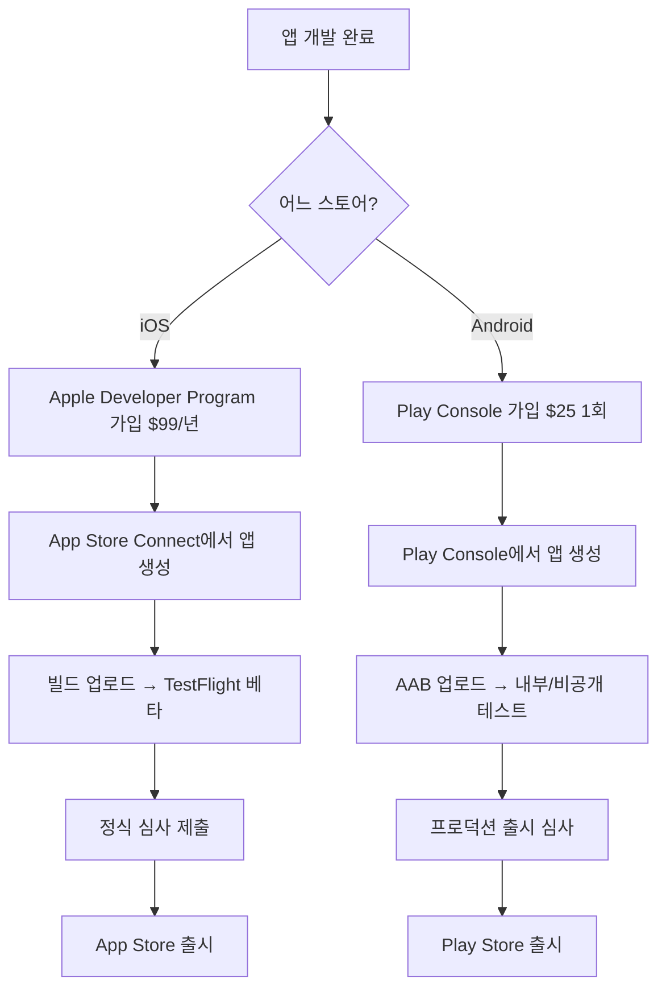
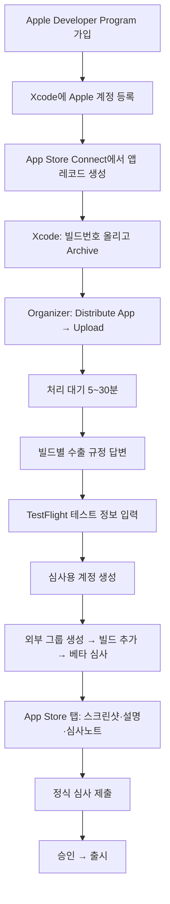
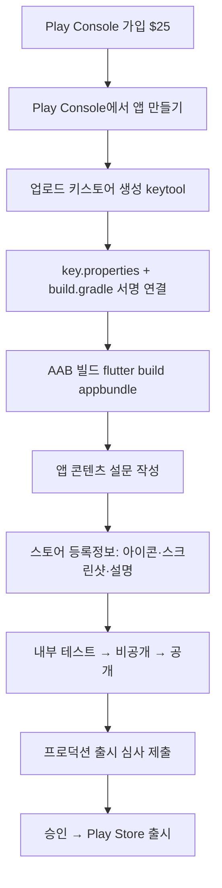

# 앱 스토어 등록 플레이북 (iOS App Store · Android Play Store)

**이 문서는 "처음 앱을 등록하는 사람"이 순서대로 따라 할 수 있게 만든
안내서다.** 커넥션센스를 실제로 등록하며 겪은 과정을 기반으로,
각 단계마다 **① 어디서(사이트 주소) ② 누가(역할) ③ 무엇을(할 일)
④ 예시**를 적었다.

> 실제 등록 중 겪은 함정과 시간순 기록은 [`backlog.md`](./backlog.md)
> (추가 104·108·109·110)와 [`HANDOFF.md`](./HANDOFF.md) "0-1 ~ 0-8" 참고.
> 이 문서는 그 경험을 "다음에 또 할 때 보는 절차서"로 압축한 것이다.

---

## 0. 큰 그림 — 두 스토어는 별개의 세계다

iOS와 Android는 **계정·요금·심사·용어가 전부 다르다.** 한쪽에서 한 일이
다른 쪽에 자동으로 반영되지 않는다.

| | iOS (Apple) | Android (Google) |
|---|---|---|
| 개발자 등록비 | **연 $99** (매년 갱신) | **1회 $25** (평생) |
| 관리 콘솔 | App Store Connect | Google Play Console |
| 베타 배포 | TestFlight | 내부/비공개/공개 테스트 |
| 앱 서명 | Apple이 인증서 관리(Xcode 자동) | **개발자가 키스토어 직접 보관** |
| 심사 기간 | 보통 1~3일 | 보통 수시간~며칠 |
| 배포 파일 | `.ipa` (아카이브) | `.aab` (App Bundle) |



---

## 0-1. 공통 사전 준비 (양쪽 시작 전에 반드시)

| 무엇 | 어디서 | 왜 필요 | 우리 예시 |
|---|---|---|---|
| 사업자/개인 신원 | — | 개발자 계정 가입에 필요 | 사업자등록증(CreamHouse Co., 220-86-89511) |
| 개인정보처리방침 URL | 웹 호스팅(예: Firebase Hosting) | **양쪽 스토어 모두 필수 제출** | https://connection-sense.web.app/privacy-policy |
| 계정 삭제 안내 URL | 웹 호스팅 | **Play는 필수**(앱 내 삭제와 별개) | https://connection-sense.web.app/account-deletion |
| 앱 아이콘 | — | 1024×1024(iOS), 512×512(Android) | `assets/icons3d/` |
| 스크린샷 | 실기기/시뮬레이터 | 스토어 등록정보용 | 기기별 캡처 |

> ⚠️ **법적 문서는 앱 구현과 정확히 일치해야 한다.** 방침과 코드가 어긋나면
> 그 자체가 반려·법적 리스크다(우리는 BYOK 서술 불일치로 한 번 겪음).
> 문서 배포는 `firebase deploy --only hosting`(무료 Spark 요금제로 가능).

---

# Part 1. iOS — App Store 등록

## 1-0. iOS 전체 순서도



## 1-1. Apple Developer Program 가입

- **어디서**: https://developer.apple.com/programs/enroll/
- **누가**: 회사 대표 또는 계정 소유자
- **할 일**: 연 $99 결제, 조직(회사)이면 D-U-N-S 번호 필요할 수 있음.
  가입 후 역할은 https://developer.apple.com/account 에서 확인.
- **예시**: 우리는 `apps@creamhouse.net`이 계정 소유자, `globe2030@icloud.com`이
  관리자(Admin). **팀 ID**는 `77L7BH2M2W`.
- **함정**: "App Store Connect 권한"과 "Developer Portal 권한"은 **별개 시스템**이다.
  한쪽에서 Admin이어도 다른 쪽에 없을 수 있다.

## 1-2. Xcode에 Apple 계정 등록 (서명 준비)

- **어디서**: Xcode → Settings(`Cmd+,`) → **Accounts** 탭
- **누가**: 빌드하는 개발자(맥에서)
- **할 일**: `+`로 Apple 계정 로그인(2단계 인증). 그래야 **배포용 인증서
  (iOS Distribution)**가 발급된다.
- **함정(실제 겪음)**: "App Store Connect 403" 에러의 진짜 원인이 **Xcode에
  계정이 하나도 등록 안 돼 있어** 배포 인증서를 못 만든 것이었다. 콘솔 권한이
  아니라 로컬 환경 문제였다. 증상 이름에 속지 말 것.

## 1-3. App Store Connect에서 앱 레코드 생성

- **어디서**: https://appstoreconnect.apple.com → **앱** → `+` → 신규 앱
- **누가**: Admin 이상
- **할 일**: 이름, 기본 언어, **번들 ID**(Xcode 프로젝트와 동일해야 함), SKU 입력.
- **예시**: 번들 ID `com.creamhouse.connectionsense`, 이름 "커넥션센스".
- **함정**: 번들 ID가 과거 다른 Apple ID에 선점돼 있으면 못 쓴다 — 그때는
  번들 ID를 바꾸고 Firebase 등 연동 설정(`GoogleService-Info.plist`,
  URL 스킴)도 전부 같이 바꿔야 한다.

## 1-4. 빌드 만들기 (Archive)

- **어디서**: 맥 터미널 + Xcode
- **누가**: 개발자
- **할 일**:
  1. `pubspec.yaml`의 빌드 번호를 **매번 올린다**(예: `1.0.0+4` → `1.0.0+5`).
  2. 아카이브 생성. 우리는 커밋 해시가 앱에 박히는 스크립트를 쓴다:
     ```bash
     tool/build_app.sh ipa release
     ```
     (Xcode에서 Product → Archive로 만들어도 된다.)
- **함정(실제 겪음)**: 같은 버전+빌드번호를 두 번 올리면 App Store Connect가
  **"Redundant Binary Upload"(code 90189)**로 거부한다. 앱 버전(1.0.0)은
  두고 뒤 숫자(+N)만 올리면 된다.

## 1-5. 업로드

- **어디서**: Xcode → Window → **Organizer**(`Cmd+Shift+9`) → Archives
- **누가**: 개발자
- **할 일**: 대상 아카이브 선택 → **Distribute App** → **App Store Connect**
  → **Upload** → 서명은 "Automatically manage signing".
- **예시**: 업로드 성공 시 "ConnectionSense 1.0.0 (5) uploaded" + 초록 체크.
- **함정**: `flutter build ipa`의 IPA export가 `Copy failed`로 실패해도
  **아카이브 자체는 정상**이다 — Organizer로 아카이브를 열어 올리면 된다.

## 1-6. 수출 규정(암호화) 답변 — ⚠️ 빌드마다

- **어디서**: App Store Connect → **TestFlight** → 해당 빌드 → 우상단
  **"수출 규정 준수 정보 제공"**
- **누가**: Admin
- **할 일**: "앱 암호화 문서" 질문에 답. **암호화를 쓰면(대부분) 아래처럼**:
  - 유형: **"Apple의 운영 체제 내 암호화를 대체하거나 이와 병행하여 사용하는
    표준 암호화 알고리즘"** (AES 같은 표준 알고리즘을 직접 구현한 경우)
  - 프랑스 후속 질문: 화면 안내에 따라(우리는 "아니오")
- **예시 근거**: 우리는 명함을 AES-256-GCM(`cryptography` 패키지, 직접 구현)으로
  암호화한다 → Apple OS 암호화 아님 + 표준 알고리즘.
- **함정(실제 겪음)**: **빌드마다** 답해야 한다. 버전 단위로 물려받지 않는다.
  매번 답하기 싫으면 `Info.plist`에 `ITSAppUsesNonExemptEncryption` 값을
  넣으면 되지만, 그것도 같은 신고라 값을 확정한 뒤 넣어야 한다.
- **주의**: 이건 **회사 명의의 수출 규제 신고**다. 최종 판단은 법무 검토가 맞다.

## 1-7. TestFlight "테스트 정보" 입력

- **어디서**: TestFlight → 왼쪽 사이드바 **추가 → 테스트 정보**
- **누가**: Admin
- **할 일**:
  - **베타 앱 설명**, **피드백 이메일**, **개인정보처리방침 URL**
  - **베타 앱 심사 정보**: 연락처(성/이름/전화/이메일) + **심사용 추가 정보(심사 노트)**
  - **로그인 정보("로그인 필요")**: 심사용 계정 필요 → 1-8에서 만든 뒤 채운다
- **예시 문안**: [`store-review-notes.md`](./store-review-notes.md)에 그대로
  붙여넣을 문안이 정리돼 있다.

## 1-8. 심사용 계정 생성 — ⚠️ 소셜 로그인 앱은 필수

- **어디서**: (앱 밖) 새 Gmail 계정 생성 → 앱에 로그인해 테스트 데이터 등록
- **누가**: 사용자
- **할 일**:
  1. **새 Gmail**을 만든다. **2단계 인증을 끈다**(심사자가 로그인해야 하므로).
  2. 그 계정으로 앱에 로그인해 **테스트 명함 3~5건** 등록(빈 화면이면 반려).
  3. 주소가 있는 명함을 하나 이상 넣어 "주변 인맥"이 동작하게.
  4. 계정/비번을 1-7의 "로그인 필요"와 심사 노트에 채운다.
- **함정**: **기존 관리자 계정을 재사용하지 말 것.** 심사 노트의 비밀번호는
  Apple에 넘어간다 — 그 계정으로 할 수 있는 모든 일이 함께 넘어간다.
  또한 회사(Workspace) 계정은 2단계 인증이 강제될 수 있어 일반 Gmail이 낫다.
- **주의(우리 원칙)**: 가짜 인물 정보를 만들지 않는다. 명백히 테스트용임이
  드러나는 이름을 쓴다.

## 1-9. 외부 테스트 그룹 → 베타 심사 제출

- **어디서**: TestFlight
- **누가**: Admin
- **할 일**:
  1. **외부 그룹 생성** — 상단 파란 배너의 **"그룹 생성"** 링크(이메일 초대 =
     외부). 이름 예: `외부 베타 테스터`.
  2. 그룹에 **빌드 추가** + **"테스트할 내용(What to Test)"** 입력.
  3. **테스터 이메일 추가**(외부는 이메일 초대).
  4. **베타 심사 제출** → 승인되면(1~2일) 테스터에게 초대 메일 발송.
- **함정(실제 겪음)**: 사이드바의 **➕는 "내부 그룹"**(App Store Connect 팀
  사용자 전용, 최대 100, 심사 불필요)이다. 외부(이메일 초대, 최대 10,000,
  베타 심사 필요)는 **배너의 "그룹 생성" 링크**로 만든다. 외부 그룹이 하나도
  없으면 사이드바에 "외부 테스팅" 섹션 자체가 안 보인다.

## 1-10. 정식 App Store 심사 제출

- **어디서**: App Store Connect → **배포(App Store)** 탭
- **누가**: Admin
- **할 일**: **스크린샷**(기기 크기별), **앱 설명·키워드·카테고리**,
  **연령 등급**, **개인정보 보호(데이터 수집 항목)**, 빌드 선택, **심사 노트**
  (심사용 계정 포함) → **심사에 제출**.
- **예시 문안**: [`store-review-notes.md`](./store-review-notes.md) 공용.

---

# Part 2. Android — Play Store 등록

## 2-0. Android 전체 순서도



## 2-1. Play Console 가입

- **어디서**: https://play.google.com/console
- **누가**: 회사 대표/소유자
- **할 일**: **1회 $25** 결제. 조직 계정이면 D-U-N-S 등 확인 절차가 있을 수 있음.

## 2-2. 앱 만들기

- **어디서**: Play Console → **앱 만들기**
- **할 일**: 앱 이름, 기본 언어, 앱/게임 구분, 무료/유료 선택, 정책 동의.

## 2-3. 업로드 키스토어 생성 — ⚠️ 잃으면 끝

- **어디서**: 맥 **터미널**(대화창 아님 — 비밀번호가 화면에 노출됨)
- **누가**: 개발자
- **할 일**:
  ```bash
  mkdir -p ~/keys
  keytool -genkey -v -keystore ~/keys/<앱>-upload.jks \
    -keyalg RSA -keysize 2048 -validity 10000 -alias upload
  ```
  비밀번호 6자 이상. 이름/조직 등(DN)은 표시용이라 아무 값이나 됨.
  키 비밀번호 프롬프트에서 **엔터**를 치면 스토어 비밀번호와 같아진다.
- **예시**: `~/keys/connectionsense-upload.jks`, alias `upload`.
- **함정(실제 겪음)**: **이 파일과 비밀번호를 잃으면 앱 업데이트를 영원히
  못 올린다.** 반드시 저장소 밖 **2곳 이상**에 백업(우리: iCloud + 맥 메모).

## 2-4. 서명 연결 (key.properties + build.gradle)

- **어디서**: 프로젝트 코드
- **누가**: 개발자
- **할 일**:
  1. `android/key.properties`(gitignore 처리 — 비밀번호 커밋 금지):
     ```
     storePassword=<키스토어 만들 때 입력한 비밀번호>
     keyPassword=<같은 비밀번호(엔터로 만든 경우)>
     keyAlias=upload
     storeFile=/Users/<계정>/keys/<앱>-upload.jks
     ```
  2. `android/app/build.gradle.kts`가 이 파일을 읽어 릴리스에 서명하도록 수정
     (파일 없으면 debug로 폴백하게 조건 분기 — CI/다른 기기 대비).
- **함정(실제 겪음)**:
  - `key.properties` 비밀번호는 **키스토어를 만들 때 입력한 그 값**이어야 한다.
    새 비밀번호를 지어내면 `keystore password was incorrect`.
  - 키=스토어 비밀번호인데 `keyPassword`가 다르면 `Get Key failed: Given
    final block not properly padded`(스토어는 열리는데 키에서 막힘).

## 2-5. AAB 빌드 + 서명 확인

- **어디서**: 맥 터미널
- **할 일**:
  ```bash
  flutter build appbundle --release     # 또는 tool/build_app.sh appbundle release
  ```
  서명 확인:
  ```bash
  jarsigner -verify -verbose -certs build/app/outputs/bundle/release/app-release.aab | grep CN=
  ```
  결과에 debug가 아닌 내 키(`CN=...`)가 뜨면 성공.
- **참고**: Play는 `.apk`가 아니라 **`.aab`(App Bundle)**를 올린다.

## 2-6. "앱 콘텐츠" 설문 — 없으면 제출이 막힘

- **어디서**: Play Console → 왼쪽 **정책 및 프로그램 → 앱 콘텐츠**
- **할 일**(각 항목 설문 작성):
  - **개인정보처리방침 URL**
  - **앱 액세스 권한**(로그인 필요 앱이면 심사용 계정 제공)
  - **광고 포함 여부**
  - **콘텐츠 등급**(설문)
  - **타겟 연령층**
  - **데이터 보안**(수집·공유하는 데이터 선언 — 개인정보처리방침과 일치해야)
- **함정**: **계정 삭제 안내 URL**이 없으면 "앱 콘텐츠" 제출이 막힌다
  (앱 내 삭제 기능과 **별개**로 웹 URL을 요구).

## 2-7. 테스트 트랙 (내부 → 비공개 → 공개)

- **어디서**: Play Console → **테스트** 섹션
- **할 일**:
  - **내부 테스트**: 최대 100명, 즉시(심사 거의 없음). 이메일 목록으로 초대.
  - **비공개 테스트**: 심사 있음. (프로덕션 승인에 일정 기간 비공개 테스트를
    요구하는 정책이 있을 수 있음 — 개인 개발자 계정.)
  - **공개 테스트**: 누구나 참여.
- **예시**: 테스터 배포는 처음엔 **내부 테스트**로 빠르게 시작.

## 2-8. 스토어 등록정보 + 프로덕션 심사

- **어디서**: Play Console → **성장 → 스토어 등록정보** / **프로덕션**
- **할 일**: 앱 아이콘(512²), 그래픽 이미지, 스크린샷, 짧은/자세한 설명 →
  **프로덕션** 트랙에 AAB 올리고 **출시 검토 제출**.

---

# Part 3. 양쪽 공통 — 처음이라 놓치기 쉬운 함정 모음

우리가 실제로 밟은 지뢰들. 다음엔 여기부터 확인하면 시간을 아낀다.

| # | 함정 | 증상 | 진짜 원인/해결 |
|---|---|---|---|
| 1 | 빌드번호 재사용 | "Redundant Binary Upload"(90189) | 올릴 때마다 `+N` 증가 |
| 2 | 수출 규정 미답 | 빌드에 노란 경고, 배포 안 됨 | **빌드마다** 답(1-6) |
| 3 | 위치 목적 문자열 | "90683 Missing purpose string" | `NSLocationAlwaysAndWhenInUse...` 추가 |
| 4 | 키스토어 분실 | (미래에) 업데이트 영구 불가 | 저장소 밖 2곳 백업 |
| 5 | 내부 vs 외부 혼동 | 팀원만 테스트 가능 | 외부는 배너 "그룹 생성"(1-9) |
| 6 | 심사용 계정 없음 | 심사자가 로그인 불가 → 반려 | 새 계정 + 테스트 데이터(1-8) |
| 7 | 계정삭제 URL 없음 | Play "앱 콘텐츠" 막힘 | 웹 URL 별도 게시(0-1) |
| 8 | 증상≠원인 | "403 권한 에러" | 실은 Xcode 계정 미등록(로컬) |

> **핵심 교훈**: 스토어 에러 메시지의 **이름(증상)이 원인을 가리키지 않는
> 경우가 많다.** "403", "인증 실패", "무한 로딩" 모두 실제 원인은 다른 곳
> (로컬 환경, 세션 만료, 시작 코드)에 있었다. 콘솔만 파지 말고 로컬·세션도 볼 것.

---

## 부록. 우리 프로젝트 고정 값 (커넥션센스 기준)

| 항목 | 값 |
|---|---|
| iOS 번들 ID | `com.creamhouse.connectionsense` |
| Apple 팀 ID | `77L7BH2M2W` |
| Android 패키지 | `com.connectiontrace.connection_trace_ai_flutter` |
| 업로드 키스토어 | `~/keys/connectionsense-upload.jks` (alias `upload`) |
| 법적 문서 | `https://connection-sense.web.app/{privacy-policy, terms-of-service, account-deletion, app-permissions}` |
| 심사/테스트 문안 | [`store-review-notes.md`](./store-review-notes.md) |
| 빌드 스크립트 | `tool/build_app.sh {ipa|appbundle|apk} release` |
